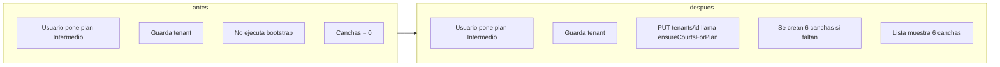

# Plan iterado: Canchas por plan, colores y precio editable

## Objetivos

- **Crear tenant**: POST `/api/tenants` crea 3, 6 o 9 canchas según plan (BASIC / MEDIUM / PREMIUM), con nombres Cancha 1…N, colores y constantes compartidas.
- **Actualizar tenant**: PUT `/api/tenants/[id]` con plan debe asegurar esas canchas (crear faltantes vía `ensureCourtsForPlan`), sin depender de “Ejecutar bootstrap”.
- **Colores**: Una sola paleta; colores en `Court.features` en POST y bootstrap; `courts.ts` usa la misma paleta para fallbacks.
- **Precio base**: Input de precio base en Canchas (super admin) editable como texto (borrar/escribir), no solo flechas.

---

## Estado actual del código (resumen)

- **[lib/court-colors.ts](lib/court-colors.ts)**: Ya existe `COURT_COLOR_PALETTE` y `getCourtFeaturesByIndex(n)`.
- **[lib/constants/court-defaults.ts](lib/constants/court-defaults.ts)**: Ya existe `DEFAULT_COURT_VALUES` y `getDefaultOperatingHoursJson()`.
- **[lib/services/courts.ts](lib/services/courts.ts)**: Ya importa `COURT_COLOR_PALETTE` desde court-colors y lo usa en `getCourtColors`.
- **[app/api/tenants/route.ts](app/api/tenants/route.ts)**: Ya tiene enum plan, crea 3/6/9 canchas con `getPlanDefaultCourts`, `getCourtFeaturesByIndex` y `DEFAULT_COURT_VALUES`; rollback si falla.
- **[lib/services/tenants/bootstrap.ts](lib/services/tenants/bootstrap.ts)**: Ya usa `getCourtFeaturesByIndex(n)` y court-defaults para crear/actualizar canchas; la lógica está inline, no extraída a `ensureCourtsForPlan`.
- **Pendiente**: Extraer `ensureCourtsForPlan`, llamarla desde PUT y desde bootstrap; input precio base como texto en la UI.

---

## 1. Validación del plan (hecho)

**Archivo:** [app/api/tenants/route.ts](app/api/tenants/route.ts)

- Schema: `subscriptionPlan: z.enum(['BASIC', 'MEDIUM', 'PREMIUM']).optional().default('BASIC')` y `tenantData.subscriptionPlan: plan` con `plan = validated.subscriptionPlan ?? 'BASIC'`. Ya implementado.

---

## 2. Módulos compartidos (hecho)

- **[lib/court-colors.ts](lib/court-colors.ts)**: `COURT_COLOR_PALETTE` + `getCourtFeaturesByIndex(courtNumber)`. Hecho.
- **[lib/constants/court-defaults.ts](lib/constants/court-defaults.ts)**: `DEFAULT_COURT_VALUES`, `getDefaultOperatingHoursJson()`. Hecho.

---

## 3. Canchas al crear tenant (hecho, verificar)

**Archivo:** [app/api/tenants/route.ts](app/api/tenants/route.ts)

- Tras crear tenant y AdminWhitelist: `numCourts = getPlanDefaultCourts(plan)`, bucle `n = 1..numCourts`, `name: \`Cancha ${n}`,` description: Cancha ${n}`,` basePrice`,` operatingHours`,` features: JSON.stringify(getCourtFeaturesByIndex(n))`, rollback en error. Ya implementado; solo verificar que use` DEFAULT_COURT_VALUES.basePrice`y`getDefaultOperatingHoursJson()` (o equivalente desde court-defaults).

**Opcional UI:** En formulario de creación de tenant, texto “Se crearán X canchas según el plan” (X = 3, 6 o 9).

---

## 4. ensureCourtsForPlan y uso en PUT y bootstrap (pendiente)

**Archivo:** [lib/services/tenants/bootstrap.ts](lib/services/tenants/bootstrap.ts)

- **Extraer** la lógica que crea/actualiza canchas según plan a una función exportada `ensureCourtsForPlan(tenantId: string)`:
  - Obtener tenant (con `subscriptionPlan`).
  - `numCourts = getPlanDefaultCourts(tenant.subscriptionPlan)`.
  - Para `n = 1..numCourts`: buscar cancha por nombre `Cancha ${n}`; si no existe, `prisma.court.create`; si existe, `prisma.court.update`. Datos: nombre, description, basePrice desde `DEFAULT_COURT_VALUES`, operatingHours desde `getDefaultOperatingHoursJson()`, `features: JSON.stringify(getCourtFeaturesByIndex(n))`, `priceMultiplier: 1`, `isActive: true`. Idempotente por nombre.
- **Refactorizar** `bootstrapTenant`: en lugar del bucle inline de canchas, llamar a `ensureCourtsForPlan(tenantId)` (y seguir devolviendo `courtsEnsured` si hace falta para el resultado, contando las canchas existentes + creadas/actualizadas).

**Archivo:** [app/api/tenants/[id]/route.ts](app/api/tenants/[id]/route.ts)

- En el handler **PUT**, después de `prisma.tenant.update`: si en el payload se envió `subscriptionPlan` (o siempre que se actualice el tenant), llamar a `ensureCourtsForPlan(tenantId)`. Así, al guardar Metro 360 con plan Intermedio se crean las 6 canchas si no existían.

**Opcional UX:** En la página del tenant, si `courts.length === 0` y el plan tiene defaultCourts > 0, mostrar “Guarda el tenant para crear las canchas según tu plan”.

---

## 5. Colores en bootstrap y courts.ts (hecho)

- **Bootstrap**: Ya usa `getCourtFeaturesByIndex(n)` en courtDefs y constantes de court-defaults.
- **courts.ts**: Ya usa `COURT_COLOR_PALETTE` desde court-colors en `transformCourtData` / `getCourtColors`. Nada pendiente aquí.

---

## 6. Campo “Precio base” editable como texto (pendiente)

**Archivo:** [app/super-admin/tenants/[id]/page.tsx](app/super-admin/tenants/[id]/page.tsx)

- Sustituir el input de precio base: de `type="number"` a `type="text"` con `inputMode="decimal"`, `defaultValue="24000"` y opcional `placeholder="24000"`.
- En `handleAddCourt`: validar `parseFloat(value)`; si no es número o es < 1, `toast.error("Precio base debe ser un número mayor a 0")` y no enviar; si ok, enviar el número (backend espera basePrice en pesos).

---

## Resumen de archivos

| Archivo                                                                        | Estado    | Acción                                                                        |
| ------------------------------------------------------------------------------ | --------- | ----------------------------------------------------------------------------- |
| [app/api/tenants/route.ts](app/api/tenants/route.ts)                           | Hecho     | Verificar uso de court-defaults/court-colors.                                 |
| [lib/court-colors.ts](lib/court-colors.ts)                                     | Hecho     | —                                                                             |
| [lib/constants/court-defaults.ts](lib/constants/court-defaults.ts)             | Hecho     | —                                                                             |
| [lib/services/tenants/bootstrap.ts](lib/services/tenants/bootstrap.ts)         | Parcial   | Extraer `ensureCourtsForPlan(tenantId)`; bootstrap debe invocarla.            |
| [app/api/tenants/[id]/route.ts](app/api/tenants/[id]/route.ts)                 | Pendiente | En PUT, llamar `ensureCourtsForPlan(tenantId)` tras actualizar tenant.        |
| [lib/services/courts.ts](lib/services/courts.ts)                               | Hecho     | —                                                                             |
| [app/super-admin/tenants/[id]/page.tsx](app/super-admin/tenants/[id]/page.tsx) | Pendiente | Precio base: `type="text"`, `inputMode="decimal"`, validar en handleAddCourt. |

---

## Diagrama: canchas al actualizar tenant

---

## Orden de implementación (solo pendientes)

1. **bootstrap.ts**: Extraer `ensureCourtsForPlan(tenantId)` con la lógica actual de canchas (getPlanDefaultCourts, bucle 1..N, create/update por nombre, court-defaults + getCourtFeaturesByIndex). Refactorizar `bootstrapTenant` para llamar a `ensureCourtsForPlan(tenantId)`.
2. **app/api/tenants/[id]/route.ts**: En PUT, después de actualizar el tenant, llamar `ensureCourtsForPlan(tenantId)` cuando corresponda (p. ej. si `subscriptionPlan` está en el body).
3. **app/super-admin/tenants/[id]/page.tsx**: Input precio base a `type="text"`, `inputMode="decimal"`, validación en `handleAddCourt`.

---

## Documentación de lo hecho

### Colores por cancha (paleta única)

- **Backend y persistencia**: [lib/court-colors.ts](lib/court-colors.ts) define `COURT_COLOR_PALETTE` (Tailwind: `color`, `bgColor`, `textColor`) y `getCourtFeaturesByIndex(courtNumber)`. Ese objeto se persiste en `Court.features` (JSON) al crear canchas.
- **Creación de tenant**: En POST [app/api/tenants/route.ts](app/api/tenants/route.ts) se crean 3, 6 o 9 canchas según plan (`getPlanDefaultCourts`), con `features: JSON.stringify(getCourtFeaturesByIndex(n))` y constantes de [lib/constants/court-defaults.ts](lib/constants/court-defaults.ts).
- **Bootstrap**: [lib/services/tenants/bootstrap.ts](lib/services/tenants/bootstrap.ts) crea/actualiza canchas con la misma lógica: `getCourtFeaturesByIndex(n)` y court-defaults.
- **Servicio de canchas**: [lib/services/courts.ts](lib/services/courts.ts) importa `COURT_COLOR_PALETTE` y lo usa en `transformCourtData` / `getCourtColors` para fallback cuando `Court.features` no tiene color.

### Frontend (hex para íconos e ilustraciones)

- **HomeSection**: [components/HomeSection.tsx](components/HomeSection.tsx) usa `paletteHex` (colores hex) para el ícono de la cancha seleccionada y las tarjetas de canchas. Fórmula: `paletteHex[(selectedNumber - 1) % paletteHex.length]` (líneas 220–222, 424, 443, 532, 578).
- **Slots en modal**: En el mismo archivo (aprox. 981–1006) hay un `getCourtColor` hardcodeado solo para canchas 1–3; para canchas 4–9 conviene reutilizar la misma paleta hex (o leer `slot.court?.features?.color` si el API lo devuelve).

### Extensión a 9 colores (sin repetición para canchas 1–9)

- **Objetivo**: Que canchas 1–9 tengan color distinto; con 7 colores, cancha 8 y 9 repiten.
- **Solución**: Añadir 2 colores a la paleta (p. ej. azul `#2563eb` y amarillo `#eab308`).
- **Dónde aplicar**:
  - En [lib/court-colors.ts](lib/court-colors.ts): agregar dos entradas a `COURT_COLOR_PALETTE` (Tailwind equivalentes: blue, yellow/amber).
  - En [components/HomeSection.tsx](components/HomeSection.tsx): extender `paletteHex` con esos dos hex y, si se desea consistencia, reemplazar `getCourtColor` del modal por la misma fórmula con `getCourtNumber` y `paletteHex`.

### Resumen de flujo

1. **Al crear tenant**: Se crean N canchas (N = 3/6/9 por plan); cada una tiene `features` con el color de `getCourtFeaturesByIndex(n)`.
2. **Al mostrar canchas**: Si `Court.features` trae `color`/`bgColor`/`textColor`, se usan; si no, fallback por número de cancha con la paleta en courts.ts.
3. **En la home**: El color del ícono y de las tarjetas se calcula con `paletteHex` y el número de cancha (`getCourtNumber`); al tener 9 elementos en `paletteHex`, canchas 1–9 no repiten color.

---

## Checklist final

- Plan validado (enum + default). 
- Una sola paleta y court-defaults; courts.ts y POST ya los usan.
- Canchas 1..N al crear tenant; rollback en POST si falla.
- `ensureCourtsForPlan` extraída; usada en bootstrap y en PUT tenant.
- Precio base editable como texto en la UI de canchas del super admin.

