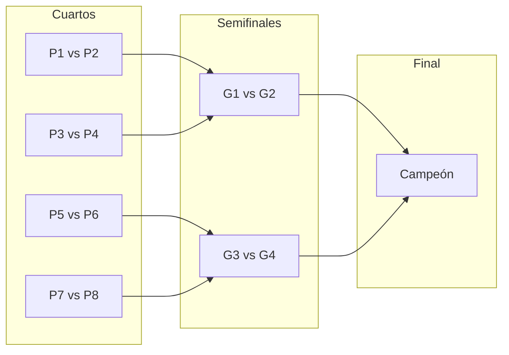

# Completar sección Admin Torneos

Plan principal para la funcionalidad de torneos en el panel de administración. Ruta: `/admin-panel/admin/torneos`. Archivo principal: `app/admin-panel/admin/torneos/page.tsx`.

---

## Decisiones cerradas

| Tema | Decisión |
|------|----------|
| **Super admin** | **Sí puede crear torneos** (debe seleccionar el club en el formulario; la API acepta `tenantId` y valida con `canAccessTenant`). También puede gestionar inscripciones en cualquier torneo al que tenga acceso. |

---

## Estado actual

### Implementado (según docs)

**Formulario** ([admin-torneos-formulario-2026-02.md](docs/actualizaciones/admin-torneos-formulario-2026-02.md)):

- Paso 1: campo "Parejas máximas", validación min ≤ max.
- Paso 2: botón "Confirmar Horarios" habilitado cuando la franja tiene inicio y cierre.
- Vista previa: cronograma con rango completo (inicio - fin) por franja.
- Paso 3: botón "Volver al paso anterior" en esquina inferior izquierda de la tarjeta.

**Super admin e inscripciones** ([admin-torneos-superadmin-inscripciones-2026-02.md](docs/actualizaciones/admin-torneos-superadmin-inscripciones-2026-02.md)):

- Super admin puede crear torneos (selector de club en "Crear torneo"; POST con `tenantId`).
- Super admin puede gestionar inscripciones (GET/POST/PATCH/DELETE con tenant resuelto vía torneo y `canAccessTenant`).
- UI: selector de club para super admin, estado de error en inscripciones + "Reintentar", mensaje del API al agregar, aviso "Cupo completo" y deshabilitar "Agregar" cuando `currentPairs >= maxPairs`.

**Landing y menú** ([landing-login-menu-usuario-2026-02.md](docs/actualizaciones/landing-login-menu-usuario-2026-02.md)):

- Login desde landing redirige a `/` (no al dashboard).
- Header con avatar y menú: "Ir a mi club", "Panel Super Admin" (si aplica), "Cerrar sesión".
- Botón "Reservar Ahora" condicional (sin sesión → login; con sesión y tenant → dashboard; con sesión sin tenant → ancla a `#clubs-list`).

### Falta

- CourtBlock e integración en disponibilidad (bloquear canchas en fechas/horarios del torneo; evitar reservas normales durante el torneo).
- Cancelación de reservas con aviso cuando aplique.
- Edición/eliminación de torneos (PATCH/DELETE y recálculo de CourtBlocks si aplica).
- Publicación (OPEN_REGISTRATION + `publishedAt`).
- Listado público de torneos si aplica.
- Fase 4 opcional (partidos, sorteo, cuadros; pagos fuera de alcance en este plan).

---

## Fase 1.2 – Servicio y validaciones

- Solo admin del tenant o super admin (con tenant seleccionado) pueden crear/editar torneos.
- Servicio de torneos (CRUD) con validaciones de negocio (minPairs ≤ maxPairs, fechas coherentes, etc.).
- Resolución de tenant: admin usa su tenant de sesión; super admin debe recibir `tenantId` en el payload y validarse con `canAccessTenant`.

---

## Fase 1.3 – APIs REST

- **GET/POST** torneos: listar y crear. El super admin puede crear torneos enviando `tenantId` en el body; la API valida con `canAccessTenant` y crea el torneo para ese tenant. Admin de tenant usa el tenant de su sesión.
- **GET/PATCH/DELETE** torneo por id: obtener, actualizar, eliminar (con validación de tenant/super admin).
- **Inscripciones:** GET/POST en `torneos/[id]/inscripciones`, PATCH/DELETE en `torneos/[id]/inscripciones/[registrationId]`. Tenant resuelto vía torneo; super admin permitido con `canAccessTenant(tournament.tenantId)`.

---

## Fase 1.4 – Frontend: quitar mock y conectar wizard

**Hecho.** El frontend realiza fetch a GET/POST de torneos, handlePublish a la API de creación, y maneja estados vacío/error. Las mejoras del formulario (Paso 1–3) y del flujo super admin (selector de club, inscripciones) están documentadas en los docs citados en "Implementado (según docs)".

---

## Orden recomendado de implementación

| # | Paso | Estado |
|---|------|--------|
| 1 | Modelo Prisma (Tournament, CourtBlock si aplica, inscripciones) | Hecho |
| 2 | Servicio de torneos e inscripciones | Hecho |
| 3 | APIs torneos (GET, POST, GET by id, PATCH, DELETE) e inscripciones | Hecho |
| 4 | Frontend sin mock, wizard conectado a APIs | Hecho |
| 5 | CourtBlock, cancelar reservas, availability, liberación, PATCH con recálculo | Pendiente |
| 6 | Inscripciones y publicación (OPEN_REGISTRATION, publishedAt) en la medida ya implementada | Hecho (parcial) |
| 7 | Resto de publicación, listado público, edición/eliminación de torneos | Pendiente |
| 8 | Fase 4 opcional (formato, premios, partidos, sorteo, cuadros) | Pendiente |

---

## Archivos clave a crear o tocar

| Área | Archivos | Nota |
|------|----------|------|
| **Torneos e inscripciones** | Listados en [admin-torneos-superadmin-inscripciones-2026-02.md](docs/actualizaciones/admin-torneos-superadmin-inscripciones-2026-02.md) | API y UI ya tocados para super admin e inscripciones |
| **Landing / Login** | `middleware.ts`, `app/login/page.tsx`, `app/page.tsx`, `components/LandingPage.tsx` | Ver [landing-login-menu-usuario-2026-02.md](docs/actualizaciones/landing-login-menu-usuario-2026-02.md) |
| **Fase 4 (si se implementa)** | Paso 1 en `app/admin-panel/admin/torneos/page.tsx` (formato + premios), modelo Prisma (`tournamentFormat`, `prizeIsMonetary`, premios por liga, grupos si aplica), componente(s) UI bracket, ruta/estado "Fixture", API o servicio para generar sorteo y fixture (incl. round-robin por grupo) | Ver Fase 4 más abajo |

---

## Cierre en profundidad

- **Vista detalle torneo:** La gestión de inscripciones (lista, agregar, cupo completo, Reintentar) y el selector de club para super admin ya están implementados según los docs de actualizaciones.
- **UI:** Inscripciones cargadas por admin/super admin, selector de club para super admin en "Crear torneo", estados de error y cupo completo documentados en [admin-torneos-superadmin-inscripciones-2026-02.md](docs/actualizaciones/admin-torneos-superadmin-inscripciones-2026-02.md).

---

## Fase 4 (opcional): Partidos, sorteo del fixture y cuadros

### 6.0 Tipo de torneo (selector en Paso 1 – Datos del torneo)

- La posibilidad de elegir **qué tipo de torneo** se realiza debe estar en la **primera ventana** del wizard (Paso 1: Club, Título, Categoría, Premios, Reglas). El formato elegido determina: (a) qué premios se muestran (2 premios globales vs 4 premios por liga); (b) cómo se genera el fixture (ver 6.1 y 6.1a).
- Añadir en ese paso una sección o campo **"Formato del torneo"** (o "Tipo de torneo") con dos opciones:
  1. **Eliminatoria directa** (ej. Octavos a Final): un solo cuadro eliminatorio hasta la final.
  2. **Fase de grupos + Doble Eliminatoria**: fase de grupos; los 2 mejores de cada grupo van a "Liga de Oro", los 2 peores a "Liga de Plata"; luego doble eliminatoria en cada liga.
- Persistir el formato elegido en el modelo del torneo (ej. campo `tournamentFormat`: `DIRECT_ELIMINATION` | `GROUPS_DOUBLE_ELIMINATION`) para que el sorteo y la generación de partidos usen la lógica correcta.

### 6.0a Premios: monetario o no, y por liga (Oro/Plata)

- **Tipo de premio (monetario o no):** En Paso 1, en la sección de premios, permitir elegir si el premio será **monetario** o **no monetario**.
  - **Monetario:** se usan campos numéricos (ej. valor en pesos) para 1er y 2do lugar; el front puede formatear a moneda.
  - **No monetario:** el premio es descriptivo (ej. trofeo, producto, beca). Campos de texto o descripción por puesto (1er lugar, 2do lugar) en lugar de monto. En el modelo: puede ser un flag `prizeIsMonetary` (boolean) y, si es monetario, `prizeFirst`/`prizeSecond` (Int); si no, `prizeFirstDescription`/`prizeSecondDescription` (String), o un solo campo `prizeDescription` por puesto.
- **Premios por liga (solo si formato "Fase de grupos + Doble Eliminatoria"):** Cuando el formato del torneo es Liga de Oro y Liga de Plata, los premios se configuran **por separado** para cada liga:
  - **Liga de Oro:** premio 1er lugar y premio 2do lugar (monetario o descripción, según el tipo elegido).
  - **Liga de Plata:** premio 1er lugar y premio 2do lugar (monetario o descripción, según el tipo elegido).
- En la UI del Paso 1: si el formato es "Eliminatoria directa", mostrar los dos premios habituales (1er y 2do). Si el formato es "Fase de grupos + Doble Eliminatoria", mostrar dos bloques, "Premios Liga de Oro" y "Premios Liga de Plata", cada uno con 1er y 2do lugar (y en cada caso respetar si el premio es monetario o no).
- Persistir en el modelo: tipo de premio (monetario/no) y, para formato doble liga, cuatro premios (Oro 1er, Oro 2do, Plata 1er, Plata 2do) ya sea como valores numéricos o como textos según corresponda.

### 6.1 División de partidos y formatos

- Definir entidades para el cuadro: **Match** (o Fixture): partido entre dos parejas, con ronda, grupo (si aplica), posición en el cuadro y resultado opcional.
- **Formato 1 – Eliminatoria directa:** A partir de N parejas, calcular rondas (octavos, cuartos, semifinal, final); si N no es potencia de 2, usar byes. Un solo cuadro hasta la final.
- **Formato 2 – Fase de grupos + Doble Eliminatoria:** Primero se juega la fase de grupos (ver 6.1a); según posiciones, los 2 mejores de cada grupo van a "Liga de Oro" y los 2 peores a "Liga de Plata"; en cada liga se arma un cuadro de doble eliminatoria (ganadores y perdedores).
- Servicio/API: generar el **fixture** (lista de partidos por ronda y, si aplica, por grupo) una vez realizado el sorteo.

### 6.1a Fase de grupos (formato "Fase de grupos + Doble Eliminatoria")

- **Distribución en grupos:** Distribuir **aleatoriamente** las parejas inscritas en **N grupos** (ej. 4 grupos). El número N puede ser configurable en Paso 1 (ej. "Cantidad de grupos") o derivado de la cantidad de parejas; dejarlo definido en el plan (ej. 4 grupos por defecto si hay 8–16 parejas).
- **Partidos por grupo:** Generar los registros **Match** de **todos contra todos (Round Robin)** dentro de cada grupo. Es decir, por cada grupo se crean los partidos que enfrentan a cada pareja con cada otra del mismo grupo; los resultados determinan la tabla del grupo (posiciones) y quiénes pasan a Liga de Oro (2 mejores) y quiénes a Liga de Plata (2 peores).

### 6.2 Sorteo del fixture

- **Sorteo:** Algoritmo que asigna las parejas inscritas a las posiciones del cuadro (llaves). Puede ser aleatorio (shuffle) o por orden de inscripción; dejar definido en el plan (ej. "sorteo aleatorio").
- **Momento del sorteo:** El admin dispara el sorteo manualmente desde la UI (botón "Realizar sorteo" en la vista de gestión del torneo / inscripciones).

### 6.3 Opción: sorteo con cantidad mínima de parejas

- Cuando el número de parejas inscritas **alcance o supere** `minPairs`, la UI debe ofrecer la **opción de hacer el sorteo con las parejas que ya están**.
- No obligar a llegar a `maxPairs`; si el admin cierra inscripciones o decide "jugar con lo que hay", puede ejecutar el sorteo con `currentPairs >= minPairs`. Validación en backend: solo permitir generar fixture si `currentPairs >= minPairs`.
- En la pantalla de inscripciones (o vista detalle torneo): mostrar mensaje tipo "Ya puedes realizar el sorteo con X parejas" y botón "Realizar sorteo" habilitado cuando `currentPairs >= minPairs`.

### 6.4 Dibujo de los cuadros del sorteo

- Cuando se hayan agregado las parejas y se haya realizado el sorteo, mostrar un **cuadro visual del fixture** (bracket) en la UI.
- Estructura típica de cuadro eliminatorio (ejemplo 8 parejas): primera ronda (cuartos) con 4 partidos, semifinales con 2 partidos, final con 1; las llaves se conectan de ronda a ronda (ganador partido 1 vs ganador partido 2 en semifinal, etc.).
- Esquema del cuadro (8 parejas, 4 rondas de partidos):

- **Contenido por partido (celda del cuadro):** Llave/posición, pareja A vs pareja B (nombres o etiquetas), resultado si ya se cargó (opcional).
- **Ubicación:** Vista "Fixture" o "Cuadro" dentro del detalle del torneo (pestaña o sección), visible después del sorteo. Si no hay sorteo aún, mostrar "Realiza el sorteo para ver el cuadro" y botón para sortear (habilitado si `currentPairs >= minPairs`).

### Orden recomendado Fase 4

1. Modelo: `tournamentFormat`, `prizeIsMonetary`, premios por liga (Oro/Plata) si aplica.
2. Paso 1 UI: selector formato + bloques premios (monetario/no; si doble liga, Oro y Plata por separado).
3. Modelo Match + generación de fixture (eliminatoria y/o grupos + doble eliminatoria).
4. Distribución aleatoria en grupos y Round Robin.
5. API de sorteo.
6. UI "Realizar sorteo" (habilitado si `currentPairs >= minPairs`).
7. UI cuadro/bracket.

---

## Documentación de referencia

- [admin-torneos-formulario-2026-02.md](docs/actualizaciones/admin-torneos-formulario-2026-02.md)
- [admin-torneos-superadmin-inscripciones-2026-02.md](docs/actualizaciones/admin-torneos-superadmin-inscripciones-2026-02.md)
- [landing-login-menu-usuario-2026-02.md](docs/actualizaciones/landing-login-menu-usuario-2026-02.md)
