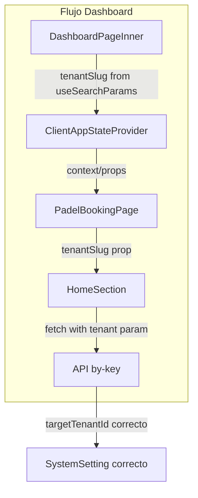

# Plan: Corrección de bugs potenciales

## Resumen de cambios

Se abordan 5 correcciones priorizadas según severidad. Los `catch` vacíos y las funciones mock con `Math.random()` se excluyen del plan por ser de menor impacto y requerir decisiones de diseño más amplias.

---

## 1. LandingPage - TypeError con `club.description` (Prioridad alta)

**Problema:** Si `club.description` es `null` o `undefined`, la expresión `club.description?.toLowerCase().includes(...)` devuelve `undefined` en `toLowerCase()` y luego `undefined.includes()` lanza **TypeError**.

**Archivo:** [components/LandingPage.tsx](components/LandingPage.tsx) (líneas 73-76)

**Cambio:**

```typescript
// Antes
club.description?.toLowerCase().includes(searchTerm.toLowerCase())

// Después  
(club.description ?? '').toLowerCase().includes(searchTerm.toLowerCase())
```

---

## 2. HomeSection - `sessionText` faltante en carga desde API (Prioridad media)

**Problema:** En `loadHomeCardSettings`, el segundo `setHomeCardSettings` (cuando los datos vienen de la API) no incluye `sessionText`, pero el primer bloque (localStorage) sí lo incluye. Al cargar desde API se pierde ese campo.

**Archivo:** [components/HomeSection.tsx](components/HomeSection.tsx) (líneas 163-170)

**Cambio:** Añadir `sessionText` en el objeto que se pasa a `setHomeCardSettings` cuando la fuente es la API:

```typescript
setHomeCardSettings({
  labelCourtName: parsed?.labelCourtName || 'Nombre de la cancha',
  locationName: parsed?.locationName || 'Downtown Sports Center',
  mapUrl: parsed?.mapUrl || '',
  sessionText: parsed?.sessionText || '1:30 hour sessions',  // añadir
  descriptionText: parsed?.descriptionText || '...',
  iconImage: parsed?.iconImage || ''
})
```

---

## 3. HomeSection - Pasar `tenantSlug` al fetch de `home_card_settings` (Prioridad media)

**Problema:** El fetch no envía el tenant, por lo que en escenarios con varios tenants o vistas públicas, el backend puede devolver el registro equivocado.

**Archivos:**

- [components/HomeSection.tsx](components/HomeSection.tsx): añadir prop opcional `tenantSlug?: string` y usarla en la URL del fetch
- [padel-booking.tsx](padel-booking.tsx): pasar `tenantSlug` a `HomeSection` si está disponible
- [app/dashboard/page.tsx](app/dashboard/page.tsx): pasar `tenantSlug` desde `DashboardPageInner` hacia `ClientAppStateProvider` y luego a `PadelBookingPage`

**Flujo de props:** `DashboardPageInner` (tiene `searchParams.get('tenantSlug')`) -> `ClientAppStateProvider` (nueva prop) -> `PadelBookingPage` (recibe y reenvía) -> `HomeSection` (usa en el fetch).

**Fetch:**

```typescript
const url = tenantSlug 
  ? `/api/system-settings/public/by-key?key=home_card_settings&tenant=${encodeURIComponent(tenantSlug)}`
  : '/api/system-settings/public/by-key?key=home_card_settings'
const res = await fetch(url, { cache: 'no-store' })
```

---

## 4. Reemplazar `substr` deprecado por `substring` (Prioridad baja)

**Archivos y cambio:**


| Archivo                                                  | Línea | Antes           | Después             |
| -------------------------------------------------------- | ----- | --------------- | ------------------- |
| [components/AdminTurnos.tsx](components/AdminTurnos.tsx) | 397   | `.substr(2, 9)` | `.substring(2, 11)` |
| [app/api/events/route.ts](app/api/events/route.ts)       | 45    | `.substr(2, 9)` | `.substring(2, 11)` |


Nota: `substr(2, 9)` toma 9 caracteres desde índice 2; `substring(2, 11)` produce el mismo resultado.

---

## 5. Propagar `tenantSlug` por el árbol de componentes del dashboard

**Cambios necesarios:**

1. **ClientAppStateProvider** ([components/providers/ClientAppStateProvider.tsx](components/providers/ClientAppStateProvider.tsx)): Añadir prop opcional `tenantSlug?: string | null` y pasarla a los hijos.
2. **DashboardPageInner** ([app/dashboard/page.tsx](app/dashboard/page.tsx)): Pasar `tenantSlug={tenantSlug}` a `ClientAppStateProvider`.
3. **PadelBookingPage** ([padel-booking.tsx](padel-booking.tsx)): Recibir `tenantSlug` desde el contexto (o props) y pasarlo a `HomeSection`.
4. **HomeSection** ([components/HomeSection.tsx](components/HomeSection.tsx)): Añadir `tenantSlug?: string | null` a `HomeSectionProps` y usarlo en el fetch de `loadHomeCardSettings`.

---

## Diagrama del flujo de tenantSlug (cambio 3 + 5)



---

## Orden de implementación sugerido

1. Cambio 1 (LandingPage): corrección inmediata del crash
2. Cambio 2 (sessionText): corrección aislada en HomeSection
3. Cambios 4 (substr): correcciones puntuales
4. Cambios 3 y 5 (tenantSlug): modificación de varios componentes en cadena

---

## Excluidos del plan

- **catch vacíos:** Requiere definir estrategia de logging/errores; no se incluye en este plan.
- **generateTimeSlots / generateUnifiedSlots con Math.random():** Son funciones de mock; su uso real debe confirmarse antes de cambiar el comportamiento.
