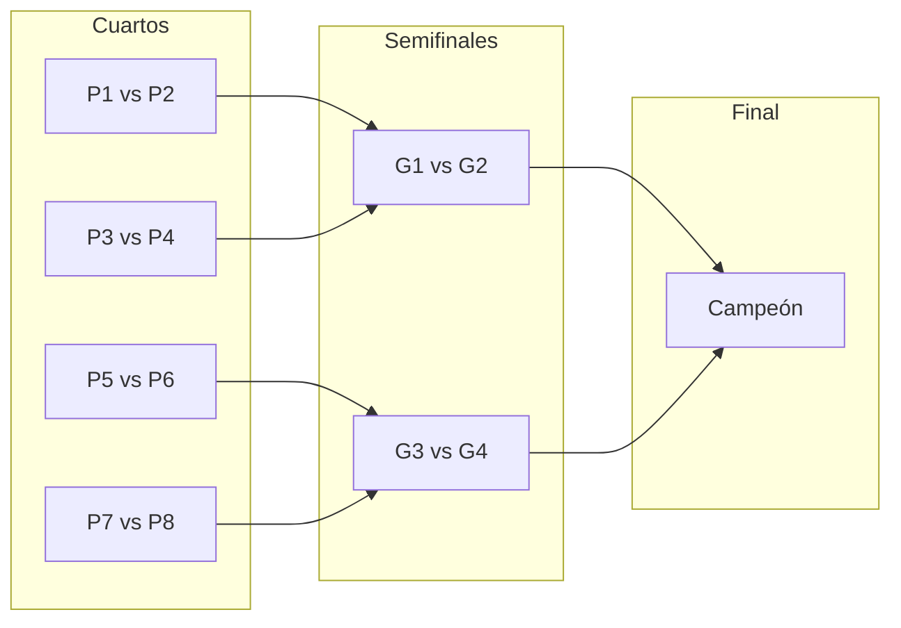

# Plan: Cuadro visual tipo bracket para torneos (iterado)

## Contexto

- **Datos existentes:** La API `GET /api/torneos/[id]/partidos` devuelve `TournamentMatchWithDetails[]` con `round` (ej. `QUARTERFINAL`, `SEMIFINAL`, `FINAL`), `positionInRound`, `registration1Label`, `registration2Label`, `winnerLabel`, `score`. La relación “siguiente partido” se deduce: partido en ronda `r` posición `p` alimenta ronda `r+1` posición `floor(p/2)`.
- **UI actual:** En [app/admin-panel/admin/torneos/page.tsx](app/admin-panel/admin/torneos/page.tsx) (líneas 948-961) el fixture de eliminatoria directa es un **grid de tarjetas** sin conexiones entre rondas.
- **Alcance:** Solo torneos **Eliminatoria directa** (`DIRECT_ELIMINATION`). La vista por grupos se mantiene igual.
- **Backend:** En [lib/services/tournaments.ts](lib/services/tournaments.ts) el sorteo de eliminatoria directa solo crea rondas con nombres `QUARTERFINAL`, `SEMIFINAL`, `FINAL` (o subconjunto según cantidad de partidos). No se usan `ROUND_1`/`ROUND_2` en este flujo.

---

## Tareas principales

### 1. Utilidad de estructura del bracket

- **Archivo:** `lib/tournament-bracket.ts`
- Orden canónico de rondas para eliminatoria: no depender del orden del enum de Prisma. Ordenar por **cantidad de partidos por ronda (descendente)**: la ronda con más partidos = primera columna, la de 1 partido = última.
- Función que agrupe partidos por `round` y devuelva rondas ordenadas (primera ronda → final) y, por cada ronda, partidos ordenados por `positionInRound`.
- Para eliminatoria directa, filtrar partidos con `groupId === null` (evitar mezclar con partidos de fase de grupos si en el futuro hay datos mixtos).
- **Tipos:** Definir interfaz mínima `BracketMatch` en este archivo (o en el componente) con: `id`, `round`, `positionInRound`, `registration1Label`, `registration2Label`, `winnerLabel`, `score`. El tipo `PartidoItem` de la página cumple esta interfaz; no hace falta exportar desde la página.

### 2. Componente `BracketElimination`

- **Ubicación:** [components/admin/BracketElimination.tsx](components/admin/BracketElimination.tsx)
- **Props:** `matches: BracketMatch[]` (o tipo compatible), opcional `roundLabels?: Record<string, string>` (ej. `{ QUARTERFINAL: 'Cuartos', SEMIFINAL: 'Semifinales', FINAL: 'Final' }`).
- **Comportamiento:**
  - Si `matches.length === 0`: devolver `null` o mensaje breve ("No hay partidos para mostrar"); el padre ya controla el caso “sin sorteo”.
  - Agrupar por `round` usando la utilidad; ordenar rondas por número de partidos (descendente).
  - **Layout crítico:** En cada columna de ronda las celdas deben posicionarse de forma que la celda de la ronda siguiente quede **alineada verticalmente entre las dos celdas que la alimentan**. Es decir: espaciado variable por ronda (no solo apilar todas las celdas con el mismo gap). Opciones de implementación:
    - **A)** Contenedores por “llave”: cada dos celdas de la ronda N se agrupan en un wrapper que contiene (1) las dos celdas y (2) una línea vertical hacia la celda de la ronda N+1; las celdas tienen línea horizontal hacia el eje de ese wrapper. Así la celda de la ronda N+1 se coloca naturalmente entre las dos.
    - **B)** Grid/posición calculada: por cada ronda, calcular la posición vertical de cada celda en unidades “slot” (ej. primera ronda 0,1,2,3; segunda 0.5, 2.5; tercera 1.5) y usar CSS grid o `top`/`margin` para alinear; dibujar líneas con SVG desde las celdas al siguiente nivel.
  - **Conexiones:** Especificar estructura concreta. Recomendación: opción A con CSS (borde derecho de cada celda + pseudoelemento o div de “conector” que une al eje; línea vertical del eje a la siguiente columna). Si no basta, usar SVG overlay con coordenadas calculadas a partir de índices y anchos de columna conocidos.
  - **Celdas:** Mostrar `registration1Label ?? 'Bye'`, `registration2Label ?? 'Bye'`; si hay `score` mostrarlo; si hay `winnerLabel`, resaltar ganador (negrita o badge), sin depender solo del color (accesibilidad).
- **Accesibilidad:** Títulos por ronda (heading o `aria-label`), nombres de parejas en texto; `aria-label` en el contenedor del bracket y en cada celda de partido (ej. “Partido: X vs Y, resultado 6-4”).

### 3. Integración en la página de torneos

- **Archivo:** [app/admin-panel/admin/torneos/page.tsx](app/admin-panel/admin/torneos/page.tsx)
- En la pestaña Fixture, rama `selectedTorneo?.tournamentFormat !== "GROUPS_DOUBLE_ELIMINATION"` y `partidos.length > 0`:
  - Renderizar `<BracketElimination matches={partidos} />` dentro de un contenedor con `overflow-x-auto` y `min-width` adecuado (ej. `min-w-[800px]`) para scroll horizontal en móvil.
  - Decisión: usar **solo el bracket** como vista principal (quitar el grid de tarjetas actual) para no duplicar; opcionalmente añadir después un toggle “Vista lista / Vista cuadro” si se quiere mantener la lista compacta.

### 4. Estilos y consistencia

- Tailwind y componentes shadcn ([components/ui/card.tsx](components/ui/card.tsx)), respetar dark mode y `text-muted-foreground` para secundario.

### 5. Casos borde

- **Sin partidos:** Padre ya muestra “Realiza el sorteo…”. El componente recibe `matches.length === 0` y no renderiza contenido relevante (null o mensaje corto).
- **Byes:** Mostrar "Bye" o "—" cuando `registration1Label` o `registration2Label` son null.
- **Última ronda con 2 partidos:** Con 8 partidos en primera ronda el backend puede crear 4 semifinales y 2 “FINAL” (posiciones 0 y 1). El bracket debe soportar 1 o más celdas en la última columna; la lógica de conexión (posición `p` → siguiente `p >> 1`) sigue igual.

---

## Huecos detectados y cómo cerrarlos

| # | Hueco | Riesgo | Cierre en el plan |
|---|--------|--------|--------------------|
| 1 | **Orden de rondas** | Confiar en el orden del enum de Prisma (ROUND_1, ROUND_2, QUARTERFINAL…) daría columnas en orden incorrecto en algunos clientes. | Orden explícito por **cantidad de partidos por ronda** (descendente): primera columna = ronda con más partidos. |
| 2 | **Tipo de partido** | BracketElimination acoplado al tipo local de la página o tipos duplicados. | Interfaz mínima `BracketMatch` en `lib/tournament-bracket.ts` o en el componente; la página pasa `partidos` que ya la cumplen. |
| 3 | **Layout vertical (espaciado)** | Apilar todas las celdas con el mismo gap no permite que las líneas conecten visualmente con la celda “siguiente” (que debe quedar entre las dos que la alimentan). | Sección “Layout crítico” añadida: espaciado variable por llave (agrupar de a dos celdas y alinear la celda siguiente entre ellas), o grid/posición calculada + SVG. |
| 4 | **Conexiones CSS vs SVG** | “CSS con bordes” queda vago y puede no bastar para líneas entre celdas arbitrarias. | Estructura concreta: opción A (contenedores por llave + bordes/seudoelementos) como primera opción; SVG overlay como alternativa si hace falta. |
| 5 | **Partidos de fase de grupos** | Si algún partido tiene `groupId` no null (fase grupos), no debe pintarse en el bracket de eliminatoria. | En la utilidad (o al preparar datos para el bracket), filtrar `groupId === null` para eliminatoria directa. |
| 6 | **Última ronda con 2 partidos** | Con 8 partidos en primera ronda hay 2 “FINAL”; el diseño podría asumir solo 1. | Caso borde explícito: soportar 1 o más celdas en la última columna; la regla `p >> 1` sigue siendo válida. |
| 7 | **Accesibilidad** | Solo “etiquetas semánticas” es poco concreto. | Añadido: títulos por ronda, `aria-label` en contenedor y en cada celda (partido, parejas, resultado). |
| 8 | **Vista lista vs cuadro** | No definir si se quita la lista actual puede dejar UI duplicada. | Decisión explícita: bracket como vista principal; lista actual se puede quitar o dejar detrás de un toggle “Vista lista / Vista cuadro”. |

---

## Orden de implementación

1. Crear `lib/tournament-bracket.ts`: orden de rondas, agrupación, filtro `groupId === null`, tipo `BracketMatch`.
2. Crear `components/admin/BracketElimination.tsx`: columnas por ronda, celdas, espaciado por llave (o grid+SVG), conexiones, accesibilidad.
3. Integrar en [app/admin-panel/admin/torneos/page.tsx](app/admin-panel/admin/torneos/page.tsx) (rama eliminatoria directa, `partidos.length > 0`), contenedor con scroll horizontal.
4. Revisar responsive (scroll, `min-width`) y dark mode.

---

## Archivos

| Acción | Archivo |
|--------|---------|
| Crear | `lib/tournament-bracket.ts` |
| Crear | `components/admin/BracketElimination.tsx` |
| Modificar | `app/admin-panel/admin/torneos/page.tsx` |

---

## Diagrama de referencia (relación de posiciones)

Partido en ronda `r`, `positionInRound = p` alimenta partido en ronda `r+1`, `positionInRound = p >> 1`.
