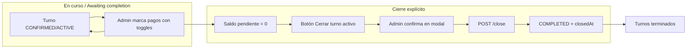

# Plan iterado: Toggle de pago y cierre de turno en Admin

## Objetivo

1. **Bug del toggle**: Al marcar un jugador como pagado, el turno no debe pasar a "turnos terminados"; solo se actualizan los datos de pago.
2. **Flujo de cierre**: El turno solo pasa a terminados cuando (a) el saldo pendiente es cero y (b) el admin cierra explícitamente con "Cerrar turno" (POST `/close`). No debe existir un botón que pase a completado sin exigir saldo ni sin acción explícita.

---

## Cambios principales

### 1. Preservar `status` y `closedAt` al aplicar respuesta del toggle (PATCH/PUT)

**Archivo:** [components/AdminTurnos.tsx](components/AdminTurnos.tsx)

- Tras el PATCH exitoso (y en el fallback PUT cuando hay 404 "Jugador no encontrado"), al hacer `setBookings` **no** reemplazar el booking por `mapped` tal cual.
- Usar el booking **del estado que se está actualizando** (`prev`) para conservar `status` y `closedAt`:
  - En el éxito del PATCH:  
  `setBookings(prev => prev.map(b => (b.id === bookingId ? { ...mapped, status: b.status, closedAt: b.closedAt ?? null } : b)))`
  - En el éxito del PUT fallback: la misma lógica con `mapped` y `b.status` / `b.closedAt`.
- Así se evita que cualquier respuesta del servidor (bug o cambio futuro) mueva el turno de sección solo por actualizar un pago. Se preserva siempre el estado de cierre del turno que ya tenía la lista.

### 2. Un solo botón de cierre: "Cerrar turno" solo con saldo en cero

**Archivo:** [components/AdminTurnos.tsx](components/AdminTurnos.tsx)

- **Eliminar** el botón "Terminar turno" que llama a `updateBookingStatus(booking.id, 'completado')` (PUT con status COMPLETED sin validar saldo).
- **Mostrar** un único botón "Cerrar turno" cuando se cumplan **todas** estas condiciones:
  - Saldo pendiente del turno = 0 (`pendingBalance === 0`).
  - Y **una** de:
    - `category === 'awaiting_completion'` (el horario del turno ya finalizó), **o**
    - `booking.status === 'completado' && !booking.closedAt` (caso legacy: turno ya marcado completado pero aún no cerrado).
- Al hacer clic: abrir el modal de confirmación existente y, al confirmar, llamar a `closeBooking(bookingId)` (POST `/api/bookings/[id]/close`). El backend ya valida que el turno haya finalizado y que no haya saldo pendiente.
- **No** mostrar "Cerrar turno" durante `in_progress` (turno aún en horario): el endpoint `/close` rechaza con "El turno aún no finalizó", así que mostrarlo solo en `awaiting_completion` evita errores y confusión.

Opcional: deshabilitar u ocultar el botón cuando `pendingBalance > 0` con tooltip: "Saldo pendiente debe ser $0 para cerrar".

### 3. Función `updateBookingStatus` y referencias

- **No** eliminar la función `updateBookingStatus` si se usa en otros flujos (p. ej. cancelar). Solo dejar de usarla para pasar a `'completado'` desde el botón "Terminar turno" (que se quita).
- Si en el código no queda ninguna llamada a `updateBookingStatus(..., 'completado')`, se puede dejar la función por si otros módulos o futuras features la usan; no es obligatorio borrarla.

---

## Huecos cubiertos en esta iteración

### 4. Rate limit (429) en el toggle

- Hoy, ante 429 se hace `return` y el **optimistic update** queda aplicado en la UI pero el servidor puede no tener el cambio; además el `finally` sí se ejecuta y se limpia `inFlightUpdates`.
- **Propuesta**: En el bloque que maneja 429, **revertir** el estado optimista con `setBookings(prev => prev.map(b => (b.id === bookingId ? previousState : b)))` y mostrar un toast tipo "Demasiadas solicitudes; reintentá en un momento". Así el usuario ve el estado real y puede volver a togglear.
- Mantener el `return` para no hacer el PATCH de nuevo en ese mismo flujo; el `finally` sigue limpiando `inFlightUpdates`.

### 5. Condición de "Cerrar turno" y backend

- El endpoint POST `/api/bookings/[id]/close` exige: (1) que el turno haya finalizado (`now >= endDateTime`), (2) saldo pendiente = 0, (3) que no esté ya COMPLETED.
- Por eso el botón "Cerrar turno" debe mostrarse solo cuando:
  - `pendingBalance === 0`, y
  - `category === 'awaiting_completion'` (horario ya terminado) **o** legacy `status === 'completado' && !closedAt`.
- No mostrar el botón en `in_progress` evita que el usuario intente cerrar antes de hora y reciba "El turno aún no finalizó".

### 6. Caso legacy (turno ya completado sin closedAt)

- Si ya existen turnos con `status === 'completado'` y `closedAt` null (p. ej. por el viejo "Terminar turno"), deben poder cerrarse con "Cerrar turno" cuando el saldo sea 0.
- Por eso la condición del botón incluye:  
`(category === 'awaiting_completion' || (booking.status === 'completado' && !booking.closedAt)) && pendingBalance === 0`.

### 7. Tests y data-testid

- Se **quita** el botón con `data-testid="admin-terminar-turno-btn-${idx + 1}"`. Cualquier test que espere ese botón debe actualizarse o eliminarse.
- El flujo de cierre pasa a depender solo del botón "Cerrar turno" (`admin-complete-btn`). Revisar tests que:
  - Simulen saldo 0 y `awaiting_completion` (o legacy completado sin closedAt) y comprueben que se puede abrir el modal y llamar a POST `/close`.
  - No dependan de hacer clic en "Terminar turno" para dejar el turno en completado.

### 8. Refetch inicial (loadBookings)

- El `useEffect` que llama a `loadBookings` hace `setBookings(mapped)` con la respuesta del GET; no toca la lógica de status/closedAt en el toggle. No hace falta cambiar el refetch; los cambios son solo en la rama de éxito del PATCH/PUT del toggle y en la visibilidad del botón de cierre.

### 9. Backend (defensivo, opcional)

- El PATCH `/api/bookings/[id]/players/position/[position]/payment` no modifica `status` ni `closedAt`; solo actualiza jugadores y `paymentStatus`. No se planean cambios de backend; el front se protege preservando `status` y `closedAt` al aplicar la respuesta. Si en el futuro alguien cambiara el backend y devolviera COMPLETED en esa ruta, el front seguiría manteniendo el status/closedAt que tenía el turno en la lista.

---

## Resumen de archivos

| Archivo                                                  | Cambio                                                                                                                                                                                                                                                                                                                                                                                                                                                                                                                                                         |
| -------------------------------------------------------- | -------------------------------------------------------------------------------------------------------------------------------------------------------------------------------------------------------------------------------------------------------------------------------------------------------------------------------------------------------------------------------------------------------------------------------------------------------------------------------------------------------------------------------------------------------------- |
| [components/AdminTurnos.tsx](components/AdminTurnos.tsx) | (1) En `togglePlayerPayment`, al aplicar respuesta PATCH y PUT fallback: merge con `{ ...mapped, status: b.status, closedAt: b.closedAt ?? null }` usando el `b` de `prev`. (2) En bloque 429 del toggle: revertir optimistic update con `previousState` y toast. (3) Quitar botón "Terminar turno". (4) Mostrar "Cerrar turno" solo cuando `pendingBalance === 0` y (`category === 'awaiting_completion'` o `(booking.status === 'completado' && !booking.closedAt)`). (5) Revisar/actualizar tests que usen `admin-terminar-turno-btn` o el flujo de cierre. |

---

## Diagrama del flujo deseado

- Toggle de pago: nunca cambia `status` ni `closedAt` en el estado local.
- Paso a "terminados" solo vía POST `/close` con saldo 0 y confirmación del admin.

