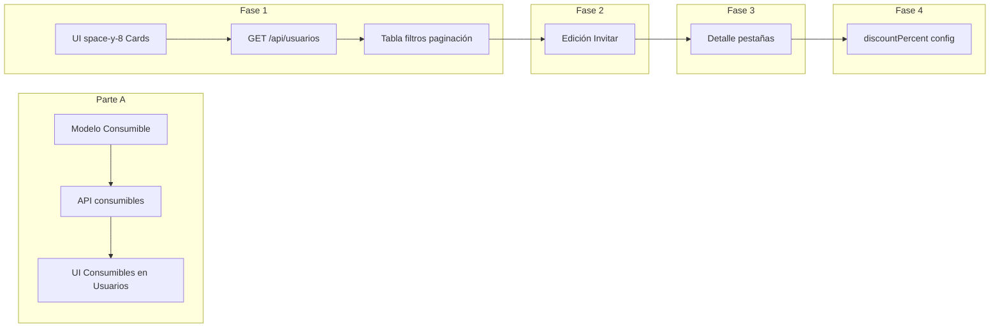

# Plan combinado: Admin Usuarios + Consumibles

Referencias:

- [docs/pasos/admin-usuarios-pendientes.md](docs/pasos/admin-usuarios-pendientes.md)
- Plan iterado Admin Usuarios + Plan Consumibles editables/activables

---

## Contexto

- **Página:** [app/admin-panel/admin/usuarios/page.tsx](app/admin-panel/admin/usuarios/page.tsx) — header con barra naranja y grid de 4 Cards; datos vía [hooks/useAnalisisUsuarios.ts](hooks/useAnalisisUsuarios.ts) desde [app/api/usuarios/analisis/route.ts](app/api/usuarios/analisis/route.ts). Hoy incluye el Card "Programa de Descuentos para Usuarios Regulares" con beneficios VIP/Premium/Regular **hardcodeados**.
- **Objetivo combinado:** (1) Completar pendientes de la pestaña Usuarios (listado paginado, CRUD, detalle, descuentos, config categorías). (2) Sustituir ese programa fijo por **Consumibles** dinámicos: ítems en BD que el admin puede crear y editar; las tarjetas de información mantienen el **estilo visual** del actual "Programa de Descuentos" (como en la captura de referencia), con las **acciones en la parte inferior** de cada tarjeta — **Editar** y **toggle Activar/Desactivar** (sin botón Eliminar), igual que en la pestaña Canchas ([app/admin-panel/admin/canchas/page.tsx](app/admin-panel/admin/canchas/page.tsx)).
- **Existente:** CRUD `user` en [app/api/crud/[...params]/route.ts](app/api/crud/[...params]/route.ts); [app/api/users/search/route.ts](app/api/users/search/route.ts); modelo User en [prisma/schema.prisma](prisma/schema.prisma).

---

## Parte A: Consumibles (sustitución del Programa de Descuentos)

Se puede implementar primero o en paralelo a la Fase 1; no depende del listado paginado de usuarios.

### A.1 Modelo de datos

En [prisma/schema.prisma](prisma/schema.prisma):

- Nuevo modelo **Consumible**: `id`, `tenantId`, `name`, `description?`, `isActive` (default true), `sortOrder` (default 0), `createdAt`, `updatedAt`; relación con Tenant.
- En **Tenant** añadir: `consumibles Consumible[]`.
- Migración: `npx prisma migrate dev --name add_consumible`.

Opcional más adelante: campo `categoria` (VIP | Premium | Regular) para agrupar consumibles por categoría.

### A.2 API Consumibles

- **GET** `app/api/consumibles/route.ts`: listar consumibles del tenant (auth ADMIN/SUPER_ADMIN; `getUserTenantIdSafe`). Query opcional `?activos=true`. Orden: `sortOrder asc`, `createdAt`.
- **POST** `app/api/consumibles/route.ts`: crear (body: `name`, `description?`, `isActive?`, `sortOrder?`). Zod; asignar `tenantId`.
- **GET** `app/api/consumibles/[id]/route.ts`: uno por id (y que pertenezca al tenant).
- **PATCH** `app/api/consumibles/[id]/route.ts`: actualizar `name`, `description`, **isActive**, `sortOrder` (usado por Switch y por formulario Editar).
- **DELETE** `app/api/consumibles/[id]/route.ts`: opcional.

Permisos: mismo criterio que análisis usuarios; Super Admin opcionalmente con `x-tenant-id`.

### A.3 UI en página Usuarios

En [app/admin-panel/admin/usuarios/page.tsx](app/admin-panel/admin/usuarios/page.tsx):

- **Quitar:** array `programaDescuentos` (líneas 60–93) y el Card "Programa de Descuentos para Usuarios Regulares" (grid de 3 columnas con beneficios fijos).
- **Añadir:** estado `consumibles`, `loadingConsumibles`, `errorConsumibles`; fetch GET `/api/consumibles` al montar.
- **Nueva sección "Consumibles" (beneficios dinámicos):**
  - **Estilo de tarjetas:** Mantener el mismo diseño visual que las tarjetas actuales de beneficios (captura de referencia): tarjeta con borde redondeado, badge/categoría, contenido de requisitos y beneficios, y **acciones en la parte inferior** de la tarjeta, en coherencia con la pestaña Canchas (donde Editar y Eliminar van al pie con `border-t`).
  - Título y descripción (ej. "Beneficios o consumibles visibles. Activa o desactiva cada uno.").
  - Botón "Nuevo consumible" → modal/sheet con nombre (obligatorio), descripción opcional, activo por defecto → POST.
  - **Lista en tarjetas:** cada consumible se muestra en una tarjeta con el estilo actual (nombre como etiqueta/título, descripción como contenido de beneficios). En la **parte inferior de cada tarjeta**: botón **Editar** (modal con nombre/descripción → PATCH) y **toggle Activar/Desactivar** (Switch para `isActive` → PATCH con `{ isActive }` y refetch). **No** incluir botón Eliminar.
  - Patrón del Switch: igual que canchas (`handleToggleActive` → PUT courts); aquí `handleToggleConsumible` → PATCH `/api/consumibles/[id]` con `{ isActive: !consumible.isActive }`.

---

## Fase 1: Alineación UI y listado paginado con filtros

### 1.1 Ajustes de UI

- Contenedor principal `space-y-6` → `space-y-8`.
- Cards de métricas: `CardHeader` + `CardTitle` + `CardContent` como en [app/admin-panel/admin/turnos/page.tsx](app/admin-panel/admin/turnos/page.tsx).
- Header: mantener "Actualizar"; en Fase 2 añadir "Invitar usuario" cuando exista el flujo.

### 1.2 GET /api/usuarios (listado paginado)

Crear **GET** `app/api/usuarios/route.ts`:

- Auth: ADMIN o SUPER_ADMIN; `getUserTenantIdSafe`; opcional `x-tenant-id` para Super Admin.
- Query (Zod): `page`, `limit`, `sortBy`, `sortOrder`, `q` (nombre/email), `categoria` (VIP|Premium|Regular), `actividad` (activos|inactivos|nuevos).
- Lógica: usuarios del tenant, `deletedAt: null`; calcular reservas, última reserva, categoría (umbrales por defecto 20/10; en Fase 4 desde config). Ordenación: por nombre/email/createdAt en DB; si `sortBy=reservas|ultimaReserva`, fetch acotado + orden en memoria + paginar.
- Respuesta: `createSuccessResponse` (message, data, meta) con `calculatePaginationMeta(page, limit, total)` de [lib/validations/common.ts](lib/validations/common.ts).

### 1.3 Tabla en la UI

- Hook `hooks/useUsuariosList.ts`: parámetros (page, limit, sortBy, sortOrder, q, categoria, actividad) → `{ data, meta, loading, error, refetch }`.
- Página: barra búsqueda (debounce), filtros categoría/actividad, tabla con cabeceras ordenables y paginación; estados loading (skeleton), empty, error (Reintentar).
- Métricas (Total, Activos, Nuevos, Retención) siguen de `useAnalisisUsuarios`.

---

## Fase 2: Gestión de usuarios (CRUD / edición y creación)

- **Edición y activar/desactivar:** PATCH `/api/crud/user/[id]` para name, fullName, email, phone, role, isActive. Validación: si `session.user.id === id`, rechazar PATCH que ponga role no ADMIN/SUPER_ADMIN o `isActive: false`. UI: por fila "Editar" (modal/sheet) y "Activar/Desactivar" (AlertDialog + PATCH).
- **Crear usuario:** POST CRUD user o POST `app/api/usuarios/invitar/route.ts` (email, name, phone?). Botón "Invitar usuario" en header que abra modal.

---

## Fase 3: Detalle de usuario

- "Ver detalle" abre modal/sheet con pestañas: **Info** (contacto, categoría, descuento), **Reservas** (GET `/api/bookings?userId=`), **Pagos/Deuda** (resumen desde bookings o GET `/api/usuarios/[id]/resumen`). Usuario: GET `/api/crud/user/[id]`.

---

## Fase 4: Descuentos y configuración de categorías

- **User.discountPercent** (Int?, migración): null = calculado; 0 = 0%; otro = override. PATCH CRUD; en edición y detalle campo "Descuento %".
- **Umbrales categorías:** SystemSetting `usuario.categoria.vip.minReservas`, `usuario.categoria.premium.minReservas`. GET/PATCH `app/api/admin/config/categorias-usuario/route.ts`; en análisis y GET usuarios usar esos umbrales. UI: bloque "Categorías de usuarios" con inputs y Guardar.

---

## Huecos tapados (resumen)

| Hueco                             | Decisión                                                                                                                                                                                                        |
| --------------------------------- | --------------------------------------------------------------------------------------------------------------------------------------------------------------------------------------------------------------- |
| CREATE usuario                    | Invitar usuario (POST CRUD o /api/usuarios/invitar); botón en header.                                                                                                                                           |
| Ordenación reservas/ultimaReserva | v1: sort por nombre/email/createdAt en DB; si sortBy reservas                                                                                                                                                   |
| Historial reservas                | GET /api/bookings?userId= (sin nuevo endpoint).                                                                                                                                                                 |
| Zod en GET /api/usuarios          | paginationSchema + q, categoria, actividad.                                                                                                                                                                     |
| Estados tabla                     | Loading, empty, error + Reintentar.                                                                                                                                                                             |
| discountPercent                   | Int?; null = calculado, 0 = 0%, otro = override.                                                                                                                                                                |
| Config categorías                 | GET/PATCH /api/admin/config/categorias-usuario.                                                                                                                                                                 |
| Super Admin tenant                | x-tenant-id en GET usuarios; selector en UI si se desea.                                                                                                                                                        |
| useUsuariosList                   | Hook con params y refetch.                                                                                                                                                                                      |
| No auto-editarse                  | PATCH user: si session.id === id y (role baja o isActive false) → 403.                                                                                                                                          |
| **Consumibles**                   | Modelo Consumible; API dedicada; en Usuarios reemplazar Card fijo por sección con tarjetas (estilo actual de beneficios); acciones al pie: Editar + toggle Activar/Desactivar (sin Eliminar); Nuevo consumible. |

---

## Huecos tapados (iteración 2)

Huecos detectados en una segunda pasada; decisiones para no dejar cabos sueltos al implementar.

| Hueco                                   | Decisión                                                                                                                                                                                                                                                                                                                  |
| --------------------------------------- | ------------------------------------------------------------------------------------------------------------------------------------------------------------------------------------------------------------------------------------------------------------------------------------------------------------------------- |
| **Consumibles: lista vacía**            | Mostrar estado vacío en la sección ("No hay consumibles") con CTA "Nuevo consumible"; no ocultar la sección.                                                                                                                                                                                                              |
| **Consumibles inactivos**               | Mostrar todos los consumibles en tarjetas (activos e inactivos). El toggle Activar/Desactivar cambia el estado; opcionalmente aplicar estilo visual distinto a inactivos (ej. opacidad o borde) como en canchas.                                                                                                          |
| **Consumibles: DELETE**                 | No implementar DELETE en v1. Un consumible creado por error se desactiva con el toggle; si más adelante se necesita borrar, añadir DELETE y confirmación en UI.                                                                                                                                                           |
| **Consumibles: descripción en tarjeta** | Mostrar `description` del consumible como contenido de "Beneficios" (texto o lista si se guarda con saltos de línea; en v1 texto plano o una sola línea). Nombre del consumible = etiqueta/badge (sustituye "VIP/Premium/Regular"). No hay "Requisitos" ni "%" por consumible en v1 salvo que se añadan campos al modelo. |
| **Consumibles: sortOrder**              | API ordena por `sortOrder asc`, `createdAt`. En v1 no hay UI para reordenar; nuevos consumibles tendrán `sortOrder: 0` y se desempatará por fecha. Reorden (drag o inputs) es mejora futura.                                                                                                                              |
| **Consumibles: loading/error**          | En loading: skeleton o mensaje "Cargando consumibles...". En error: mensaje en la sección + botón "Reintentar" que vuelva a hacer GET.                                                                                                                                                                                    |
| **Consumibles: permisos**               | Crear/editar/toggle: mismo criterio que análisis usuarios (ADMIN y SUPER_ADMIN). "Nuevo consumible" visible para todo ADMIN (no solo Super Admin), salvo que se decida restringir.                                                                                                                                        |
| **GET /api/usuarios: paginación**       | Usar `paginationSchema` de [lib/validations/common.ts](lib/validations/common.ts): default `limit: 10`, max `100`. Respuesta con `calculatePaginationMeta(page, limit, total)`.                                                                                                                                           |
| **Filtro actividad "nuevos"**           | Definir: usuarios con primera reserva o creación en los últimos 30 días (o solo `createdAt` en últimos 30 días). Dejar explícito en GET /api/usuarios para consistencia.                                                                                                                                                  |
| **Tabla usuarios: columnas**            | Mínimo: nombre, email, categoría (VIP/Premium/Regular), reservas totales, última reserva (o "Nunca"), estado (activo/inactivo), acciones (Editar, Activar/Desactivar, Ver detalle).                                                                                                                                       |
| **Invitar usuario (v1)**                | Decisión: v1 = crear usuario vía POST CRUD (email, name, phone?, role, contraseña temporal o generada). Invitación por email (enlace mágico) queda como iteración posterior si se desea.                                                                                                                                  |
| **Detalle: reservas**                   | GET `/api/bookings?userId=<id>` ya soportado ([app/api/bookings/route.ts](app/api/bookings/route.ts)); usar en pestaña Reservas del detalle.                                                                                                                                                                              |
| **Detalle: resumen Pagos/Deuda**        | Si no existe `/api/usuarios/[id]/resumen`: calcular en cliente a partir de GET bookings del usuario (totales por estado, deuda si aplica) o añadir endpoint mínimo en Fase 3.                                                                                                                                             |
| **discountPercent: validación**         | En PATCH user: `discountPercent` opcional, entero; si presente, en rango 0–100 (Zod).                                                                                                                                                                                                                                     |
| **Config categorías: keys por defecto** | Si no existen SystemSetting para el tenant: usar por defecto VIP ≥20 reservas, Premium ≥10. Keys: `usuario.categoria.vip.minReservas`, `usuario.categoria.premium.minReservas` (valor numérico en `value`).                                                                                                               |
| **Tabla en móvil**                      | Decisión: scroll horizontal de tabla o, en breakpoint pequeño, vista en cards por fila. Dejar como detalle de implementación; preferir no romper lectura.                                                                                                                                                                 |
| **Abrir detalle usuario**               | Desde la tabla de usuarios: acción "Ver detalle" (o icono/click en fila) que abre el modal/sheet con pestañas Info, Reservas, Pagos.                                                                                                                                                                                      |

---

## Orden sugerido de implementación

1. **Parte A (Consumibles):** Modelo Consumible + migración → API consumibles (GET/POST, GET/PATCH/DELETE [id]) → en página Usuarios quitar programaDescuentos y añadir sección Consumibles con tarjetas (estilo actual de beneficios; acciones al pie: Editar + toggle Activar/Desactivar; Nuevo consumible).
2. **Fase 1:** UI (space-y-8, Cards) → GET /api/usuarios → useUsuariosList → tabla con búsqueda, filtros, paginación, estados.
3. **Fase 2:** Validación no auto-editarse en CRUD PATCH user → UI Editar y Activar/Desactivar → Invitar usuario y botón en header.
4. **Fase 3:** Detalle (modal/sheet, pestañas Info / Reservas / Pagos).
5. **Fase 4:** User.discountPercent + GET/PATCH categorias-usuario + uso en análisis y listado + UI config y edición descuento.

---

## Archivos principales

| Acción     | Archivo                                                                                                                                             |
| ---------- | --------------------------------------------------------------------------------------------------------------------------------------------------- |
| Modificar  | [prisma/schema.prisma](prisma/schema.prisma): modelo Consumible, relación Tenant; luego User.discountPercent (Fase 4)                               |
| Crear      | `app/api/consumibles/route.ts` (GET, POST)                                                                                                          |
| Crear      | `app/api/consumibles/[id]/route.ts` (GET, PATCH, DELETE opcional)                                                                                   |
| Modificar  | [app/admin-panel/admin/usuarios/page.tsx](app/admin-panel/admin/usuarios/page.tsx): quitar programaDescuentos; sección Consumibles; luego Fases 1–4 |
| Crear      | `app/api/usuarios/route.ts` (GET listado paginado)                                                                                                  |
| Crear      | `hooks/useUsuariosList.ts`                                                                                                                          |
| Opcional   | `app/api/usuarios/invitar/route.ts`, `app/api/usuarios/[id]/resumen/route.ts`                                                                       |
| Crear      | `app/api/admin/config/categorias-usuario/route.ts`                                                                                                  |
| Ajustar    | [app/api/usuarios/analisis/route.ts](app/api/usuarios/analisis/route.ts) (umbrales Fase 4)                                                          |
| Ajustar    | [app/api/crud/[...params]/route.ts](app/api/crud/[...params]/route.ts) (no auto-editarse en PATCH user)                                             |
| Reutilizar | GET [app/api/bookings/route.ts](app/api/bookings/route.ts) (userId), CRUD user                                                                      |

---

## Consideraciones

- **Multitenant:** Todo por `tenantId`; Super Admin con `x-tenant-id` o selector si se implementa.
- **Permisos:** Solo ADMIN y SUPER_ADMIN; no auto-editarse (rol/isActive).
- **UI:** Componentes [components/ui](components/ui); estilos alineados con Turnos/Torneos y Canchas. Tarjetas de consumibles/beneficios: mismo estilo visual que las actuales; acciones al pie de la tarjeta (Editar + toggle Activar/Desactivar, sin Eliminar).

