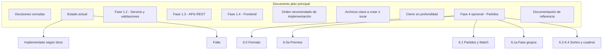

# Plan 6ª parte – Sección de torneos (iteración 2)

Objetivo: **actualizar únicamente el documento del plan principal** según [docs/pasos/6-parte-de-seccion-de-torneos.md](docs/pasos/6-parte-de-seccion-de-torneos.md). Sin cambios de código.

---

## Entregable único

| Qué | Detalle |
|-----|---------|
| **Archivo** | Plan principal "Completar sección Admin Torneos". Nombre sugerido: `completar-seccion-admin-torneos.plan.md` en `.cursor/plans/` (el doc original cita `completar_sección_admin_torneos_6e0880ec.plan.md`; no existe en repo). |
| **Acción** | Si no existe: crear el archivo con la estructura abajo y rellenar con el contenido indicado en el paso 6. Si existe: aplicar solo las ediciones (parches) por sección. |
| **Fuente** | Especificación literal en [6-parte-de-seccion-de-torneos.md](docs/pasos/6-parte-de-seccion-de-torneos.md); detalles de implementado en los tres docs de [docs/actualizaciones/](docs/actualizaciones/). |

---

## Estructura obligatoria del plan principal

El documento debe contener (en este orden) las secciones que se van a tocar:

---

## Orden de ejecución (pasos concretos)

### Paso 1 – Crear o localizar el plan principal

- Buscar en `.cursor/plans/` un archivo que sea el plan "Completar sección Admin Torneos" (por nombre o por contenido: Fase 1.2, Decisiones cerradas, etc.).
- Si **no existe**: crear `completar-seccion-admin-torneos.plan.md` con las secciones: Decisiones cerradas, Estado actual, Fase 1.2, 1.3, 1.4, Orden recomendado, Archivos clave, Cierre en profundidad, Fase 4 (opcional), Documentación de referencia. Rellenar con contenido base coherente con [admin-torneos-pendientes.md](docs/pasos/admin-torneos-pendientes.md) y con lo que el paso 6 pide cambiar.
- Si **existe**: seguir con el Paso 2 y aplicar solo las ediciones indicadas.

### Paso 2 – Corregir decisión Super admin

- **Fase 1.2:** Reemplazar cualquier redacción del tipo "super admin no crea torneos" por: *"Solo admin del tenant o super admin (con tenant seleccionado) pueden crear/editar torneos."*
- **Fase 1.3:** En la parte de GET/POST torneos, añadir: el super admin puede crear torneos enviando `tenantId` en el body; la API valida con `canAccessTenant`.
- **Tabla Decisiones cerradas:** En la fila "Super admin" poner: *"**Sí puede crear torneos** (debe seleccionar el club en el formulario; la API acepta `tenantId` y valida con `canAccessTenant`). También puede gestionar inscripciones en cualquier torneo al que tenga acceso."*

### Paso 3 – Actualizar "Estado actual"

- **Nuevo subapartado "Implementado (según docs)":**
  - Formulario: Paso 1 (Parejas máximas, min ≤ max), Paso 2 (Confirmar Horarios con inicio/cierre), vista previa cronograma, Paso 3 (Volver al paso anterior). Referencia: [admin-torneos-formulario-2026-02.md](docs/actualizaciones/admin-torneos-formulario-2026-02.md).
  - Super admin e inscripciones: crear torneos (selector club, POST `tenantId`), gestionar inscripciones (GET/POST/PATCH/DELETE), UI (selector, error + Reintentar, cupo completo, deshabilitar Agregar). Referencia: [admin-torneos-superadmin-inscripciones-2026-02.md](docs/actualizaciones/admin-torneos-superadmin-inscripciones-2026-02.md).
  - Landing y menú: login → `/`, header con menú (Ir a mi club, Panel Super Admin, Cerrar sesión), Reservar Ahora condicional. Referencia: [landing-login-menu-usuario-2026-02.md](docs/actualizaciones/landing-login-menu-usuario-2026-02.md).
- **Subapartado "Falta":** Dejar únicamente: CourtBlock e integración en disponibilidad; cancelación de reservas con aviso; edición/eliminación de torneos (PATCH/DELETE y recálculo CourtBlocks); publicación (OPEN_REGISTRATION + `publishedAt`); listado público si aplica; Fase 4 opcional. Eliminar de "Falta" todo lo ya cubierto por los docs (modelo base, APIs base, quitar mock, wizard conectado, inscripciones, selector super admin, UI inscripciones).

### Paso 4 – Ajustar Fase 1.4 y Orden recomendado

- **Fase 1.4:** Escribir que está hecha (fetch GET/POST, handlePublish a API, estados vacío/error) y que las mejoras están en los docs citados.
- **Orden recomendado:** Marcar como **hechos** puntos 1–4 y la parte ya hecha del punto 6. Marcar como **pendientes**: punto 5 (CourtBlock, cancelar reservas, availability, liberación, PATCH con recálculo); resto de publicación/listado; edición/eliminación; Fase 4.

### Paso 5 – Archivos clave y Cierre

- **Archivos clave:** Indicar que los archivos de API y UI para super admin e inscripciones se listan en [admin-torneos-superadmin-inscripciones-2026-02.md](docs/actualizaciones/admin-torneos-superadmin-inscripciones-2026-02.md). Opcional: fila "Landing / Login" con `middleware.ts`, `app/login/page.tsx`, `app/page.tsx`, `components/LandingPage.tsx` y enlace a [landing-login-menu-usuario-2026-02.md](docs/actualizaciones/landing-login-menu-usuario-2026-02.md).
- **Cierre en profundidad:** En vista detalle torneo y UI: nota de que la gestión de inscripciones y el selector de club para super admin están implementados según los docs.

### Paso 6 – Documentación de referencia

- Sección **Documentación de referencia** con exactamente estos tres enlaces:
  - [admin-torneos-formulario-2026-02.md](docs/actualizaciones/admin-torneos-formulario-2026-02.md)
  - [admin-torneos-superadmin-inscripciones-2026-02.md](docs/actualizaciones/admin-torneos-superadmin-inscripciones-2026-02.md)
  - [landing-login-menu-usuario-2026-02.md](docs/actualizaciones/landing-login-menu-usuario-2026-02.md)

### Paso 7 – Expandir Fase 4

Sustituir la Fase 4 (opcional) por subsecciones con este contenido:

| Subsección | Contenido mínimo |
|------------|------------------|
| **6.0 Formato en Paso 1** | Selector "Formato del torneo": Eliminatoria directa \| Fase de grupos + Doble Eliminatoria. Modelo: `tournamentFormat`. |
| **6.0a Premios** | Monetario sí/no (`prizeIsMonetary`). Si doble liga: premios Liga de Oro (1er/2do) y Liga de Plata (1er/2do), por separado. |
| **6.1 Partidos** | Entidad Match (ronda, grupo si aplica, posición, resultado). Eliminatoria: rondas + byes. Grupos + doble eliminatoria: ver 6.1a. API/servicio para generar fixture. |
| **6.1a Fase de grupos** | N grupos aleatorios; Round Robin por grupo; 2 mejores → Liga de Oro, 2 peores → Liga de Plata. |
| **6.2 Sorteo** | Algoritmo (ej. aleatorio); admin dispara desde UI "Realizar sorteo". |
| **6.3 minPairs** | Sorteo permitido si `currentPairs >= minPairs`; validación en backend; UI con mensaje y botón habilitado. |
| **6.4 Cuadros** | Vista Fixture/Cuadro con bracket; si no hay sorteo, mensaje y botón "Realizar sorteo". Incluir diagrama mermaid (cuartos → semifinales → final). |

Añadir en el plan: **Archivos clave Fase 4** (Paso 1 en torneos page, Prisma formato/premios/grupos, componente bracket, API/servicio sorteo y fixture) y **Orden recomendado Fase 4** (modelo → UI Paso 1 → Match + fixture → grupos + Round Robin → API sorteo → UI sorteo → UI cuadro).

### Paso 8 – Verificación

- Revisar con la tabla "Resumen de ediciones en el plan" al final de [6-parte-de-seccion-de-torneos.md](docs/pasos/6-parte-de-seccion-de-torneos.md).
- Confirmar que no se ha modificado ningún archivo de código.

---

## Checklist final (verificación)

| # | Sección | Hecho |
|---|---------|-------|
| 1 | Decisiones cerradas – Super admin | □ |
| 2 | Fase 1.2 y 1.3 – Super admin creador | □ |
| 3 | Estado actual – Implementado (según docs) | □ |
| 4 | Estado actual – Falta reducido | □ |
| 5 | Fase 1.4 – Marcada hecha | □ |
| 6 | Orden recomendado – Hechos 1–4 y parte 6 | □ |
| 7 | Archivos clave + Cierre | □ |
| 8 | Documentación de referencia (3 enlaces) | □ |
| 9 | Fase 4 – Formato, premios, partidos, sorteo, cuadros | □ |
| 10 | Archivos clave y Orden Fase 4 | □ |

---

## Resumen de la iteración

- **Iteración 1:** Plan con bloques de contenido por sección y aclaración de archivo objetivo.
- **Iteración 2:** Orden de ejecución paso a paso (1–8), estructura del documento en diagrama, entregable único explícito y checklist de verificación para no dejar ninguna edición sin aplicar.
