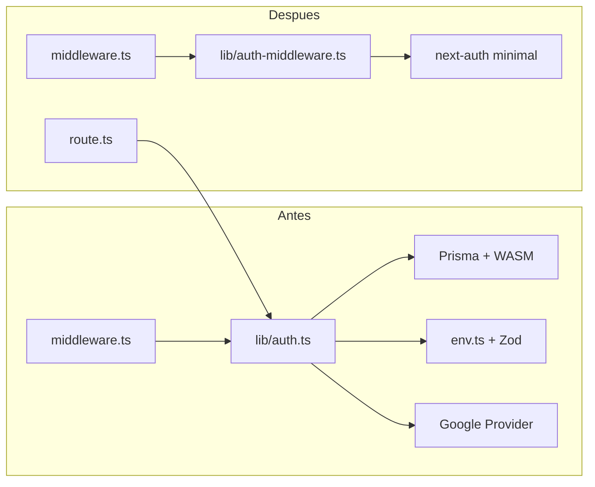

# Plan: Refactorización Auth Middleware (Reducir Bundle < 1 MB)

## Contexto

- **Problema**: La Edge Function del middleware pesa ~1.03 MB (límite Vercel Hobby: 1 MB).
- **Causa**: `middleware.ts` importa `auth` desde `lib/auth.ts`, que arrastra:
  - Prisma (WASM ~2.2 MB)
  - Zod (vía `lib/config/env.ts`)
  - Google provider, callbacks con DB, etc.
- **Solución**: Crear `lib/auth-middleware.ts` con **solo** lo necesario para validar JWT en Edge: `secret` + `session` callback idéntico al de `lib/auth.ts`.



---

## Fase 0: Baseline y preparación

1. **Ejecutar build y verificar tamaño actual**:

```bash
npm run build
node scripts/check-middleware-size.js
```

   Documentar el tamaño gzip actual para comparar después.

2. **Agregar script de verificación en `package.json`** (opcional pero recomendado):

```json
"check-middleware": "node scripts/check-middleware-size.js"
```

3. **Ejecutar tests relevantes** para tener baseline de éxito:
  - `npm run test:unit` (Jest)
  - `npm run test:e2e tests/e2e/auth.spec.ts tests/e2e/admin-autenticacion.spec.ts`

---

## Fase 1: Crear `lib/auth-middleware.ts`

Crear archivo nuevo con configuración mínima:

- Importar solo `next-auth` y `NextAuthConfig`
- Usar `process.env.NEXTAUTH_SECRET` directamente (no importar `env.ts` ni Zod)
- Callback `session` **idéntico** al de `lib/auth.ts` líneas 337-349:
  - `session.user.id`, `role`, `isAdmin`, `isSuperAdmin`, `tenantId`
- Opcional: declarar los mismos tipos de `Session`/`User` vía `declare module` para consistencia TypeScript, o importar solo los tipos si existe un archivo de tipos compartidos sin dependencias pesadas.

**Contenido esperado** (según doc):

```typescript
import NextAuth from "next-auth"
import type { NextAuthConfig } from "next-auth"

const config = {
  secret: process.env.NEXTAUTH_SECRET,
  trustHost: true,
  callbacks: {
    session({ session, token }) {
      if (session.user) {
        session.user.id = (token.sub as string) || session.user.id
        session.user.role = (token.role as 'USER' | 'ADMIN' | 'SUPER_ADMIN') || 'USER'
        session.user.isAdmin = Boolean(token.isAdmin)
        session.user.isSuperAdmin = Boolean(token.isSuperAdmin)
        session.user.tenantId = (token.tenantId as string | null) || null
      }
      return session
    },
  },
} satisfies NextAuthConfig

export const { auth } = NextAuth(config)
```

- **No modificar** `lib/auth.ts` ni `app/api/auth/[...nextauth]/route.ts`: siguen usando `handlers` desde `lib/auth`.

---

## Fase 2: Cambiar import en `middleware.ts`

En `middleware.ts`, línea 8:

```diff
- import { auth } from "./lib/auth"
+ import { auth } from "./lib/auth-middleware"
```

El resto del middleware permanece igual.

---

## Fase 3: Build y verificación de tamaño

1. `npm run build`
2. `node scripts/check-middleware-size.js`
3. Verificar salida: `Dentro del límite`. Si sigue excediendo: `ANALYZE=true npm run build` y revisar qué sigue entrando en el bundle.

---

## Fase 4: Pruebas

### Tests automatizados

- `npm run test:unit`
- `npm run test:e2e tests/e2e/auth.spec.ts`
- `npm run test:e2e tests/e2e/admin-autenticacion.spec.ts`

### Checklist manual (según doc)

| Acción                                              | Resultado esperado                             |
| --------------------------------------------------- | ---------------------------------------------- |
| Sin login, ir a `/dashboard`                        | Redirección a `/login`                         |
| Login con Google                                    | Sesión creada, redirección correcta            |
| Usuario normal → `/admin-panel`                     | Redirección a `/auth/error?error=AccessDenied` |
| Admin → `/admin-panel`                              | Acceso permitido                               |
| Super admin → `/super-admin`                        | Acceso permitido                               |
| Usuario con tenant → `/dashboard`                   | Acceso permitido                               |
| Usuario sin tenant en `/dashboard` (sin tenantSlug) | Redirección a `/`                              |
| APIs públicas (`/api/courts`, etc.)                 | Sin login, 200 OK                              |
| Club público (`/club/[slug]`)                       | Sin login, acceso permitido                    |

---

## Fase 5: Deploy y validación

1. Commit, push, deploy en Vercel.
2. Confirmar que el deploy no reporta error de límite 1 MB.
3. Repetir pruebas críticas en producción/staging si corresponde.

---

## Rollback rápido

Si algo falla:

1. Revertir el import en `middleware.ts`:

```typescript
import { auth } from "./lib/auth"
```

2. Eliminar `lib/auth-middleware.ts` si se creó.

No hay cambios en base de datos ni en la API; el rollback es solo de código.

---

## Archivos involucrados

| Archivo                               | Acción                                      |
| ------------------------------------- | ------------------------------------------- |
| `lib/auth-middleware.ts`              | Crear (nuevo)                               |
| `middleware.ts`                       | Cambiar 1 línea (import)                    |
| `lib/auth.ts`                         | Sin cambios                                 |
| `app/api/auth/[...nextauth]/route.ts` | Sin cambios                                 |
| `package.json`                        | Opcional: agregar script `check-middleware` |

---

## Huecos detectados y mitigaciones

### 1. Importación exclusiva de `auth-middleware`
**Mitigación:** Añadir comentario de advertencia en `auth-middleware.ts`: "Solo para middleware. NO importar en rutas API, layouts ni componentes." Verificar con grep que solo `middleware.ts` lo importa.

### 2. Variables de entorno en Edge
**Mitigación:** En Vercel, confirmar que `NEXTAUTH_SECRET` está definida y se incluye en el entorno Edge.

### 3. Compatibilidad de cookies
**Mitigación:** No configurar cookies en `auth-middleware`; NextAuth usa las mismas convenciones por defecto.

### 4. Estrategia de sesión JWT
**Mitigación:** `auth-middleware` no define `session.strategy`; sin adapter, NextAuth v5 usa JWT por defecto. Comportamiento compatible.

### 5. Tipos TypeScript
**Mitigación:** La ampliación es global en `lib/auth.ts`, así que `middleware.ts` y `auth-middleware.ts` ya tienen esos tipos.

---

## Orden de ejecución resumido

1. Baseline: build + check-middleware-size + tests
2. Crear `lib/auth-middleware.ts` (incluyendo comentario de uso exclusivo)
3. Cambiar import en `middleware.ts`
4. Build + check-middleware-size
5. `grep -r "auth-middleware"` para confirmar que solo `middleware.ts` lo importa
6. Tests unitarios y e2e
7. Pruebas manuales según checklist
8. Deploy y verificación final
