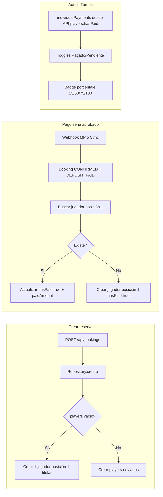

# Plan unificado: Reflejar seña en Admin Turnos (toggles y porcentaje)

Este plan combina:

1. **Reflejar la seña en Admin Turnos:** que el estado de pago de la seña (pagado por el usuario vía Mercado Pago o sincronizado) sea visible en el panel de administración de turnos.
2. **Reflejar el pago en toggles y porcentaje:** que los toggles de pago por jugador muestren "Pagado" cuando corresponda, y que se muestre el porcentaje pagado (25%, 50%, 75%, 100%) según la regla: **25% = solo titular, 50% = titular + jugador 2, 75% = titular + 2 + 3, 100% = los cuatro**.

---

## Contexto del problema

- **Lo que ya funciona:** El botón "Terminar turno" pasa correctamente el turno a confirmados/completados. La etiqueta "Seña Pagada" en Mis Turnos se muestra cuando `paymentStatus === 'Deposit Paid'`.
- **Problema:** En Admin Turnos, los **toggles de pago por jugador** (Pagado/Pendiente) no reflejan que el titular ya pagó la seña. Eso ocurre porque:
  - Al aprobar el pago en Mercado Pago (webhook o sync), solo se actualiza `Booking.paymentStatus` a `DEPOSIT_PAID`; **no** se actualiza `BookingPlayer.hasPaid` para el jugador en posición 1 (titular).
  - En [AdminTurnos.tsx](components/AdminTurnos.tsx) los toggles se construyen desde `apiBooking.players[].hasPaid` (líneas 241-246). Si ningún jugador tiene `hasPaid`, todos muestran "Pendiente".
- Además, si la reserva se crea **sin** enviar `players` (flujo usuario desde el modal), el [BookingRepository](lib/repositories/BookingRepository.ts) no crea ningún `BookingPlayer`, por lo que no hay a quién marcar como pagado al confirmar la seña.

---

## Huecos cubiertos (detalle de implementación)

- **H1 – Webhook: incluir `user`:** En el `findUnique` del booking en [BookingWebhookHandler.ts](lib/services/payments/BookingWebhookHandler.ts) añadir `user: { select: { name: true } }`. Usar `booking.user?.name ?? 'Titular'` al crear el jugador.
- **H2 – Webhook: caso pago tardío:** En la transacción donde se reactiva la reserva CANCELLED (pago aprobado pero llegó tarde), aplicar la misma lógica: buscar jugador position 1 → update o create con hasPaid + paidAmount.
- **H3 – Idempotencia:** Siempre "buscar jugador position 1; si existe update, si no create". Así webhook o sync repetidos no fallan ni crean duplicados (unique `bookingId`+`position`).
- **H4 – Titular en todas las reservas sin players:** Si **cualquier** creación (usuario o admin) no envía `players` o envía array vacío, crear jugador posición 1 con nombre del usuario de la reserva.
- **H5 – paidAmount en centavos:** `paidAmount = booking.depositAmount > 0 ? booking.depositAmount : Math.round(booking.totalPrice / 4)` (todo en centavos).
- **H6 – Sync: incluir `user`** en el findUnique del booking y misma lógica jugador dentro del mismo `$transaction`.
- **H7 – API:** GET bookings y getBookingById ya incluyen players con hasPaid/paidAmount; no requiere cambios.
- **H8 – Fallo jugador:** Si la update/create del jugador falla, decidir: rollback completo (reserva sigue PENDING) o catch + log y commit de booking+payment (recomendado para no bloquear la confirmación).
- **H9 – Opcional:** Script o endpoint para reservas con `paymentStatus = DEPOSIT_PAID` sin jugador en posición 1 con hasPaid; crear o actualizar jugador 1 con hasPaid y paidAmount.

---

## 1. Marcar titular como pagado cuando se confirma la seña

**Objetivo:** Cuando el pago de la seña se aprueba (webhook MP o sync), marcar el jugador en **posición 1 (titular)** como `hasPaid: true` y `paidAmount` proporcional. Si no existe ese jugador, crearlo.

**Archivos:**

- **[lib/services/payments/BookingWebhookHandler.ts](lib/services/payments/BookingWebhookHandler.ts)**  
  - Incluir `user: { select: { name: true } }` en el `findUnique` del booking (H1).
  - En la transacción del flujo normal (pago aprobado + reserva PENDING): tras actualizar Booking y crear Payment, buscar jugador con `bookingId` y `position: 1`; si existe update `hasPaid: true` y `paidAmount`; si no existe create con `playerName: booking.user?.name ?? 'Titular'` (H3, H5).
  - En la transacción del **pago tardío** (reserva CANCELLED reactivada): misma lógica de jugador dentro de esa transacción (H2).
  - paidAmount en centavos: `booking.depositAmount > 0 ? booking.depositAmount : Math.round(booking.totalPrice / 4)` (H5). Opcional: si falla solo la update/create del jugador, catch + log sin re-lanzar para no hacer rollback de booking+payment (H8).
- **[app/api/bookings/[id]/sync-payment-status/route.ts](app/api/bookings/[id]/sync-payment-status/route.ts)**  
  - Incluir `user: { select: { name: true } }` en el findUnique del booking (H6).
  - Dentro del mismo `$transaction`: tras actualizar Booking y crear Payment, misma lógica jugador (find position 1 → update or create). paidAmount en centavos igual que arriba. Idempotencia (H3). Opcional mismo criterio de rollback (H8).

**Nota:** `paidAmount` y `totalPrice`/`depositAmount` en BD están en centavos ([lib/utils/currency.ts](lib/utils/currency.ts)).

---

## 2. Asegurar que exista titular al crear la reserva (H4)

**Objetivo:** Cualquier reserva creada sin `players` (o con array vacío), ya sea por usuario o por admin, debe tener al menos un jugador en posición 1 (titular), para que al pagar la seña haya a quién marcar.

**Recomendado:** En [lib/services/BookingService.ts](lib/services/BookingService.ts) (método `createBooking`): si `input.players` está vacío o no definido, obtener nombre del usuario (`prisma.user.findUnique({ where: { id: userId }, select: { name: true } })`) y construir `players: [{ playerName: nombreDelUsuario ?? 'Titular', position: 1 }]` antes de llamar al repository. Alternativa: en [lib/repositories/BookingRepository.ts](lib/repositories/BookingRepository.ts) (método `create`), si `data.players` es vacío o no definido, dentro de la transacción crear un `BookingPlayer` con `bookingId`, `position: 1`, `playerName` desde User por `data.userId` (o "Titular").

---

## 3. Mostrar porcentaje pagado en Admin Turnos (25% / 50% / 75% / 100%)

**Objetivo:** Mostrar de forma explícita el porcentaje pagado según cantidad de jugadores con `hasPaid`: 1 → 25%, 2 → 50%, 3 → 75%, 4 → 100%.

**Archivo:** [components/AdminTurnos.tsx](components/AdminTurnos.tsx).

- En la sección expandida "Jugadores y Pagos Individuales" (o en el encabezado de la tarjeta del turno), calcular:
  - `paidCount = Object.values(booking.individualPayments).filter(s => s === 'pagado').length`
  - Porcentaje: `paidCount === 0 ? 0 : (paidCount * 25)` (25, 50, 75, 100).
- Mostrar un badge o texto: "0% pagado", "25% pagado", "50% pagado", "75% pagado" o "100% pagado".
- Ubicación sugerida: encima de la grilla de jugadores, junto al título "Jugadores y Pagos Individuales".

Con los cambios de los puntos 1 y 2, los toggles pasarán a mostrar "Pagado" para el titular cuando la seña esté pagada; el badge de porcentaje dará el resumen visual.

---

## Flujo resumido

---

## Orden sugerido de tareas

1. Webhook: incluir user en findUnique; en flujo normal y en pago tardío, lógica idempotente jugador 1 (find → update or create); paidAmount en centavos; opcional no rollback si solo falla jugador.
2. Sync-payment-status: incluir user en findUnique; misma lógica jugador en la transacción; idempotencia y paidAmount en centavos.
3. Crear reserva: si players vacío o ausente, crear jugador posición 1 (titular) con nombre del usuario (BookingService o Repository).
4. AdminTurnos: badge porcentaje (0/25/50/75/100%) junto a "Jugadores y Pagos Individuales".
5. Opcional (H9): script o endpoint para reservas con DEPOSIT_PAID sin jugador marcado.

---

## Archivos clave

| Área                      | Archivo                                                                                                                                           |
| ------------------------- | ------------------------------------------------------------------------------------------------------------------------------------------------- |
| Webhook pago MP           | [lib/services/payments/BookingWebhookHandler.ts](lib/services/payments/BookingWebhookHandler.ts)                                                  |
| Sync pago desde MP        | [app/api/bookings/[id]/sync-payment-status/route.ts](app/api/bookings/[id]/sync-payment-status/route.ts)                                          |
| Crear reserva (jugadores) | [lib/repositories/BookingRepository.ts](lib/repositories/BookingRepository.ts) o [lib/services/BookingService.ts](lib/services/BookingService.ts) |
| UI toggles y %            | [components/AdminTurnos.tsx](components/AdminTurnos.tsx)                                                                                          |

---

## Notas

- No es necesario cambiar `depositConfirmPercent` ni `deposit_percentage`: el primero se usa para auto-confirmar la reserva cuando el total pagado por jugadores alcanza ese %; el segundo define cuánto se cobra de seña.
- La API de listado y detalle de reservas ya incluye `players` con `hasPaid` y `paidAmount` (H7); AdminTurnos ya puede armar `individualPayments` y el badge.
- La regla 25% = 1 jugador, 50% = 2, etc. es de **visualización** y consistencia con los toggles. Si el tenant cobra 50% de seña y el titular paga ese 50% por MP, al marcar solo al titular como "pagado" el badge mostrará "25% pagado" (1 de 4 jugadores). Opcionalmente se puede en el futuro añadir un concepto aparte tipo "Seña pagada" además del % por jugador.
- Reservas existentes con DEPOSIT_PAID pero sin jugador marcado: opcional migración (H9) para no depender de que el admin marque manualmente.

