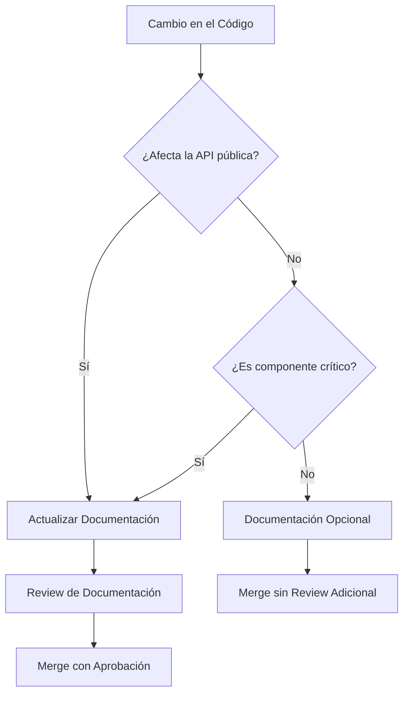

# Documentación del Proyecto Turnero de Padel

Bienvenido a la documentación técnica del sistema de turnos para canchas de padel. Esta carpeta contiene toda la documentación interna del proyecto, incluyendo estándares, plantillas y guías para desarrolladores.

## 📁 Estructura de la Documentación

```
docs/
├── README.md                           # Este archivo - Índice principal
├── MULTITENANT_COMPLETE.md            # ⭐ Documentación completa multitenant
├── ROLLBACK_MULTITENANT.md            # Guía de rollback multitenant
├── REVISION_APIS_MULTITENANT.md       # Revisión de APIs multitenant
├── REVISION_SUPER_ADMIN_PANEL.md      # Revisión del panel super admin
├── DOCUMENTATION-STANDARDS.md          # Estándares de documentación
├── FRONTEND_PROTECTION_POLICIES.md     # Políticas de protección del frontend
├── frontend-interfaces-report.md       # Reporte detallado de interfaces del frontend
├── technical-interfaces-specification.md # Especificación técnica de interfaces
├── templates/                          # Plantillas de documentación
│   ├── COMPONENT-TEMPLATE.md           # Plantilla para componentes React
│   ├── API-TEMPLATE.md                 # Plantilla para APIs y endpoints
│   ├── SERVICE-TEMPLATE.md             # Plantilla para servicios y utilidades
│   └── HOOK-TEMPLATE.md                # Plantilla para hooks personalizados
├── architecture/                       # Documentación de arquitectura
├── api/                               # Documentación de APIs
├── components/                        # Documentación de componentes
├── services/                          # Documentación de servicios
└── guides/                            # Guías y tutoriales
```

## 🎯 Propósito de la Documentación

Esta documentación tiene como objetivo:

- **Facilitar el onboarding** de nuevos desarrolladores
- **Mantener consistencia** en el código y arquitectura
- **Documentar decisiones técnicas** y patrones utilizados
- **Proporcionar referencias rápidas** para el equipo de desarrollo
- **Establecer estándares** de calidad y mejores prácticas

## 🏢 Documentación Multitenant

El sistema utiliza una arquitectura multitenant. Para información completa, consulta:

- **[Documentación Completa Multitenant](./MULTITENANT_COMPLETE.md)** - ⭐ Guía completa del sistema multitenant, incluyendo arquitectura, modelo de datos, migración, rollback, testing y operación
- **[Rollback Multitenant](./ROLLBACK_MULTITENANT.md)** - Guía para revertir la migración multitenant si es necesario
- **[Revisión APIs Multitenant](./REVISION_APIS_MULTITENANT.md)** - Detalle de todas las APIs actualizadas para soportar multitenancy
- **[Revisión Panel Super Admin](./REVISION_SUPER_ADMIN_PANEL.md)** - Documentación del panel de super administración

## 🖥️ Documentación de Interfaces del Frontend

### 📊 [Reporte de Interfaces](./frontend-interfaces-report.md)

Reporte completo y detallado de las interfaces principales del sistema:
- **Dashboard de Usuario** (`/dashboard`): Interfaz para usuarios finales
- **Panel de Administración** (`/admin`): Interfaz administrativa
- Análisis comparativo de funcionalidades
- Componentes y tecnologías utilizadas
- Flujos de navegación y UX

### 🔧 [Especificación Técnica](./technical-interfaces-specification.md)

Documentación técnica detallada que incluye:
- Arquitectura de rutas y componentes
- Diagramas de flujo y secuencia
- Interfaces TypeScript y estructuras de datos
- Integración con backend y APIs
- Estrategias de performance y optimización
- Cobertura de testing y métricas de calidad

### 🛡️ [Políticas de Protección](./FRONTEND_PROTECTION_POLICIES.md)

Documento que define:
- Archivos y componentes protegidos
- Rutas de usuario vs. administrativas
- Procesos de autorización para modificaciones
- Separación de responsabilidades entre interfaces

## 📋 Estándares de Documentación

Antes de contribuir con documentación, por favor revisa nuestros [Estándares de Documentación](./DOCUMENTATION-STANDARDS.md) que incluyen:

- Convenciones JSDoc para componentes y funciones
- Estándares de arquitectura y comentarios
- Herramientas recomendadas
- Criterios de calidad

## 📝 Plantillas Disponibles

### 🧩 [Plantilla de Componentes](./templates/COMPONENT-TEMPLATE.md)

Usa esta plantilla para documentar:
- Componentes React
- Props y estados
- Hooks utilizados
- Ejemplos de uso
- Tests y casos de uso

### 🔌 [Plantilla de APIs](./templates/API-TEMPLATE.md)

Usa esta plantilla para documentar:
- Endpoints de la API
- Parámetros y respuestas
- Códigos de estado
- Ejemplos de requests/responses
- Validaciones y reglas de negocio

### ⚙️ [Plantilla de Servicios](./templates/SERVICE-TEMPLATE.md)

Usa esta plantilla para documentar:
- Servicios y utilidades
- Clases y managers
- Configuración y dependencias
- Ciclo de vida y estados
- Performance y optimizaciones

### 🪝 [Plantilla de Hooks](./templates/HOOK-TEMPLATE.md)

Usa esta plantilla para documentar:
- Hooks personalizados
- Parámetros y valores de retorno
- Estados internos
- Ejemplos de uso
- Performance y optimizaciones

## 🚀 Cómo Usar las Plantillas

1. **Selecciona la plantilla apropiada** según el tipo de código que vas a documentar
2. **Copia la plantilla** a la ubicación correspondiente en la estructura de documentación
3. **Renombra el archivo** siguiendo las convenciones de nomenclatura
4. **Completa todas las secciones** relevantes de la plantilla
5. **Revisa y valida** que la documentación cumple con los estándares

### Convenciones de Nomenclatura

- **Componentes**: `ComponentName.md`
- **APIs**: `endpoint-name.md` o `api-group.md`
- **Servicios**: `ServiceName.md`
- **Hooks**: `useHookName.md`

### Ubicación de Archivos

```
docs/
├── components/
│   ├── CourtCard.md
│   ├── BookingForm.md
│   └── UserProfile.md
├── api/
│   ├── auth-endpoints.md
│   ├── booking-endpoints.md
│   └── court-endpoints.md
├── services/
│   ├── AuthService.md
│   ├── BookingService.md
│   └── NotificationService.md
└── hooks/
    ├── useAuth.md
    ├── useBookings.md
    └── useCourts.md
```

## 🏗️ Arquitectura del Sistema

### Stack Tecnológico

- **Frontend**: Next.js 14, React 18, TypeScript
- **Backend**: Next.js API Routes, Prisma ORM
- **Base de Datos**: PostgreSQL (migración desde SQLite)
- **Autenticación**: NextAuth.js con Google OAuth
- **Estilos**: Tailwind CSS
- **Testing**: Jest, React Testing Library

### Patrones Arquitectónicos

- **Component-Based Architecture**: Componentes reutilizables y modulares
- **Custom Hooks Pattern**: Lógica de estado encapsulada
- **Service Layer Pattern**: Servicios para lógica de negocio
- **Repository Pattern**: Abstracción de acceso a datos
- **API-First Design**: APIs bien definidas y documentadas

## 📊 Métricas de Documentación

### Objetivos de Cobertura

- **Componentes críticos**: 100% documentados
- **APIs públicas**: 100% documentadas
- **Servicios principales**: 100% documentados
- **Hooks personalizados**: 100% documentados
- **Funciones utilitarias**: 80% documentadas

### Indicadores de Calidad

- ✅ **Completitud**: Todas las secciones relevantes completadas
- ✅ **Precisión**: Información actualizada y correcta
- ✅ **Claridad**: Explicaciones claras y ejemplos útiles
- ✅ **Consistencia**: Sigue los estándares establecidos
- ✅ **Mantenimiento**: Actualizada con los cambios del código

## 🔄 Proceso de Mantenimiento

### Responsabilidades

1. **Desarrolladores**: Documentar nuevo código y actualizar documentación existente
2. **Code Reviewers**: Verificar que los PRs incluyan documentación apropiada
3. **Tech Lead**: Revisar y aprobar cambios en estándares de documentación
4. **QA**: Validar que la documentación refleje el comportamiento real

### Flujo de Actualización



### Herramientas de Automatización

- **JSDoc**: Generación automática de documentación desde comentarios
- **TypeScript**: Validación de tipos y interfaces
- **Linting**: Verificación de estándares de documentación
- **CI/CD**: Validación automática en pull requests

## 📚 Recursos Adicionales

### Documentación Externa

- [Next.js Documentation](https://nextjs.org/docs)
- [React Documentation](https://react.dev)
- [Prisma Documentation](https://www.prisma.io/docs)
- [NextAuth.js Documentation](https://next-auth.js.org)
- [Tailwind CSS Documentation](https://tailwindcss.com/docs)

### Herramientas Recomendadas

- **VSCode Extensions**:
  - Auto JSDoc Comments
  - TypeScript Importer
  - Markdown All in One
  - Mermaid Markdown Syntax Highlighting

- **Navegadores de Documentación**:
  - [Docusaurus](https://docusaurus.io) (para sitio de documentación)
  - [Storybook](https://storybook.js.org) (para componentes)
  - [Swagger/OpenAPI](https://swagger.io) (para APIs)

## 🤝 Contribuir a la Documentación

### Antes de Contribuir

1. Lee los [Estándares de Documentación](./DOCUMENTATION-STANDARDS.md)
2. Revisa las plantillas existentes
3. Verifica que no exista documentación duplicada
4. Asegúrate de que tu contribución agregue valor

### Proceso de Contribución

1. **Fork** el repositorio
2. **Crea una rama** para tu documentación: `docs/feature-name`
3. **Usa las plantillas** apropiadas
4. **Sigue los estándares** establecidos
5. **Crea un PR** con descripción clara de los cambios
6. **Responde a feedback** durante el review

### Checklist de Contribución

- [ ] ¿Seguí los estándares de documentación?
- [ ] ¿Usé la plantilla apropiada?
- [ ] ¿Incluí ejemplos de código relevantes?
- [ ] ¿Documenté todos los parámetros y valores de retorno?
- [ ] ¿Agregué diagramas donde sea necesario?
- [ ] ¿Verifiqué la ortografía y gramática?
- [ ] ¿Actualicé el índice si es necesario?

## 📞 Contacto y Soporte

Si tienes preguntas sobre la documentación o necesitas ayuda:

- **Issues**: Crea un issue en GitHub con la etiqueta `documentation`
- **Discussions**: Usa GitHub Discussions para preguntas generales
- **Code Review**: Menciona a `@tech-lead` en PRs que requieran review de documentación

---

**Última actualización**: Diciembre 2024  
**Mantenido por**: Equipo de Desarrollo Turnero de Padel