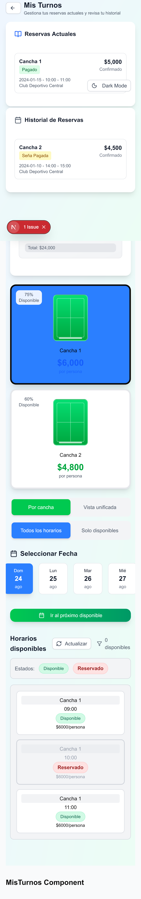

# Página de Administración de Turnos (http://localhost:3000/admin-panel/admin/turnos)

## 1. Contexto del sistema

- Modelo de reserva individual: en este proyecto, la reserva la realiza una única persona (titular). No existe un modelo multi-usuario para co‑reservas; la gestión completa se centra en un titular y tres acompañantes opcionales.
- Titular y slots genéricos: solamente se almacena de forma garantizada el nombre del titular del turno. El resto de slots de jugadores (`player2`, `player3`, `player4`) pueden carecer de nombre en la base de datos y se muestran con nombres genéricos (p. ej., “Jugador 2”) en la interfaz, manteniendo el flujo de pagos y administración.
- Estructura fija de 4 jugadores: la lógica financiera y de UI considera siempre cuatro posiciones. El cálculo del monto por jugador divide el total original entre 4 y suma extras prorrateados o asignados directamente.
- Estados de reserva: `PENDING`, `CONFIRMED`, `ACTIVE`, `COMPLETED`, `CANCELLED`. Adicionalmente, se distingue “Completado” de “Cerrado” (cuando existe `closedAt`).
- SSE y auditoría: la interfaz consume eventos en tiempo real y emite eventos administrativos para auditoría cuando falla el registro transaccional o al completar/cerrar un turno.

## 2. Requisitos técnicos para recrear la funcionalidad desde cero

### 2.1 Estructura de base de datos (tablas y relaciones)

- `User`
  - `id` (cuid)
  - `name`, `email`, `phone`, `role` (`USER`|`ADMIN`)
- `Court`
  - `id`, `name`, `description`, `basePrice`, `priceMultiplier`, `features` (JSON/string), `isActive`, `operatingHours` (JSON `{ open, close }`)
- `Booking`
  - `id`, `courtId` (FK), `userId` (FK), `bookingDate` (date), `startTime`, `endTime`, `durationMinutes`
  - `totalPrice`, `depositAmount`
  - `status` (`PENDING`, `CONFIRMED`, `ACTIVE`, `COMPLETED`, `CANCELLED`)
  - `paymentStatus` (`PENDING`, `DEPOSIT_PAID`, `FULLY_PAID`)
  - `paymentMethod` (`CASH`, `BANK_TRANSFER`, `CARD`)
  - `notes`, `cancellationReason`
  - `createdAt`, `updatedAt`, `cancelledAt`, `closedAt`
- `BookingPlayer`
  - `id`, `bookingId` (FK), `playerName`, `playerPhone`, `playerEmail`, `position` (1–4), `hasPaid` (bool), `paidAmount`
- `BookingExtra`
  - `id`, `bookingId` (FK), `productoId`, `quantity`, `unitPrice`, `totalPrice`
  - `assignedToAll` (bool), `deletedAt`
  - `playerId` (FK opcional hacia `BookingPlayer`)
- `Payment`
  - `id`, `bookingId` (FK), `amount`, `paymentMethod`, `paymentType`, `status`, `createdAt`

Relaciones principales:

- `Booking` 1–N `BookingPlayer`
- `Booking` 1–N `BookingExtra`
- `Booking` 1–N `Payment`
- `Booking` N–1 `Court`, `Booking` N–1 `User`

### 2.2 Endpoints API requeridos

- Reservas
  - `GET /api/bookings` — listado con filtros (paginación, estado, fecha)
  - `GET /api/bookings/[id]` — detalle
  - `POST /api/bookings` — creación
  - `PUT /api/bookings/[id]` — actualización (fecha/hora, estado, `paymentStatus`, `players`)
  - `DELETE /api/bookings/[id]` — cancelación (soft delete)
  - `POST /api/bookings/[id]/close` — cierre definitivo con validaciones de saldo y fin de turno
- Extras
  - `POST /api/bookings/[id]/extras` — agregar extra
  - `DELETE /api/bookings/[id]/extras/[extraId]` — eliminar extra
- Auditoría/Eventos
  - `POST /api/admin/test-event` — emitir evento administrativo (fallback/auditoría)
- Transacciones CRUD
  - `POST /api/crud/transaction` — ejecución de operaciones atómicas (p. ej., registro de pago)

### 2.3 Dependencias de frontend y backend

- Frontend: `next@15`, `react@19`, `lucide-react`, `@radix-ui/*`, `tailwindcss@4`, `react-hook-form`, `sonner`
- Backend: `@prisma/client@6`, `prisma@6`, `pg@8`, `@neondatabase/serverless`
- Autenticación: `next-auth@5` (beta), proveedor Google
- Utilidades: `zod` (validación), rate limit interno, SSE para eventos

### 2.4 Autenticación y autorización panel admin

- `NextAuth` con Google OAuth; el rol (`ADMIN`|`USER`) se asigna vía callback JWT, respaldado por `ADMIN_EMAILS` en entorno.
- Rutas de API verifican sesión y rol. El panel `/admin-panel/admin/*` está protegido; solo `ADMIN` accede a funciones de gestión (updates/cierre/transacciones).

## 3. Implementación detallada

### 3.1 Componentes de UI necesarios

- Listado de reservas: tarjetas con encabezado (cancha, fecha, hora, usuario), chip financiero y botón de expansión.
- Bloques por categoría:
  - `TURNOS CONFIRMADOS` — reservas confirmadas antes de inicio.
  - `TURNOS EN CURSO` — reservas dentro del rango horario actual.
  - `TURNOS COMPLETADOS` — finalizadas pero sin `closedAt`.
  - `TURNOS CERRADOS` — finalizadas y cerradas (con `closedAt`).
- Contenido expandido:
  - “Jugadores y Pagos Individuales”: 4 tarjetas con nombre (titular o genérico), estado de pago, y toggle.
  - “Extras Agregados (n)”: listado plegable con costos y asignaciones.
  - Resumen Financiero: `Total original`, `Pagado`, `Saldo pendiente`.
  - Acciones: `Agregar Extra`, `Completar` (con doble confirmación y validaciones), `Cancelar` (deshabilitado si no aplica).
- Modales: Agregar extra, Calendario, Confirmación de cierre.

### 3.2 Lógica de negocio para reservas individuales

- Fijar 4 posiciones (`player1..player4`). El monto por jugador = `totalPrice / 4 + extras asignados`. Los extras `assignedToAll` se prorratean entre 4.
- `computeAmountPaid(booking)` suma por jugador según `hasPaid` o estado de pago individual.
- Cierre de turno:
  - Requiere `pendingBalance === 0` y fin de horario.
  - Al cerrar, establecer `COMPLETED` y registrar `closedAt` en la reserva.
- Auditoría: al cerrar o si falla el registro transaccional, emitir evento `bookings_updated` con detalle.

### 3.3 Sistema de slots con nombres genéricos

- Solo el titular (`player1`) garantiza `playerName` persistido. Para slots sin nombre, la UI muestra placeholders (“Jugador 2/3/4”).
- Toggles: permanecen activos en todos los estados; se bloquean únicamente cuando se cumple simultáneamente: jugador marcado “pagado”, saldo pendiente 0 y turno cerrado (`closedAt`).

### 3.4 Flujo completo: desde reserva hasta administración

1. Creación de reserva (`POST /api/bookings`): cálculo de precio base desde cancha (`basePrice * multiplier * duración`).
2. Listado (`GET /api/bookings`) y mapeo a modelo local, con `pricing` calculado (base/extras/pagado/pendiente).
3. Administración: filtros, expansión, toggles de pago, gestión de extras.
4. Validación de cierre: saldo 0, horario finalizado; confirmación en modal; `POST /api/bookings/[id]/close`.
5. Cierre irreversible: registrar `closedAt`, mover a “TURNOS CERRADOS”, bloquear toggles bajo las reglas.

## 4. Instrucciones de despliegue

### 4.1 Variables de entorno

- Autenticación:
  - `NEXTAUTH_URL`
  - `NEXTAUTH_SECRET`
  - `GOOGLE_CLIENT_ID`, `GOOGLE_CLIENT_SECRET`
  - `ADMIN_EMAILS` (coma‑separado)
- Base de datos:
  - `DATABASE_URL` (PostgreSQL/Neon)

### 4.2 Inicialización de base de datos

1. Generar clientes Prisma: `npm run build` (incluye `prisma generate`).
2. Migraciones: `npx prisma migrate deploy` (o `prisma migrate dev` en desarrollo).
3. (Opcional) Datos de prueba: scripts de `scripts/seed-*` y `load-data-to-neon.js`.

### 4.3 Configuración del servidor

- Desarrollo: `npm run dev` (puerto `3000`).
- Producción: `npm run build` y `npm run start`.
- Asegurar variables de entorno y URL de autenticación correctas.

## 5. Capturas de pantalla

> Nota: Las capturas aquí referenciadas son ilustrativas y deben actualizarse según el estado actual del entorno.

### 5.1 Interfaz de administración de turnos

### 5.2 Ejemplo de turno con titular y slots genéricos

> En la imagen se observa el titular con nombre propio y los demás slots representados como “Jugador 2/3/4”, cada uno con su estado de pago y botón toggle.

---

## Anexos y consideraciones

- Cálculo financiero en backend: el servicio retorna un DTO enriquecido con `pricing` (base, extras, pagado, total calculado y saldo), evitando duplicaciones en el frontend.
- Auditoría y SSE: el panel puede emitir y recibir eventos para reflejar cambios en tiempo real y registrar acciones administrativas.
- Seguridad: el panel admin requiere autenticación Google y rol `ADMIN`. Las rutas sensibles validan permisos explícitamente.

