# Flujos de API

## Descripción

Este documento describe los flujos de las APIs del sistema de turnero de pádel, incluyendo las interacciones entre el frontend y backend, manejo de errores, autenticación y validaciones.

## Flujo de Autenticación

```mermaid
sequenceDiagram
    participant C as Cliente
    participant F as Frontend
    participant A as NextAuth API
    participant G as Google OAuth
    participant DB as Base de Datos
    
    Note over C,DB: Proceso de Login
    
    C->>F: Click "Iniciar Sesión con Google"
    F->>A: POST /api/auth/signin/google
    A->>G: Redirect to Google OAuth
    G->>C: Google Login Page
    C->>G: Enter credentials
    G->>A: Authorization code
    A->>G: Exchange code for tokens
    G->>A: Access token + User info
    
    alt Usuario nuevo
        A->>DB: INSERT INTO users
        DB->>A: User created
    else Usuario existente
        A->>DB: SELECT user
        DB->>A: User data
    end
    
    A->>DB: INSERT INTO sessions
    DB->>A: Session created
    A->>F: Set session cookie
    F->>C: Redirect to dashboard
    
    Note over C,DB: Verificación de Sesión
    
    C->>F: Access protected page
    F->>A: GET /api/auth/session
    A->>DB: SELECT session
    
    alt Sesión válida
        DB->>A: Session data
        A->>F: User session
        F->>C: Show protected content
    else Sesión inválida
        DB->>A: No session found
        A->>F: null session
        F->>C: Redirect to login
    end
```



## Flujo de Creación de Reserva

```mermaid
sequenceDiagram
    participant C as Cliente
    participant F as Frontend
    participant API as API Routes
    participant DB as Base de Datos
    participant P as Prisma ORM
    
    Note over C,P: Obtener Datos Iniciales
    
    C->>F: Accede a página de reserva
    F->>API: GET /api/courts
    API->>P: findMany({ where: { isActive: true } })
    P->>DB: SELECT * FROM courts WHERE is_active = true
    DB->>P: Courts data
    P->>API: Courts array
    API->>F: 200 OK + Courts
    F->>C: Muestra canchas disponibles
    
    Note over C,P: Selección de Fecha y Cancha
    
    C->>F: Selecciona cancha y fecha
    F->>API: GET /api/slots?date=2024-01-28&courtId=1
    API->>P: findMany bookings for date/court
    P->>DB: SELECT * FROM bookings WHERE date = ? AND court_id = ?
    DB->>P: Existing bookings
    P->>API: Bookings data
    
    Note right of API: Genera slots disponibles<br/>basado en horarios y reservas existentes
    
    API->>F: 200 OK + Available slots
    F->>C: Muestra horarios disponibles
    
    Note over C,P: Creación de Reserva
    
    C->>F: Completa formulario y envía
    F->>API: POST /api/bookings
    
    Note right of API: Validaciones:
    Note right of API: - Autenticación
    Note right of API: - Datos requeridos
    Note right of API: - Disponibilidad del slot
    Note right of API: - Límite de jugadores
    
    alt Validaciones exitosas
        API->>P: Begin transaction
        P->>DB: BEGIN TRANSACTION
        
        API->>P: create booking
        P->>DB: INSERT INTO bookings
        DB->>P: Booking created
        
        loop Para cada jugador
            API->>P: create booking_player
            P->>DB: INSERT INTO booking_players
            DB->>P: Player added
        end
        
        API->>P: create payment
        P->>DB: INSERT INTO payments
        DB->>P: Payment created
        
        P->>DB: COMMIT TRANSACTION
        API->>F: 201 Created + Booking data
        F->>C: Muestra confirmación
        
    else Error en validación
        API->>F: 400 Bad Request + Error details
        F->>C: Muestra errores de validación
        
    else Error de disponibilidad
        API->>F: 409 Conflict + "Slot no disponible"
        F->>C: Muestra error de conflicto
        
    else Error del servidor
        API->>P: Rollback transaction
        P->>DB: ROLLBACK TRANSACTION
        API->>F: 500 Internal Server Error
        F->>C: Muestra error genérico
    end
```



## Flujo de Gestión de Reservas de Usuario

```mermaid
sequenceDiagram
    participant C as Cliente
    participant F as Frontend
    participant API as API Routes
    participant DB as Base de Datos
    
    Note over C,DB: Obtener Reservas del Usuario
    
    C->>F: Accede a "Mis Reservas"
    F->>API: GET /api/bookings/user
    
    Note right of API: Extrae userId de la sesión
    
    API->>DB: SELECT bookings WHERE user_id = ? ORDER BY date DESC
    DB->>API: User bookings with relations
    API->>F: 200 OK + Bookings array
    F->>C: Muestra lista de reservas
    
    Note over C,DB: Ver Detalles de Reserva
    
    C->>F: Click en reserva específica
    F->>API: GET /api/bookings/[id]
    API->>DB: SELECT booking WHERE id = ? (with all relations)
    
    alt Reserva encontrada
        DB->>API: Booking details
        API->>F: 200 OK + Booking details
        F->>C: Muestra detalles completos
    else Reserva no encontrada
        DB->>API: null
        API->>F: 404 Not Found
        F->>C: Muestra error "Reserva no encontrada"
    end
    
    Note over C,DB: Cancelar Reserva
    
    C->>F: Click "Cancelar Reserva"
    F->>C: Muestra confirmación
    C->>F: Confirma cancelación
    F->>API: PATCH /api/bookings/[id]
    
    Note right of API: Validaciones:
    Note right of API: - Usuario es propietario
    Note right of API: - Reserva cancelable
    Note right of API: - Tiempo mínimo antes del turno
    
    alt Cancelación permitida
        API->>DB: UPDATE bookings SET status = 'CANCELLED'
        DB->>API: Booking updated
        
        Note right of API: Procesar reembolso si aplica
        
        API->>DB: UPDATE payments SET status = 'REFUNDED'
        DB->>API: Payment updated
        
        API->>F: 200 OK + Updated booking
        F->>C: Muestra confirmación de cancelación
        
    else Cancelación no permitida
        API->>F: 400 Bad Request + Reason
        F->>C: Muestra error específico
    end
```



## Flujo de Administración


## Manejo de Errores

```mermaid
flowchart TD
    A["🚀 API Request"] --> B{"🔐 Autenticación"}
    
    B -->|❌ No autenticado| C["401 Unauthorized"]
    B -->|✅ Autenticado| D{"🛡️ Autorización"}
    
    D -->|❌ Sin permisos| E["403 Forbidden"]
    D -->|✅ Autorizado| F{"✅ Validación"}
    
    F -->|❌ Datos inválidos| G["400 Bad Request"]
    F -->|✅ Datos válidos| H{"🔍 Recurso existe"}
    
    H -->|❌ No encontrado| I["404 Not Found"]
    H -->|✅ Encontrado| J{"⚡ Lógica de negocio"}
    
    J -->|❌ Conflicto| K["409 Conflict"]
    J -->|❌ Error procesamiento| L["422 Unprocessable Entity"]
    J -->|✅ Éxito| M["200/201 Success"]
    
    J -->|💥 Error servidor| N["500 Internal Server Error"]
    
    %% Error Responses
    C --> O["📤 Error Response"]
    E --> O
    G --> O
    I --> O
    K --> O
    L --> O
    N --> O
    
    %% Success Response
    M --> P["📤 Success Response"]
    
    %% Response Structure
    O --> Q["{
      error: true,
      message: string,
      details?: object,
      code?: string
    }"]
    
    P --> R["{
      success: true,
      data: object,
      message?: string
    }"]
    
    %% Styling
    classDef error fill:#ffebee,stroke:#d32f2f,stroke-width:2px
    classDef success fill:#e8f5e8,stroke:#388e3c,stroke-width:2px
    classDef process fill:#e3f2fd,stroke:#1976d2,stroke-width:2px
    
    class C,E,G,I,K,L,N,O,Q error
    class M,P,R success
    class A,B,D,F,H,J process
```



## Middleware y Interceptores

```mermaid
sequenceDiagram
    participant C as Cliente
    participant M1 as CORS Middleware
    participant M2 as Auth Middleware
    participant M3 as Validation Middleware
    participant M4 as Rate Limiting
    participant H as API Handler
    participant DB as Database
    
    C->>M1: HTTP Request
    
    Note over M1: Verificar origen permitido
    alt CORS válido
        M1->>M2: Continue
    else CORS inválido
        M1->>C: 403 Forbidden
    end
    
    Note over M2: Verificar autenticación
    alt Ruta protegida
        M2->>M2: Verificar session/token
        alt Autenticado
            M2->>M3: Continue
        else No autenticado
            M2->>C: 401 Unauthorized
        end
    else Ruta pública
        M2->>M3: Continue
    end
    
    Note over M3: Validar datos de entrada
    M3->>M3: Validar con Zod schema
    alt Datos válidos
        M3->>M4: Continue
    else Datos inválidos
        M3->>C: 400 Bad Request + Validation errors
    end
    
    Note over M4: Verificar rate limiting
    M4->>M4: Check request count per IP/user
    alt Dentro del límite
        M4->>H: Continue
    else Límite excedido
        M4->>C: 429 Too Many Requests
    end
    
    Note over H: Procesar lógica de negocio
    H->>DB: Database operations
    DB->>H: Results
    H->>C: Response
```



## Estructura de Respuestas

### Respuestas Exitosas

```typescript
// GET /api/bookings/user
{
  "success": true,
  "data": [
    {
      "id": "booking-123",
      "date": "2024-01-28",
      "startTime": "10:00",
      "endTime": "11:30",
      "status": "CONFIRMED",
      "court": {
        "id": "court-1",
        "name": "Cancha 1",
        "basePrice": 5000
      },
      "players": [
        {
          "id": "player-1",
          "name": "Juan Pérez",
          "email": "juan@email.com"
        }
      ],
      "payment": {
        "id": "payment-1",
        "amount": 5000,
        "status": "COMPLETED",
        "method": "TRANSFER"
      }
    }
  ],
  "meta": {
    "total": 1,
    "page": 1,
    "limit": 10
  }
}

// POST /api/bookings
{
  "success": true,
  "data": {
    "id": "booking-124",
    "date": "2024-01-29",
    "startTime": "14:00",
    "endTime": "15:30",
    "status": "CONFIRMED"
  },
  "message": "Reserva creada exitosamente"
}
```

### Respuestas de Error

```typescript
// 400 Bad Request - Validación
{
  "error": true,
  "message": "Datos de entrada inválidos",
  "details": {
    "date": ["La fecha es requerida"],
    "players": ["Debe tener al menos 2 jugadores"]
  },
  "code": "VALIDATION_ERROR"
}

// 409 Conflict - Slot ocupado
{
  "error": true,
  "message": "El horario seleccionado ya no está disponible",
  "details": {
    "conflictingBooking": "booking-123",
    "suggestedSlots": [
      { "startTime": "12:00", "endTime": "13:30" },
      { "startTime": "16:00", "endTime": "17:30" }
    ]
  },
  "code": "SLOT_UNAVAILABLE"
}

// 500 Internal Server Error
{
  "error": true,
  "message": "Error interno del servidor",
  "code": "INTERNAL_ERROR",
  "requestId": "req-abc123"
}
```

## Optimizaciones de Performance

### 1. Caché de Respuestas


### 2. Paginación y Filtrado

```typescript
// GET /api/bookings/user?page=1&limit=10&status=CONFIRMED&date_from=2024-01-01
{
  "success": true,
  "data": [...],
  "meta": {
    "total": 45,
    "page": 1,
    "limit": 10,
    "totalPages": 5,
    "hasNext": true,
    "hasPrev": false
  },
  "filters": {
    "status": "CONFIRMED",
    "dateFrom": "2024-01-01"
  }
}
```

### 3. Batch Operations

```typescript
// POST /api/bookings/batch
{
  "bookings": [
    { /* booking 1 data */ },
    { /* booking 2 data */ },
    { /* booking 3 data */ }
  ]
}

// Response
{
  "success": true,
  "data": {
    "created": 2,
    "failed": 1,
    "results": [
      { "success": true, "id": "booking-125" },
      { "success": true, "id": "booking-126" },
      { "success": false, "error": "Slot unavailable" }
    ]
  }
}
```

---

**Framework**: Next.js 14 App Router  
**ORM**: Prisma  
**Autenticación**: NextAuth.js  
**Validación**: Zod  
**Base de Datos**: PostgreSQL  
**Última actualización**: 2024-01-28  
**Versión**: 1.0