# Diagrama de Despliegue

## Descripción

Este documento describe la arquitectura de despliegue del sistema de turnero de pádel, incluyendo la infraestructura, servicios en la nube, configuraciones de producción y estrategias de escalabilidad.

## Arquitectura de Despliegue

```mermaid
C4Deployment
    title Diagrama de Despliegue - Sistema Turnero de Pádel
    
    Deployment_Node(cdn, "CDN", "Cloudflare/Vercel Edge") {
        Container(edge, "Edge Functions", "JavaScript", "Cache, Routing, Security")
    }
    
    Deployment_Node(vercel, "Vercel Platform", "Serverless") {
        Container(frontend, "Frontend App", "Next.js 14", "React, TypeScript, Tailwind")
        Container(api, "API Routes", "Next.js API", "Serverless Functions")
    }
    
    Deployment_Node(supabase, "Supabase", "Cloud Database") {
        ContainerDb(db, "PostgreSQL", "Database", "User data, Bookings, Courts")
        Container(auth, "Auth Service", "Supabase Auth", "Authentication & Authorization")
        Container(storage, "File Storage", "Supabase Storage", "Images, Documents")
    }
    
    Deployment_Node(external, "Servicios Externos") {
        Container(google, "Google OAuth", "OAuth 2.0", "Authentication Provider")
        Container(email, "Email Service", "Resend/SendGrid", "Notifications")
        Container(monitoring, "Monitoring", "Vercel Analytics", "Performance & Errors")
    }
    
    Deployment_Node(user_devices, "Dispositivos de Usuario") {
        Container(browser, "Web Browser", "Chrome, Firefox, Safari", "Client Application")
        Container(mobile, "Mobile Browser", "iOS/Android", "PWA Support")
    }
    
    %% Relationships
    Rel(browser, cdn, "HTTPS Requests")
    Rel(mobile, cdn, "HTTPS Requests")
    Rel(cdn, frontend, "Route to App")
    Rel(frontend, api, "API Calls")
    Rel(api, db, "Database Queries")
    Rel(api, auth, "Auth Validation")
    Rel(api, storage, "File Operations")
    Rel(auth, google, "OAuth Flow")
    Rel(api, email, "Send Notifications")
    Rel(frontend, monitoring, "Analytics Data")
```

## Infraestructura Detallada

### 1. Frontend (Vercel)


### 2. Base de Datos (Supabase)

```mermaid
graph TD
    subgraph "🗄️ Supabase Infrastructure"
        A["🐘 PostgreSQL 15"] --> B["📊 Connection Pooling"]
        A --> C["🔄 Read Replicas"]
        A --> D["💾 Automated Backups"]
        
        E["🔐 Supabase Auth"] --> F["👤 User Management"]
        E --> G["🎫 JWT Tokens"]
        E --> H["🔑 Row Level Security"]
        
        I["📁 Supabase Storage"] --> J["🖼️ Image Storage"]
        I --> K["📄 Document Storage"]
        I --> L["🔒 Access Control"]
        
        M["📡 Realtime"] --> N["🔄 Live Updates"]
        M --> O["📢 Notifications"]
    end
    
    classDef db fill:#e8f5e8,stroke:#388e3c
    classDef auth fill:#e3f2fd,stroke:#1976d2
    classDef storage fill:#fff3e0,stroke:#f57c00
    classDef realtime fill:#f3e5f5,stroke:#7b1fa2
    
    class A,B,C,D db
    class E,F,G,H auth
    class I,J,K,L storage
    class M,N,O realtime
```



### 3. Servicios Externos

```mermaid
graph LR
    subgraph "🔐 Autenticación"
        A["🔍 Google OAuth 2.0"]
        B["📧 Email Verification"]
    end
    
    subgraph "📧 Comunicaciones"
        C["📮 Resend API"]
        D["📱 Push Notifications"]
    end
    
    subgraph "📊 Monitoreo"
        E["📈 Vercel Analytics"]
        F["🐛 Error Tracking"]
        G["⚡ Performance Monitoring"]
    end
    
    subgraph "💳 Pagos (Futuro)"
        H["💰 MercadoPago"]
        I["🏦 Stripe"]
    end
    
    classDef auth fill:#e3f2fd,stroke:#1976d2
    classDef comm fill:#e8f5e8,stroke:#388e3c
    classDef monitor fill:#fff3e0,stroke:#f57c00
    classDef payment fill:#ffebee,stroke:#d32f2f
    
    class A,B auth
    class C,D comm
    class E,F,G monitor
    class H,I payment
```



## Configuración de Producción

### Variables de Entorno

```bash
# Database
DATABASE_URL="postgresql://..."
DIRECT_URL="postgresql://..."

# Authentication
NEXTAUTH_URL="https://turnero-padel.vercel.app"
NEXTAUTH_SECRET="..."
GOOGLE_CLIENT_ID="..."
GOOGLE_CLIENT_SECRET="..."

# Supabase
NEXT_PUBLIC_SUPABASE_URL="https://xxx.supabase.co"
NEXT_PUBLIC_SUPABASE_ANON_KEY="..."
SUPABASE_SERVICE_ROLE_KEY="..."

# Email
RESEND_API_KEY="..."
FROM_EMAIL="noreply@turnero-padel.com"

# Analytics
NEXT_PUBLIC_VERCEL_ANALYTICS_ID="..."

# App Configuration
NEXT_PUBLIC_APP_URL="https://turnero-padel.vercel.app"
NEXT_PUBLIC_APP_NAME="Turnero de Pádel"
```

### Configuración de Vercel

```json
{
  "version": 2,
  "builds": [
    {
      "src": "package.json",
      "use": "@vercel/next"
    }
  ],
  "functions": {
    "app/api/**/*.ts": {
      "maxDuration": 30
    }
  },
  "headers": [
    {
      "source": "/api/(.*)",
      "headers": [
        {
          "key": "Access-Control-Allow-Origin",
          "value": "https://turnero-padel.vercel.app"
        },
        {
          "key": "Access-Control-Allow-Methods",
          "value": "GET, POST, PUT, DELETE, OPTIONS"
        },
        {
          "key": "Access-Control-Allow-Headers",
          "value": "Content-Type, Authorization"
        }
      ]
    }
  ],
  "rewrites": [
    {
      "source": "/api/(.*)",
      "destination": "/api/$1"
    }
  ]
}
```

## Flujo de Despliegue


## Estrategias de Escalabilidad

### 1. Escalabilidad Horizontal

```mermaid
graph TD
    subgraph "🌍 Global Distribution"
        A["🇺🇸 US East"] --> D["⚖️ Load Balancer"]
        B["🇪🇺 Europe"] --> D
        C["🇦🇸 Asia Pacific"] --> D
    end
    
    subgraph "⚡ Serverless Functions"
        D --> E["🔄 Auto-scaling"]
        E --> F["📊 Function Instances"]
        F --> G["💾 Cold Start Optimization"]
    end
    
    subgraph "🗄️ Database Scaling"
        H["📖 Read Replicas"] --> I["🔄 Connection Pooling"]
        I --> J["📊 Query Optimization"]
        J --> K["💾 Caching Layer"]
    end
    
    D --> H
    
    classDef global fill:#e3f2fd,stroke:#1976d2
    classDef serverless fill:#e8f5e8,stroke:#388e3c
    classDef database fill:#fff3e0,stroke:#f57c00
    
    class A,B,C,D global
    class E,F,G serverless
    class H,I,J,K database
```



### 2. Optimizaciones de Performance

```mermaid
flowchart TD
    A["📱 Client Request"] --> B{"🌐 CDN Cache"}
    
    B -->|Hit| C["⚡ Cached Response"]
    B -->|Miss| D["🏠 Next.js App"]
    
    D --> E{"📄 Page Type"}
    
    E -->|Static| F["📦 Static Generation"]
    E -->|Dynamic| G["🔄 Server Rendering"]
    E -->|API| H["⚡ Serverless Function"]
    
    F --> I["💾 Edge Cache"]
    G --> J["🔄 ISR Cache"]
    H --> K{"🗄️ Database"}
    
    K -->|Cached| L["⚡ Redis Cache"]
    K -->|Fresh| M["🐘 PostgreSQL"]
    
    I --> N["📤 Response"]
    J --> N
    L --> N
    M --> N
    C --> N
    
    classDef cache fill:#e8f5e8,stroke:#388e3c
    classDef app fill:#e3f2fd,stroke:#1976d2
    classDef db fill:#fff3e0,stroke:#f57c00
    
    class B,C,I,J,L cache
    class D,E,F,G,H app
    class K,M db
```



## Monitoreo y Observabilidad

### 1. Métricas Clave

```mermaid
dashboard
    title Sistema de Monitoreo
    
    section "⚡ Performance"
        Response Time: 95ms
        Throughput: 1.2k req/min
        Error Rate: 0.1%
        Uptime: 99.9%
    
    section "💾 Resources"
        Memory Usage: 45%
        CPU Usage: 23%
        Database Connections: 12/100
        Storage Usage: 2.3GB
    
    section "👥 Users"
        Active Users: 234
        New Registrations: 12/day
        Bounce Rate: 15%
        Session Duration: 8.5min
    
    section "📊 Business"
        Daily Bookings: 45
        Revenue: $2,340
        Court Utilization: 78%
        Cancellation Rate: 5%
```

### 2. Alertas y Notificaciones


## Seguridad

### 1. Capas de Seguridad

```mermaid
graph TD
    subgraph "🌐 Edge Security"
        A["🛡️ DDoS Protection"]
        B["🔥 WAF Rules"]
        C["🌍 Geo-blocking"]
    end
    
    subgraph "🔐 Application Security"
        D["🎫 JWT Authentication"]
        E["🔑 RBAC Authorization"]
        F["✅ Input Validation"]
        G["🚫 Rate Limiting"]
    end
    
    subgraph "🗄️ Data Security"
        H["🔒 Encryption at Rest"]
        I["🔐 Encryption in Transit"]
        J["🛡️ Row Level Security"]
        K["💾 Automated Backups"]
    end
    
    subgraph "📊 Monitoring Security"
        L["👁️ Audit Logs"]
        M["🚨 Intrusion Detection"]
        N["📈 Security Analytics"]
    end
    
    A --> D
    B --> E
    C --> F
    D --> H
    E --> I
    F --> J
    G --> K
    H --> L
    I --> M
    J --> N
    
    classDef edge fill:#e3f2fd,stroke:#1976d2
    classDef app fill:#e8f5e8,stroke:#388e3c
    classDef data fill:#fff3e0,stroke:#f57c00
    classDef monitor fill:#f3e5f5,stroke:#7b1fa2
    
    class A,B,C edge
    class D,E,F,G app
    class H,I,J,K data
    class L,M,N monitor
```



### 2. Certificados y Compliance


## Backup y Recuperación

### Estrategia de Backup

```mermaid
flowchart TD
    A["🗄️ Production Database"] --> B["📊 Automated Daily Backup"]
    A --> C["🔄 Real-time Replication"]
    
    B --> D["☁️ Cloud Storage"]
    C --> E["📖 Read Replica"]
    
    D --> F["🗓️ 30-day Retention"]
    E --> G["🚨 Failover Ready"]
    
    F --> H["🏛️ Archive Storage"]
    G --> I["⚡ Auto-failover"]
    
    subgraph "🔄 Recovery Options"
        J["⚡ Point-in-time Recovery"]
        K["📋 Full Database Restore"]
        L["🔄 Incremental Restore"]
    end
    
    D --> J
    D --> K
    D --> L
    
    classDef primary fill:#e3f2fd,stroke:#1976d2
    classDef backup fill:#e8f5e8,stroke:#388e3c
    classDef recovery fill:#fff3e0,stroke:#f57c00
    
    class A,C,E,G,I primary
    class B,D,F,H backup
    class J,K,L recovery
```



---

**Plataforma**: Vercel + Supabase  
**CDN**: Vercel Edge Network  
**Base de Datos**: PostgreSQL (Supabase)  
**Monitoreo**: Vercel Analytics + Custom Metrics  
**Seguridad**: WAF + JWT + RLS  
**Última actualización**: 2024-01-28  
**Versión**: 1.0