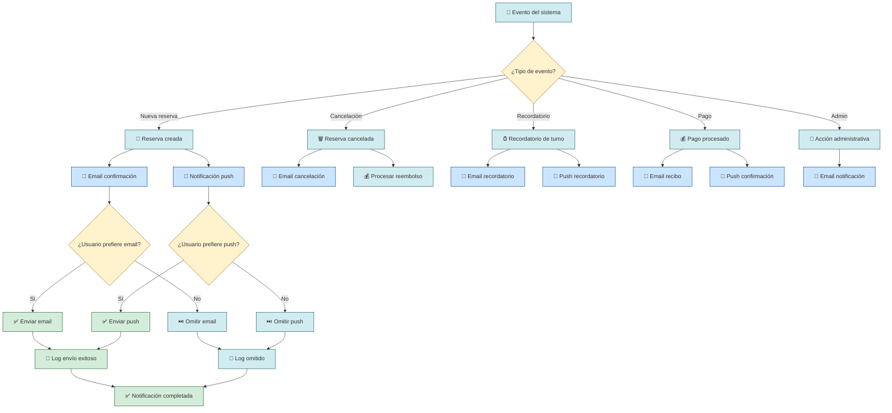
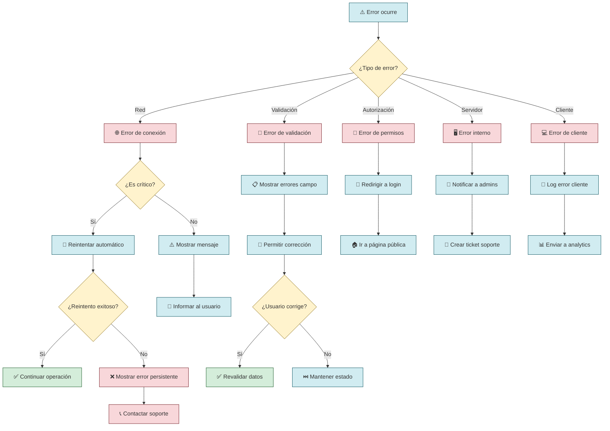

# Flujos de Usuario

## Descripción

Este documento contiene todos los flujos de usuario principales del sistema de turnero de pádel, desde la autenticación hasta la gestión de reservas y administración.

## 1. Flujo de Autenticación

### Inicio de Sesión con Google OAuth

```mermaid
flowchart TD
    A[👤 Usuario visita la app] --> B{¿Está autenticado?}
    B -->|Sí| C[🏠 Redirigir a Dashboard]
    B -->|No| D[🔐 Mostrar página de login]
    
    D --> E[🔍 Click en "Iniciar con Google"]
    E --> F[🌐 Redirigir a Google OAuth]
    F --> G{¿Autoriza permisos?}
    
    G -->|No| H[❌ Cancelar login]
    H --> D
    
    G -->|Sí| I[✅ Google devuelve código]
    I --> J[🔄 NextAuth procesa callback]
    J --> K{¿Usuario existe?}
    
    K -->|No| L[👤 Crear nuevo usuario]
    K -->|Sí| M[📝 Actualizar último login]
    
    L --> N[🎯 Crear sesión JWT]
    M --> N
    N --> O[🍪 Establecer cookies seguras]
    O --> P[🏠 Redirigir a Dashboard]
    
    %% Error handling
    J --> Q{¿Error en proceso?}
    Q -->|Sí| R[⚠️ Mostrar error]
    R --> D
    Q -->|No| N
    
    %% Styling
    classDef success fill:#d4edda,stroke:#155724
    classDef error fill:#f8d7da,stroke:#721c24
    classDef process fill:#d1ecf1,stroke:#0c5460
    classDef decision fill:#fff3cd,stroke:#856404
    
    class C,I,L,M,N,O,P success
    class H,R error
    class E,F,J process
    class B,G,K,Q decision
```

### Login desde la landing y menú de usuario (feb 2026)

Cuando el usuario inicia sesión **desde la página principal** (`/`), el destino tras el login es de nuevo la **landing** (`/`), no el dashboard. En la landing, si hay sesión:

- En el header se muestra el **avatar** (imagen de Google o iniciales) en lugar del botón "Iniciar sesión".
- Al hacer clic en el avatar se abre un menú con:
  - **Ir a mi club**: si el usuario tiene un tenant asignado y activo; enlaza a `/dashboard?tenantSlug=<slug>`.
  - **Panel Super Admin**: solo para usuarios con rol SUPER_ADMIN; enlaza a `/super-admin`.
  - **Cerrar sesión**: cierra la sesión y redirige a `/`.

El botón "Reservar Ahora" del hero es condicional: sin sesión lleva a login; con sesión y tenant lleva al dashboard del club; con sesión sin tenant lleva a la sección de clubs (`#clubs-list`).

El flujo cuando el usuario llega con la **URL de un club** (`/club/[slug]`) no cambia: se redirige a login con `callbackUrl=/dashboard?tenantSlug=slug` y, tras autenticarse, se llega al dashboard de ese club. Ver [Landing: login y menú de usuario](../actualizaciones/landing-login-menu-usuario-2026-02.md) para el detalle de cambios.

### Cierre de Sesión

```mermaid
flowchart TD
    A[👤 Usuario click "Cerrar Sesión"] --> B[🔄 Llamar a signOut()]
    B --> C[🗑️ Eliminar sesión de DB]
    C --> D[🍪 Limpiar cookies]
    D --> E[🔐 Redirigir a login]
    
    classDef process fill:#d1ecf1,stroke:#0c5460
    class A,B,C,D,E process
```

## 2. Flujo de Reserva de Cancha

### Proceso Completo de Reserva

```mermaid
flowchart TD
    A[🏠 Usuario en Dashboard] --> B[📅 Seleccionar "Nueva Reserva"]
    B --> C[🏟️ Elegir cancha]
    C --> D[📆 Seleccionar fecha]
    D --> E[⏰ Ver horarios disponibles]
    
    E --> F{¿Hay slots disponibles?}
    F -->|No| G[❌ Mostrar "Sin disponibilidad"]
    G --> H[🔄 Cambiar fecha/cancha]
    H --> D
    
    F -->|Sí| I[✅ Seleccionar horario]
    I --> J[👥 Agregar jugadores]
    J --> K{¿Todos los datos válidos?}
    
    K -->|No| L[⚠️ Mostrar errores de validación]
    L --> J
    
    K -->|Sí| M[💰 Mostrar resumen y precio]
    M --> N[💳 Seleccionar método de pago]
    N --> O[✅ Confirmar reserva]
    
    O --> P[🔄 Procesar en backend]
    P --> Q{¿Reserva exitosa?}
    
    Q -->|No| R{¿Tipo de error?}
    R -->|Conflicto| S[⚠️ "Horario ya reservado"]
    R -->|Validación| T[⚠️ "Datos inválidos"]
    R -->|Sistema| U[❌ "Error del servidor"]
    
    S --> H
    T --> J
    U --> V[🔄 Reintentar]
    V --> O
    
    Q -->|Sí| W[📧 Enviar confirmación]
    W --> X[🎉 Mostrar confirmación]
    X --> Y[📋 Ver detalles de reserva]
    
    %% Styling
    classDef success fill:#d4edda,stroke:#155724
    classDef error fill:#f8d7da,stroke:#721c24
    classDef process fill:#d1ecf1,stroke:#0c5460
    classDef decision fill:#fff3cd,stroke:#856404
    classDef warning fill:#fff3cd,stroke:#856404
    
    class I,M,O,W,X,Y success
    class G,R,S,T,U error
    class A,B,C,D,E,J,N,P process
    class F,K,Q decision
    class L warning
```

### Validaciones en el Proceso de Reserva

```mermaid
flowchart TD
    A[📝 Datos del formulario] --> B{¿Fecha válida?}
    B -->|No| C[❌ "Fecha debe ser futura"]
    B -->|Sí| D{¿Horario válido?}
    
    D -->|No| E[❌ "Horario fuera de operación"]
    D -->|Sí| F{¿Cancha disponible?}
    
    F -->|No| G[❌ "Horario ya reservado"]
    F -->|Sí| H{¿Jugadores válidos?}
    
    H -->|No| I[❌ "Mín 2, máx 4 jugadores"]
    H -->|Sí| J{¿Usuario autenticado?}
    
    J -->|No| K[🔐 "Debe iniciar sesión"]
    J -->|Sí| L[✅ Procesar reserva]
    
    C --> M[🔄 Corregir y reintentar]
    E --> M
    G --> M
    I --> M
    K --> N[🔐 Redirigir a login]
    
    classDef success fill:#d4edda,stroke:#155724
    classDef error fill:#f8d7da,stroke:#721c24
    classDef process fill:#d1ecf1,stroke:#0c5460
    classDef decision fill:#fff3cd,stroke:#856404
    
    class L success
    class C,E,G,I,K error
    class A,M,N process
    class B,D,F,H,J decision
```

## 3. Flujo de Gestión de Reservas

### Ver y Gestionar Reservas Existentes

```mermaid
flowchart TD
    A[👤 Usuario autenticado] --> B[📋 Ver "Mis Reservas"]
    B --> C[🔄 Cargar reservas del usuario]
    C --> D{¿Hay reservas?}
    
    D -->|No| E[📝 "No tienes reservas"]
    E --> F[➕ "Crear primera reserva"]
    F --> G[📅 Ir a nueva reserva]
    
    D -->|Sí| H[📊 Mostrar lista de reservas]
    H --> I[👁️ Seleccionar reserva]
    I --> J[📄 Ver detalles completos]
    
    J --> K{¿Qué acción?}
    K -->|Ver| L[👁️ Solo visualizar]
    K -->|Editar| M{¿Se puede editar?}
    K -->|Cancelar| N{¿Se puede cancelar?}
    K -->|Compartir| O[📤 Generar enlace]
    
    M -->|No| P[⚠️ "No se puede editar"]
    M -->|Sí| Q[✏️ Formulario de edición]
    Q --> R[💾 Guardar cambios]
    
    N -->|No| S[⚠️ "No se puede cancelar"]
    N -->|Sí| T[❓ Confirmar cancelación]
    T --> U{¿Confirma?}
    U -->|No| J
    U -->|Sí| V[🗑️ Cancelar reserva]
    V --> W[💰 Procesar reembolso]
    W --> X[📧 Enviar confirmación]
    
    O --> Y[📋 Copiar enlace]
    Y --> Z[✅ "Enlace copiado"]
    
    L --> J
    P --> J
    R --> AA[✅ "Reserva actualizada"]
    AA --> J
    X --> BB[🏠 Volver a lista]
    Z --> J
    
    classDef success fill:#d4edda,stroke:#155724
    classDef error fill:#f8d7da,stroke:#721c24
    classDef process fill:#d1ecf1,stroke:#0c5460
    classDef decision fill:#fff3cd,stroke:#856404
    classDef warning fill:#fff3cd,stroke:#856404
    
    class F,G,L,O,Q,R,V,W,X,Y,Z,AA,BB success
    class E,P,S error
    class A,B,C,H,I,J process
    class D,K,M,N,T,U decision
```

## 4. Flujo de Administración

### Panel de Administración

```mermaid
flowchart TD
    A[👤 Usuario intenta acceder] --> B{¿Es administrador?}
    B -->|No| C[❌ "Acceso denegado"]
    C --> D[🏠 Redirigir a home]
    
    B -->|Sí| E[👑 Cargar panel admin]
    E --> F[📊 Dashboard administrativo]
    
    F --> G{¿Qué gestionar?}
    G -->|Reservas| H[📅 Gestión de reservas]
    G -->|Canchas| I[🏟️ Gestión de canchas]
    G -->|Usuarios| J[👥 Gestión de usuarios]
    G -->|Configuración| K[⚙️ Configuración sistema]
    G -->|Reportes| L[📈 Reportes y métricas]
    
    %% Gestión de Reservas
    H --> H1[📋 Ver todas las reservas]
    H1 --> H2{¿Acción en reserva?}
    H2 -->|Ver| H3[👁️ Ver detalles]
    H2 -->|Editar| H4[✏️ Editar reserva]
    H2 -->|Cancelar| H5[🗑️ Cancelar reserva]
    H2 -->|Confirmar| H6[✅ Confirmar pago]
    
    %% Gestión de Canchas
    I --> I1[🏟️ Ver todas las canchas]
    I1 --> I2{¿Acción en cancha?}
    I2 -->|Crear| I3[➕ Nueva cancha]
    I2 -->|Editar| I4[✏️ Editar cancha]
    I2 -->|Desactivar| I5[⏸️ Desactivar cancha]
    I2 -->|Configurar| I6[⚙️ Horarios y precios]
    
    %% Gestión de Usuarios
    J --> J1[👥 Ver todos los usuarios]
    J1 --> J2{¿Acción en usuario?}
    J2 -->|Ver| J3[👁️ Ver perfil]
    J2 -->|Promover| J4[👑 Hacer admin]
    J2 -->|Suspender| J5[⏸️ Suspender usuario]
    J2 -->|Historial| J6[📋 Ver reservas]
    
    %% Configuración
    K --> K1[⚙️ Configuración general]
    K1 --> K2{¿Qué configurar?}
    K2 -->|Precios| K3[💰 Precios base]
    K2 -->|Horarios| K4[⏰ Horarios operación]
    K2 -->|Políticas| K5[📋 Políticas cancelación]
    K2 -->|Admins| K6[👑 Gestionar admins]
    
    %% Reportes
    L --> L1[📈 Seleccionar reporte]
    L1 --> L2{¿Tipo de reporte?}
    L2 -->|Ingresos| L3[💰 Reporte financiero]
    L2 -->|Ocupación| L4[📊 Reporte ocupación]
    L2 -->|Usuarios| L5[👥 Reporte usuarios]
    L2 -->|Canchas| L6[🏟️ Reporte canchas]
    
    classDef success fill:#d4edda,stroke:#155724
    classDef error fill:#f8d7da,stroke:#721c24
    classDef process fill:#d1ecf1,stroke:#0c5460
    classDef decision fill:#fff3cd,stroke:#856404
    classDef admin fill:#e2e3e5,stroke:#6c757d
    
    class E,F,H3,H4,H6,I3,I4,I6,J3,J4,K3,K4,K5,K6,L3,L4,L5,L6 success
    class C,D,H5,I5,J5 error
    class A,H,I,J,K,L,H1,I1,J1,K1,L1 process
    class B,G,H2,I2,J2,K2,L2 decision
    class F admin
```

## 5. Flujo de Notificaciones

### Sistema de Notificaciones



## 6. Flujo de Manejo de Errores

### Estrategia Global de Errores



## Consideraciones de UX

### 🎨 Principios de Diseño

- **Feedback Inmediato**: Cada acción tiene respuesta visual
- **Estados de Carga**: Indicadores claros durante procesos
- **Mensajes Claros**: Errores y éxitos con lenguaje simple
- **Navegación Intuitiva**: Flujos lógicos y predecibles
- **Accesibilidad**: Compatible con lectores de pantalla

### 📱 Responsive Design

- **Mobile First**: Diseño optimizado para móviles
- **Touch Friendly**: Botones y áreas táctiles apropiadas
- **Gestos Intuitivos**: Swipe, tap, pinch según contexto
- **Orientación**: Funcional en portrait y landscape

### ⚡ Performance

- **Carga Rápida**: Páginas < 3 segundos
- **Lazy Loading**: Carga bajo demanda de componentes
- **Optimistic UI**: Actualizaciones inmediatas con rollback
- **Offline Support**: Funcionalidad básica sin conexión

---

**Herramientas de Diagramación**: Mermaid  
**Validado con**: Usuarios reales, Tests de usabilidad  
**Última actualización**: 2024-01-28  
**Versión**: 1.0