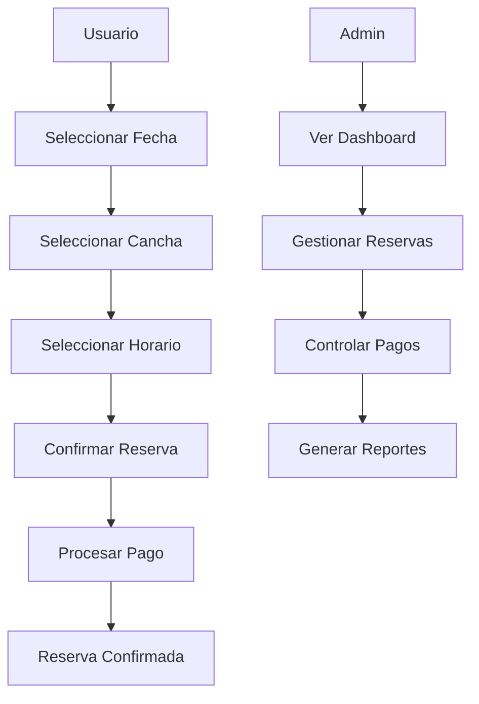

# PadelBooking - Componente Principal

## Información del Componente

**Nombre**: `PadelBooking`  
**Ubicación**: `padel-booking.tsx`  
**Tipo**: Componente de Página Principal  
**Autor**: Equipo de desarrollo  
**Fecha**: 2024-01-28

## Descripción

Componente principal de la aplicación que maneja toda la funcionalidad del sistema de reservas de pádel. Es un componente complejo que integra múltiples funcionalidades incluyendo reservas, administración, pagos y gestión de usuarios. Actualmente contiene 1681 líneas de código y maneja tanto la lógica de negocio como la presentación.

## Props/Parámetros

Este componente no recibe props externos, ya que es el componente raíz de la aplicación.

## Estados Internos

| Estado | Tipo | Descripción |
|--------|------|-------------|
| `selectedDate` | `Date \| undefined` | Fecha seleccionada para hacer reservas |
| `selectedCourt` | `string \| null` | ID de la cancha seleccionada |
| `selectedTimeSlot` | `string \| null` | Horario seleccionado para la reserva |
| `activeTab` | `string` | Tab activa en la navegación (inicio, turnos, admin) |
| `isDarkMode` | `boolean` | Estado del modo oscuro/claro |
| `showPaymentModal` | `boolean` | Controla la visibilidad del modal de pagos |
| `paymentSuccess` | `boolean` | Indica si el pago fue exitoso |
| `paymentProcessing` | `boolean` | Indica si se está procesando un pago |
| `selectedBooking` | `CourtBooking \| null` | Reserva seleccionada para acciones |
| `adminBookings` | `CourtBooking[]` | Lista de reservas para administradores |
| `userBookings` | `CourtBooking[]` | Lista de reservas del usuario actual |

## Hooks Utilizados

- `useState` - Para manejar múltiples estados locales
- `useEffect` - Para inicialización y efectos secundarios
- `useAuth` - Hook personalizado para autenticación y autorización

## Dependencias

- `react` - Biblioteca principal
- `@/hooks/useAuth` - Hook de autenticación personalizado
- `lucide-react` - Iconos
- `@/components/ui/*` - Componentes de UI (shadcn/ui)
- `date-fns` - Manipulación de fechas

## Tipos TypeScript

### Player
```typescript
type Player = {
  name: string
  hasPaid: boolean
}
```

### CourtBooking
```typescript
type CourtBooking = {
  id: string
  courtName: string
  players: Player[]
  date: Date
  startTime: string
  endTime: string
  duration: number
  totalPrice: number
  deposit: number
  remainingPayment: number
  status: "Active" | "Upcoming" | "Completed"
  paymentStatus: "Deposit Paid" | "Fully Paid" | "Pending"
  paymentMethod: "Cash" | "Bank Transfer"
  bookingTime: Date
  endBookingTime: Date
}
```

## Funcionalidades Principales

### 1. Sistema de Reservas
- Selección de fecha mediante calendario
- Selección de cancha (3 canchas disponibles)
- Selección de horarios disponibles (slots de 1.5 horas)
- Algoritmo de disponibilidad dinámica

### 2. Gestión de Pagos
- Modal de pagos con múltiples métodos
- Seguimiento de pagos por jugador (4 jugadores por reserva)
- Estados de pago: Pendiente, Depósito Pagado, Totalmente Pagado

### 3. Panel de Usuario
- Vista de "Mis Turnos" con reservas actuales y pasadas
- Acciones: Ver detalles, cancelar, reservar nuevamente
- Estados visuales según estado de reserva

### 4. Panel de Administración
- Dashboard con métricas en tiempo real
- Gestión completa de reservas
- Control de pagos individuales por jugador
- Estadísticas y reportes

### 5. Características UX/UI
- Modo oscuro/claro con persistencia
- Diseño responsive
- Navegación por tabs
- Animaciones y transiciones suaves

## Ejemplos de Uso

### Uso Básico
```tsx
import PadelBooking from './padel-booking'

function App() {
  return (
    <div className="app">
      <PadelBooking />
    </div>
  )
}
```

## Casos de Uso

1. **Usuario Regular**:
   - Hacer nuevas reservas
   - Ver sus reservas actuales y pasadas
   - Gestionar pagos
   - Cancelar reservas

2. **Administrador**:
   - Todas las funciones de usuario regular
   - Ver todas las reservas del sistema
   - Gestionar pagos de todos los usuarios
   - Acceder a métricas y estadísticas
   - Administrar canchas y precios

## Flujo de Datos



## Estilos CSS

- Utiliza **Tailwind CSS** para todos los estilos
- Soporte completo para modo oscuro con clases condicionales
- Diseño responsive con breakpoints móviles
- Animaciones con `transition-all` y `duration-300`

## Accesibilidad

- Componentes base de shadcn/ui que incluyen ARIA labels
- Navegación por teclado en modales y formularios
- Contraste adecuado en modo oscuro y claro
- Textos alternativos en iconos importantes

## Testing

### Tests Unitarios Sugeridos
```typescript
// Ejemplo de test para reserva
describe('PadelBooking', () => {
  test('should allow user to select date and court', () => {
    // Test implementation
  })
  
  test('should show admin panel for admin users', () => {
    // Test implementation
  })
  
  test('should handle payment processing', () => {
    // Test implementation
  })
})
```

## Problemas Conocidos

1. **Tamaño del Componente**: Con 1681 líneas, el componente es muy grande y debería dividirse en componentes más pequeños
2. **Datos Mock**: Actualmente usa datos simulados que deben reemplazarse con APIs reales
3. **Gestión de Estado**: El estado local es complejo y podría beneficiarse de un estado global (Zustand/Context)
4. **Separación de Responsabilidades**: Mezcla lógica de negocio con presentación

## Mejoras Futuras

1. **Refactorización**: Dividir en componentes más pequeños:
   - `BookingForm`
   - `PaymentModal`
   - `AdminDashboard`
   - `UserBookings`
   - `CourtSelector`

2. **Gestión de Estado**: Implementar Zustand o Context API para estado global

3. **Integración con APIs**: Reemplazar datos mock con llamadas a APIs reales

4. **Optimización**: Implementar lazy loading y memoización para mejorar performance

5. **Testing**: Agregar tests unitarios y de integración completos

## Notas de Desarrollo

- El componente maneja autenticación a través del hook `useAuth`
- Los datos de administrador se filtran automáticamente según el rol del usuario
- El modo oscuro se persiste en localStorage
- Las fechas se manejan con `date-fns` para mejor compatibilidad

## Changelog

### v1.0.0 (2024-01-28)
- Implementación inicial del componente principal
- Sistema completo de reservas con datos mock
- Panel de administración funcional
- Integración con sistema de autenticación
- Soporte para modo oscuro/claro