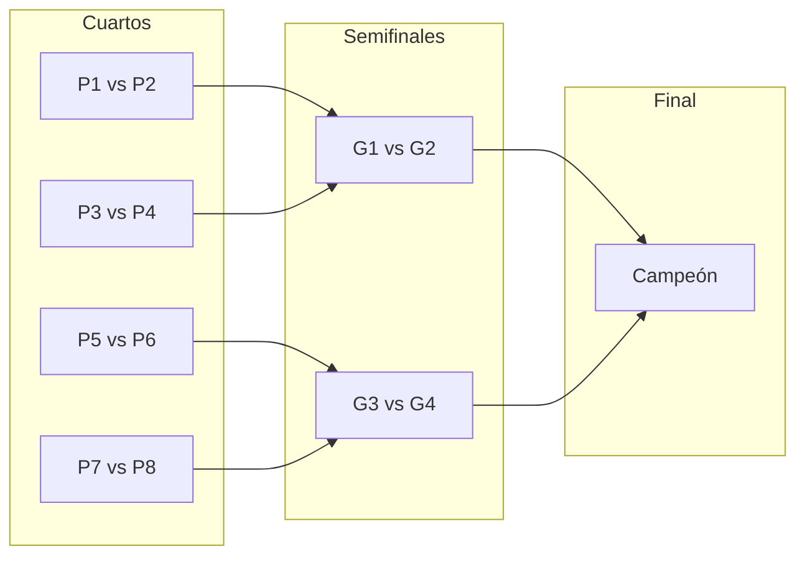

# 6ª parte – Sección de torneos

Actualizar el archivo del plan principal (completar_sección_admin_torneos_6e0880ec.plan.md) tomando como referencia los tres documentos de actualizaciones y las iteraciones de Fase 4 (formato, premios, partidos, sorteo, cuadros). No modificar código del proyecto; solo el documento del plan.

---

## Resumen ejecutivo

- **Alinear con docs:** Corregir decisión Super admin (sí puede crear torneos y gestionar inscripciones). Actualizar "Estado actual" con lo implementado (formulario, super admin, inscripciones, landing/menú). Marcar Fase 1.4 y pasos 1–4 como hechos; dejar pendiente CourtBlock, edición/eliminación, publicación y Fase 4.
- **Expandir Fase 4:** En el plan principal, sustituir la Fase 4 (opcional) por: (1) **Paso 1** – Formato del torneo (Eliminatoria directa / Fase de grupos + Doble Eliminatoria), premios monetario o no, y premios por liga (Oro/Plata) si aplica; (2) **Partidos** – División por formato, fase de grupos (N grupos aleatorios + Round Robin), sorteo con opción desde minPairs, dibujo de cuadros (bracket). Modelo: tournamentFormat, prizeIsMonetary, premios por liga, Match/Fixture.

---

## 1. Corregir decisión "Super admin" (inconsistencia con docs)

El plan actual dice que el **super admin no puede crear torneos**. Los docs indican lo contrario:

- [admin-torneos-superadmin-inscripciones-2026-02.md](../actualizaciones/admin-torneos-superadmin-inscripciones-2026-02.md): el super admin **sí** puede crear torneos (seleccionando el club) y gestionar inscripciones en cualquier torneo con acceso.

**Cambios:**

- En **Fase 1.2** (Servicio y validaciones): sustituir "Solo admin del tenant puede crear/editar torneos; el super admin **no** crea torneos" por algo como: "Solo admin del tenant o super admin (con tenant seleccionado) pueden crear/editar torneos".
- En **Fase 1.3** (APIs REST): actualizar el párrafo de GET/POST para indicar que el super admin puede crear torneos enviando `tenantId` en el body y que la API valida con `canAccessTenant`.
- En la tabla **Decisiones cerradas**, fila "Super admin": cambiar a: "**Sí puede crear torneos** (debe seleccionar el club en el formulario; la API acepta `tenantId` y valida con `canAccessTenant`). También puede gestionar inscripciones en cualquier torneo al que tenga acceso."

---

## 2. Actualizar "Estado actual" con lo ya implementado

Reflejar lo documentado en los tres archivos:

**Del formulario** ([admin-torneos-formulario-2026-02.md](../actualizaciones/admin-torneos-formulario-2026-02.md)):

- Paso 1: campo "Parejas máximas", validación min ≤ max.
- Paso 2: botón "Confirmar Horarios" habilitado cuando la franja tiene inicio y cierre.
- Vista previa: cronograma con rango completo (inicio - fin) por franja.
- Paso 3: botón "Volver al paso anterior" en esquina inferior izquierda de la tarjeta.

**De super admin e inscripciones** ([admin-torneos-superadmin-inscripciones-2026-02.md](../actualizaciones/admin-torneos-superadmin-inscripciones-2026-02.md)):

- Super admin puede crear torneos (selector de club en "Crear torneo"; POST con `tenantId`).
- Super admin puede gestionar inscripciones (GET/POST/PATCH/DELETE con tenant resuelto vía torneo y `canAccessTenant`).
- UI: selector de club para super admin, estado de error en inscripciones + "Reintentar", mensaje del API al agregar, aviso "Cupo completo" y deshabilitar "Agregar" cuando `currentPairs >= maxPairs`.

**De landing y menú** ([landing-login-menu-usuario-2026-02.md](../actualizaciones/landing-login-menu-usuario-2026-02.md)):

- Login desde landing redirige a `/` (no al dashboard).
- Header con avatar y menú: "Ir a mi club", "Panel Super Admin" (si aplica), "Cerrar sesión".
- Botón "Reservar Ahora" condicional (sin sesión → login; con sesión y tenant → dashboard; con sesión sin tenant → ancla a `#clubs-list`).

**Texto sugerido para la sección "Estado actual":**

- Añadir un subapartado **Implementado (según docs)** que liste lo anterior y cite los tres `.md` de actualizaciones.
- En **Falta**, mantener solo lo que sigue pendiente según el plan: CourtBlock e integración en disponibilidad, cancelación de reservas con aviso, edición/eliminación de torneos (PATCH/DELETE y recálculo de CourtBlocks si aplica), publicación (OPEN_REGISTRATION + `publishedAt`), listado público de torneos si aplica, y Fase 4 opcional (partidos/pagos fuera de alcance). Quitar de "Falta" todo lo que ya está cubierto por los docs (modelo, APIs base, quitar mock, conectar wizard, inscripciones cargadas por admin, selector super admin, UI inscripciones).

---

## 3. Ajustar Fase 1.4 y orden recomendado

- En **Fase 1.4** (Frontend: quitar mock y conectar wizard): indicar que ya está hecho (fetch a GET/POST, handlePublish a API, estados vacío/error) y que las mejoras del formulario y del flujo super admin están documentadas en los docs citados.
- En **Orden recomendado de implementación**: marcar como hechos los puntos 1–4 (Prisma, servicio, APIs torneos e inscripciones, frontend sin mock y con wizard conectado) y el 6 en la parte de inscripciones y publicación (en la medida ya implementada). Dejar explícitamente como pendientes: punto 5 (CourtBlock, cancelar reservas, availability, liberación, PATCH con recálculo) y lo que falte de publicación/listado público y de edición/eliminación.

---

## 4. Tabla "Archivos clave" y cierre

- En la tabla **Archivos clave a crear o tocar**: añadir que los archivos de API y UI ya tocados para super admin e inscripciones están en [admin-torneos-superadmin-inscripciones-2026-02.md](../actualizaciones/admin-torneos-superadmin-inscripciones-2026-02.md). Opcional: añadir una fila "Landing / Login" con `middleware.ts`, `app/login/page.tsx`, `app/page.tsx`, `components/LandingPage.tsx` y referenciar [landing-login-menu-usuario-2026-02.md](../actualizaciones/landing-login-menu-usuario-2026-02.md).
- En **Cierre en profundidad**: en "Vista detalle torneo" y "UI", añadir una nota de que la gestión de inscripciones (lista, agregar, cupo completo, Reintentar) y el selector de club para super admin ya están implementados según los docs.

---

## 5. Documentación de referencia

- Añadir al final (o en "Documentación de referencia") los tres documentos de actualizaciones:
  - [admin-torneos-formulario-2026-02.md](../actualizaciones/admin-torneos-formulario-2026-02.md)
  - [admin-torneos-superadmin-inscripciones-2026-02.md](../actualizaciones/admin-torneos-superadmin-inscripciones-2026-02.md)
  - [landing-login-menu-usuario-2026-02.md](../actualizaciones/landing-login-menu-usuario-2026-02.md)

---

## 6. Expandir Fase 4: Partidos, sorteo del fixture y cuadros

En el plan principal (completar_sección_admin_torneos_6e0880ec.plan.md), **sustituir o ampliar** la sección **Fase 4 (opcional): Partidos** con lo siguiente.

### 6.0 Tipo de torneo (selector en Paso 1 – Datos del torneo)

- La posibilidad de elegir **qué tipo de torneo** se realiza debe estar en la **primera ventana** del wizard (Paso 1: Club, Título, Categoría, Premios, Reglas). El formato elegido determina: (a) qué premios se muestran (2 premios globales vs 4 premios por liga); (b) cómo se genera el fixture (ver 6.1 y 6.1a).
- Añadir en ese paso una sección o campo **"Formato del torneo"** (o "Tipo de torneo") con dos opciones:
  1. **Eliminatoria directa** (ej. Octavos a Final): un solo cuadro eliminatorio hasta la final.
  2. **Fase de grupos + Doble Eliminatoria**: fase de grupos; los 2 mejores de cada grupo van a "Liga de Oro", los 2 peores a "Liga de Plata"; luego doble eliminatoria en cada liga.
- Persistir el formato elegido en el modelo del torneo (ej. campo `tournamentFormat`: `DIRECT_ELIMINATION` | `GROUPS_DOUBLE_ELIMINATION`) para que el sorteo y la generación de partidos usen la lógica correcta.

### 6.0a Premios: monetario o no, y por liga (Oro/Plata)

- **Tipo de premio (monetario o no):** En Paso 1, en la sección de premios, permitir elegir si el premio será **monetario** o **no monetario**.
  - **Monetario:** se usan campos numéricos (ej. valor en pesos) para 1er y 2do lugar; el front puede formatear a moneda.
  - **No monetario:** el premio es descriptivo (ej. trofeo, producto, beca). Campos de texto o descripción por puesto (1er lugar, 2do lugar) en lugar de monto. En el modelo: puede ser un flag `prizeIsMonetary` (boolean) y, si es monetario, `prizeFirst`/`prizeSecond` (Int); si no, `prizeFirstDescription`/`prizeSecondDescription` (String), o un solo campo `prizeDescription` por puesto.
- **Premios por liga (solo si formato "Fase de grupos + Doble Eliminatoria"):** Cuando el formato del torneo es Liga de Oro y Liga de Plata, los premios se configuran **por separado** para cada liga:
  - **Liga de Oro:** premio 1er lugar y premio 2do lugar (monetario o descripción, según el tipo elegido).
  - **Liga de Plata:** premio 1er lugar y premio 2do lugar (monetario o descripción, según el tipo elegido).
- En la UI del Paso 1: si el formato es "Eliminatoria directa", mostrar los dos premios habituales (1er y 2do). Si el formato es "Fase de grupos + Doble Eliminatoria", mostrar dos bloques, "Premios Liga de Oro" y "Premios Liga de Plata", cada uno con 1er y 2do lugar (y en cada caso respetar si el premio es monetario o no).
- Persistir en el modelo: tipo de premio (monetario/no) y, para formato doble liga, cuatro premios (Oro 1er, Oro 2do, Plata 1er, Plata 2do) ya sea como valores numéricos o como textos según corresponda.

### 6.1 División de partidos y formatos

- Definir entidades para el cuadro: **Match** (o Fixture): partido entre dos parejas, con ronda, grupo (si aplica), posición en el cuadro y resultado opcional.
- **Formato 1 – Eliminatoria directa:** A partir de N parejas, calcular rondas (octavos, cuartos, semifinal, final); si N no es potencia de 2, usar byes. Un solo cuadro hasta la final.
- **Formato 2 – Fase de grupos + Doble Eliminatoria:** Primero se juega la fase de grupos (ver 6.1a); según posiciones, los 2 mejores de cada grupo van a "Liga de Oro" y los 2 peores a "Liga de Plata"; en cada liga se arma un cuadro de doble eliminatoria (ganadores y perdedores).
- Servicio/API: generar el **fixture** (lista de partidos por ronda y, si aplica, por grupo) una vez realizado el sorteo.

### 6.1a Fase de grupos (formato "Fase de grupos + Doble Eliminatoria")

- **Distribución en grupos:** Distribuir **aleatoriamente** las parejas inscritas en **N grupos** (ej. 4 grupos). El número N puede ser configurable en Paso 1 (ej. "Cantidad de grupos") o derivado de la cantidad de parejas; dejarlo definido en el plan (ej. 4 grupos por defecto si hay 8–16 parejas).
- **Partidos por grupo:** Generar los registros **Match** de **todos contra todos (Round Robin)** dentro de cada grupo. Es decir, por cada grupo se crean los partidos que enfrentan a cada pareja con cada otra del mismo grupo; los resultados determinan la tabla del grupo (posiciones) y quiénes pasan a Liga de Oro (2 mejores) y quiénes a Liga de Plata (2 peores).

### 6.2 Sorteo del fixture

- **Sorteo:** Algoritmo que asigna las parejas inscritas a las posiciones del cuadro (llaves). Puede ser aleatorio (shuffle) o por orden de inscripción; dejar definido en el plan (ej. "sorteo aleatorio").
- **Momento del sorteo:** El admin dispara el sorteo manualmente desde la UI (botón "Realizar sorteo" en la vista de gestión del torneo / inscripciones).

### 6.3 Opción: sorteo con cantidad mínima de parejas

- Cuando el número de parejas inscritas **alcance o supere** `minPairs`, la UI debe ofrecer la **opción de hacer el sorteo con las parejas que ya están**.
- No obligar a llegar a `maxPairs`; si el admin cierra inscripciones o decide "jugar con lo que hay", puede ejecutar el sorteo con `currentPairs >= minPairs`. Validación en backend: solo permitir generar fixture si `currentPairs >= minPairs`.
- En la pantalla de inscripciones (o vista detalle torneo): mostrar mensaje tipo "Ya puedes realizar el sorteo con X parejas" y botón "Realizar sorteo" habilitado cuando `currentPairs >= minPairs`.

### 6.4 Dibujo de los cuadros del sorteo

- Cuando se hayan agregado las parejas y se haya realizado el sorteo, mostrar un **cuadro visual del fixture** (bracket) en la UI.
- Estructura típica de cuadro eliminatorio (ejemplo 8 parejas): primera ronda (cuartos) con 4 partidos, semifinales con 2 partidos, final con 1; las llaves se conectan de ronda a ronda (ganador partido 1 vs ganador partido 2 en semifinal, etc.).
- Esquema del cuadro (8 parejas, 4 rondas de partidos):

- **Contenido por partido (celda del cuadro):** Llave/posición, pareja A vs pareja B (nombres o etiquetas), resultado si ya se cargó (opcional).
- **Ubicación:** Vista "Fixture" o "Cuadro" dentro del detalle del torneo (pestaña o sección), visible después del sorteo. Si no hay sorteo aún, mostrar "Realiza el sorteo para ver el cuadro" y botón para sortear (habilitado si `currentPairs >= minPairs`).

### 6.5 Qué añadir al plan principal

- En **Paso 1 (Datos del torneo)** del plan: añadir selector "Formato del torneo" con opciones (1) Eliminatoria directa, (2) Fase de grupos + Doble Eliminatoria; persistir en modelo (ej. `tournamentFormat`). Añadir **premios**: (a) opción "Premio monetario" sí/no (campos número vs texto/descripción); (b) si formato es Liga de Oro/Plata, premios por liga por separado (Liga de Oro 1er/2do, Liga de Plata 1er/2do).
- En **Fase 4**: reemplazar el párrafo actual por subsecciones: (1) Tipo de torneo en Paso 1, (2) Premios monetario/no y por liga (6.0a), (3) División de partidos y modelo Match/Fixture (ambos formatos), (4) Fase de grupos: distribución aleatoria en N grupos + Round Robin por grupo, (5) Sorteo del fixture, (6) Opción de sorteo con mínimo de parejas, (7) Dibujo de los cuadros (bracket; para eliminatoria y para Liga Oro/Plata si aplica).
- Incluir en **Archivos clave**: campo/formato y bloques de premios (monetario/no, por liga) en Paso 1 (app/admin-panel/admin/torneos/page.tsx), modelo Prisma (tournamentFormat, prizeIsMonetary, premios por liga si aplica, grupos si aplica), componente(s) de UI para el cuadro (bracket), ruta/estado "Fixture", API o servicio para generar sorteo y fixture (incl. round-robin por grupo).
- En **Orden recomendado**: Fase 4 como último paso opcional: (1) Modelo: tournamentFormat, prizeIsMonetary, premios por liga (Oro/Plata) si aplica; (2) Paso 1 UI: selector formato + bloques premios (monetario/no; si doble liga, Oro y Plata por separado); (3) Modelo Match + generación de fixture (eliminatoria y/o grupos + doble eliminatoria); (4) Distribución aleatoria en grupos y Round Robin; (5) API de sorteo; (6) UI "Realizar sorteo" (habilitado si currentPairs >= minPairs); (7) UI cuadro/bracket.

---

## Resumen de ediciones en el plan

| Sección                           | Acción                                                                                                                                                                                                   |
| --------------------------------- | -------------------------------------------------------------------------------------------------------------------------------------------------------------------------------------------------------- |
| Decisiones cerradas – Super admin | Cambiar a "Sí puede crear torneos (selector club, `tenantId`, `canAccessTenant`) y gestionar inscripciones".                                                                                             |
| Fase 1.2 y 1.3                    | Incluir super admin como creador con tenant seleccionado.                                                                                                                                                |
| Estado actual                     | Añadir "Implementado (según docs)" con formulario, super admin + inscripciones, landing/menú; reducir "Falta" a CourtBlock, disponibilidad, edición/eliminación, publicación/listado, Fase 4 pendiente.  |
| Fase 1.4 y Orden recomendado      | Marcar pasos 1–4 y parte del 6 como hechos; dejar 5 y resto de 6/7 como pendientes.                                                                                                                      |
| Archivos clave / Cierre           | Referenciar docs de super admin e inscripciones; opcional landing; nota en UI/inscripciones.                                                                                                             |
| Documentación de referencia       | Incluir los tres .md de actualizaciones.                                                                                                                                                                 |
| **Paso 1 – Formato y premios**    | Añadir al plan principal: selector "Formato del torneo" (Eliminatoria directa / Fase de grupos + Doble Eliminatoria); "Premio monetario" sí/no; si doble liga, premios Liga de Oro (1er/2do) y Liga de Plata (1er/2do) por separado. Modelo: tournamentFormat, prizeIsMonetary, campos premios por liga. |
| **Fase 4 Partidos**               | Expandir con: división de partidos por formato, fase de grupos (N grupos aleatorios + Round Robin), sorteo (opción con minPairs), dibujo de cuadros (bracket); modelo Match; API sorteo/fixture; archivos clave y orden (ver 6.5).                                        |

Con esto el plan queda alineado con lo ya hecho, con lo que falta (CourtBlock, disponibilidad, edición/eliminación, publicación), la decisión sobre super admin corregida, y la Fase 4 detallada: formato y premios en Paso 1, partidos, sorteo y cuadros.
