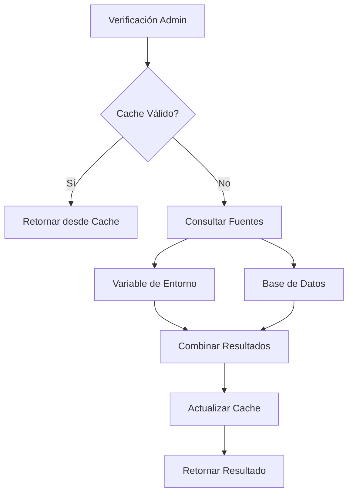
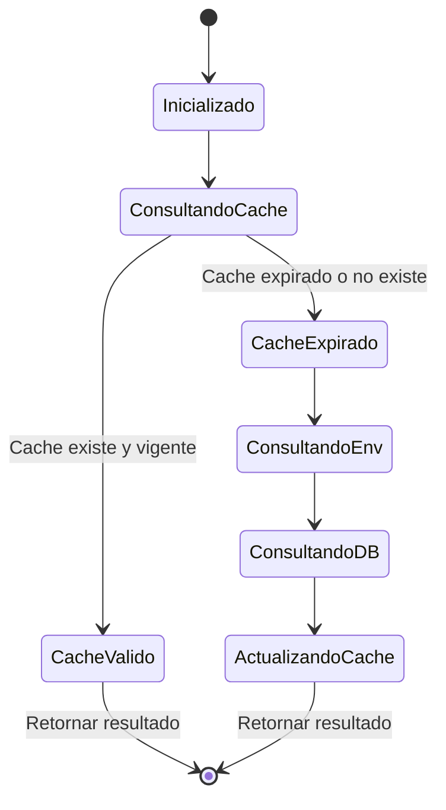

# AdminSystem - Sistema de Administración

## Información del Servicio

**Nombre**: `AdminSystem`  
**Ubicación**: `lib/admin-system.ts`  
**Tipo**: Servicio de Autorización  
**Autor**: Equipo de desarrollo  
**Fecha**: 2024-01-28

## Descripción

Sistema flexible de administradores que combina configuración por variables de entorno y gestión dinámica a través de base de datos. Proporciona un mecanismo robusto para determinar qué usuarios tienen permisos administrativos, con cache para optimizar el rendimiento y logs para auditoría.

## Responsabilidades

- **Gestión de Administradores**: Mantener lista de usuarios con permisos administrativos
- **Verificación de Permisos**: Determinar si un usuario es administrador
- **Cache de Rendimiento**: Optimizar consultas frecuentes de verificación
- **Fallback de Seguridad**: Garantizar que siempre existan administradores principales
- **Auditoría**: Registrar accesos administrativos

## Arquitectura



## Interfaz Pública

### Funciones Principales

#### `getAllAdmins(): Promise<Set<string>>`
Obtiene todos los administradores de ambas fuentes (env + db) con cache.

**Retorna**: `Promise<Set<string>>` - Set con emails de administradores normalizados

#### `isAdminEmail(email: string): Promise<boolean>`
Verifica si un email corresponde a un administrador.

**Parámetros**:
- `email: string` - Email a verificar

**Retorna**: `Promise<boolean>` - True si es administrador

#### `isAdminEmailSync(email: string): boolean`
Verificación síncrona solo contra administradores de variables de entorno.

**Parámetros**:
- `email: string` - Email a verificar

**Retorna**: `boolean` - True si es administrador principal

### Funciones Internas

#### `getEnvAdmins(): string[]`
Obtiene administradores desde variable de entorno `ADMIN_EMAILS`.

#### `getDbAdmins(): Promise<string[]>`
Obtiene administradores activos desde la tabla `AdminWhitelist`.

## Configuración

### Variables de Entorno

```bash
# Administradores principales (separados por comas)
ADMIN_EMAILS="admin1@example.com,admin2@example.com,admin3@example.com"
```

### Esquema de Base de Datos

```sql
CREATE TABLE AdminWhitelist (
  id SERIAL PRIMARY KEY,
  email VARCHAR(255) UNIQUE NOT NULL,
  isActive BOOLEAN DEFAULT true,
  addedBy VARCHAR(255),
  addedAt TIMESTAMP DEFAULT CURRENT_TIMESTAMP,
  notes TEXT
);
```

## Dependencias

- `@/lib/prisma` - Cliente de base de datos Prisma
- `@prisma/client` - Tipos de Prisma
- Variables de entorno del sistema

## Ejemplos de Uso

### Verificación Básica de Administrador
```typescript
import { isAdminEmail } from '@/lib/admin-system'

// En un API route
export async function GET(request: Request) {
  const userEmail = getUserEmailFromSession(request)
  
  const isAdmin = await isAdminEmail(userEmail)
  
  if (!isAdmin) {
    return new Response('Forbidden', { status: 403 })
  }
  
  // Lógica para administradores
  return Response.json({ data: 'admin data' })
}
```

### Verificación Síncrona (Casos Especiales)
```typescript
import { isAdminEmailSync } from '@/lib/admin-system'

// En middleware o funciones síncronas
function checkAdminSync(email: string) {
  // Solo verifica contra administradores principales
  return isAdminEmailSync(email)
}
```

### Obtener Lista Completa de Administradores
```typescript
import { getAllAdmins } from '@/lib/admin-system'

// Para auditoría o gestión
async function getAdminList() {
  const admins = await getAllAdmins()
  return Array.from(admins)
}
```

### En NextAuth.js Callbacks
```typescript
// lib/auth.ts
import { isAdminEmail } from '@/lib/admin-system'

export const authOptions: NextAuthOptions = {
  // ... otras configuraciones
  callbacks: {
    async signIn({ user, account, profile }) {
      if (account?.provider === 'google' && user.email) {
        const isAdmin = await isAdminEmail(user.email)
        // Agregar información de admin al usuario
        user.isAdmin = isAdmin
        return true
      }
      return false
    },
    async session({ session, token }) {
      if (session.user?.email) {
        const isAdmin = await isAdminEmail(session.user.email)
        session.user.isAdmin = isAdmin
      }
      return session
    }
  }
}
```

## Estados y Ciclo de Vida



## Manejo de Errores

### Errores de Base de Datos
```typescript
const getDbAdmins = async (): Promise<string[]> => {
  try {
    const admins = await prisma.adminWhitelist.findMany({
      where: { isActive: true },
      select: { email: true }
    })
    return admins.map(admin => admin.email.toLowerCase())
  } catch (error) {
    console.error('Error obteniendo administradores de BD:', error)
    return [] // Fallback a array vacío
  }
}
```

### Validación de Email
```typescript
export const isAdminEmail = async (email: string): Promise<boolean> => {
  if (!email) return false // Validación básica
  
  const normalizedEmail = email.toLowerCase().trim()
  const admins = await getAllAdmins()
  
  return admins.has(normalizedEmail)
}
```

## Rendimiento

### Sistema de Cache
- **Duración**: 5 minutos por defecto
- **Tipo**: Cache en memoria con expiración
- **Invalidación**: Automática por tiempo

### Optimizaciones
- Normalización de emails (lowercase, trim)
- Uso de `Set` para búsquedas O(1)
- Cache compartido entre todas las verificaciones
- Consultas optimizadas a base de datos

## Testing

### Tests Unitarios
```typescript
import { isAdminEmail, isAdminEmailSync } from '@/lib/admin-system'

// Mock Prisma
jest.mock('@/lib/prisma', () => ({
  prisma: {
    adminWhitelist: {
      findMany: jest.fn()
    }
  }
}))

// Mock variables de entorno
process.env.ADMIN_EMAILS = 'admin1@test.com,admin2@test.com'

describe('AdminSystem', () => {
  test('should identify env admin synchronously', () => {
    expect(isAdminEmailSync('admin1@test.com')).toBe(true)
    expect(isAdminEmailSync('user@test.com')).toBe(false)
  })

  test('should identify admin from database', async () => {
    // Mock database response
    const mockPrisma = require('@/lib/prisma').prisma
    mockPrisma.adminWhitelist.findMany.mockResolvedValue([
      { email: 'dbadmin@test.com' }
    ])

    const result = await isAdminEmail('dbadmin@test.com')
    expect(result).toBe(true)
  })

  test('should handle email normalization', async () => {
    const result = await isAdminEmail('  ADMIN1@TEST.COM  ')
    expect(result).toBe(true)
  })
})
```

### Tests de Integración
```typescript
describe('AdminSystem Integration', () => {
  test('should work with real database', async () => {
    // Setup test database
    await prisma.adminWhitelist.create({
      data: {
        email: 'testadmin@example.com',
        isActive: true
      }
    })

    const result = await isAdminEmail('testadmin@example.com')
    expect(result).toBe(true)

    // Cleanup
    await prisma.adminWhitelist.deleteMany({
      where: { email: 'testadmin@example.com' }
    })
  })
})
```

## Monitoreo y Logging

### Logs de Acceso
```typescript
// Agregar logging para auditoría
export const isAdminEmail = async (email: string): Promise<boolean> => {
  if (!email) return false
  
  const normalizedEmail = email.toLowerCase().trim()
  const admins = await getAllAdmins()
  const isAdmin = admins.has(normalizedEmail)
  
  // Log de auditoría
  console.log(`Admin check: ${normalizedEmail} -> ${isAdmin}`, {
    timestamp: new Date().toISOString(),
    email: normalizedEmail,
    isAdmin,
    source: 'admin-system'
  })
  
  return isAdmin
}
```

### Métricas
- Número de verificaciones por minuto
- Cache hit ratio
- Errores de base de datos
- Tiempo de respuesta promedio

## Problemas Conocidos

1. **Cache Global**: El cache es global y no se invalida automáticamente cuando se modifican administradores en BD
2. **Sincronización**: No hay sincronización entre instancias de la aplicación
3. **Logs Limitados**: Sistema de logging básico, podría mejorarse
4. **Validación de Email**: Validación básica, podría ser más robusta

## Mejoras Futuras

1. **Cache Distribuido**: Usar Redis para cache compartido entre instancias
2. **Invalidación Inteligente**: Invalidar cache cuando se modifican administradores
3. **Logging Avanzado**: Integrar con sistema de logging estructurado
4. **Validación Robusta**: Agregar validación de formato de email
5. **Métricas**: Implementar métricas detalladas de uso
6. **API de Gestión**: Crear endpoints para gestionar administradores dinámicamente

## Notas de Desarrollo

- Los administradores de variables de entorno son "principales" y siempre están activos
- Los administradores de base de datos pueden ser desactivados con `isActive: false`
- El cache se resetea automáticamente cada 5 minutos
- Todos los emails se normalizan a lowercase para consistencia
- El sistema es tolerante a fallos: si la BD falla, usa solo administradores de env

## Changelog

### v1.0.0 (2024-01-28)
- Implementación inicial del sistema de administradores
- Soporte para administradores de variables de entorno y base de datos
- Sistema de cache para optimización de rendimiento
- Funciones síncronas y asíncronas de verificación
- Manejo de errores y fallbacks de seguridad