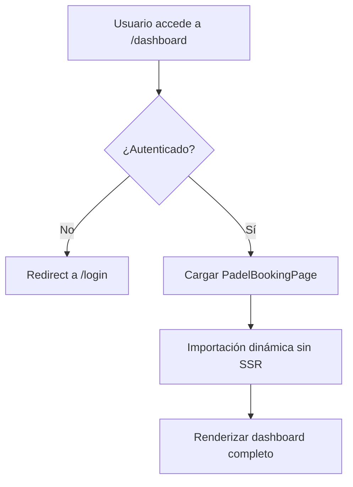
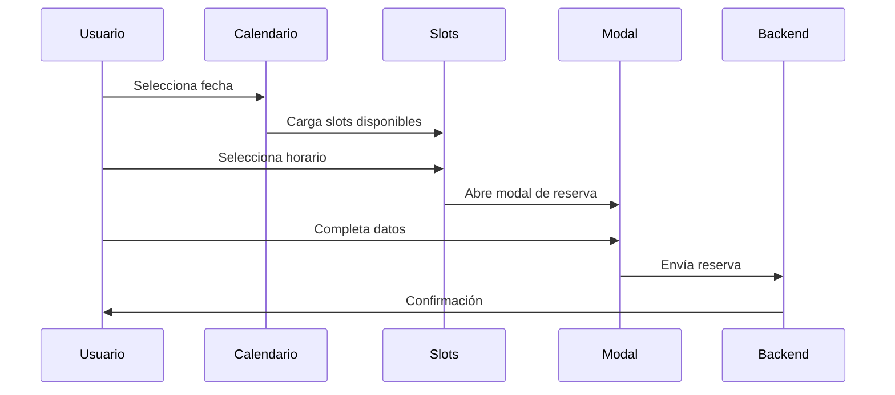
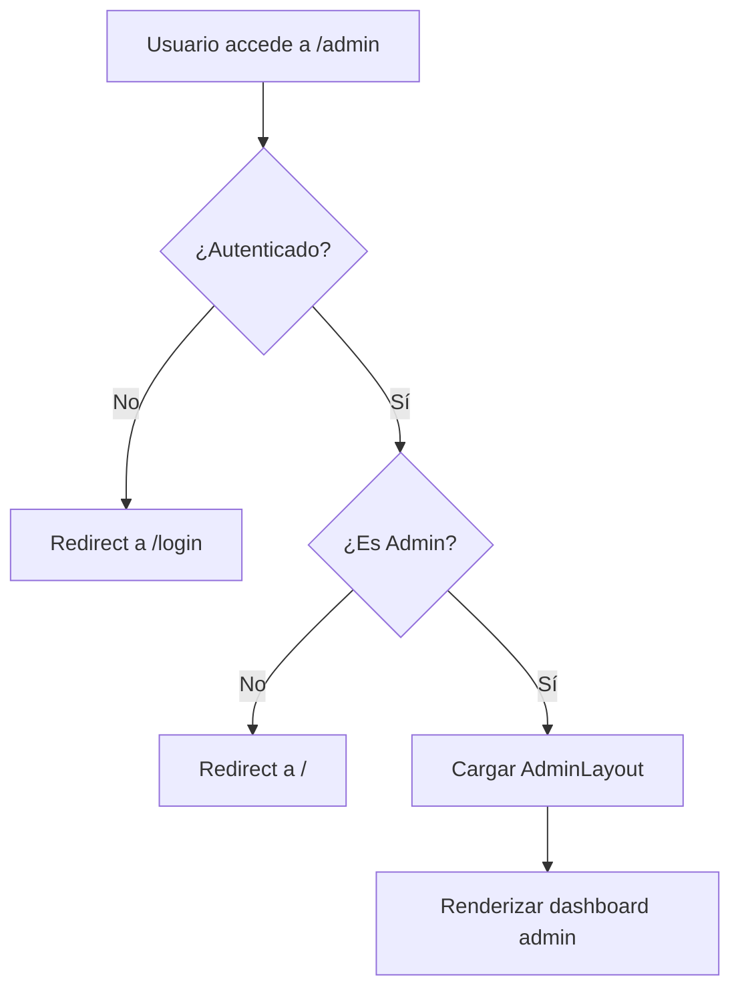

# Especificación Técnica de Interfaces del Frontend

## Resumen Ejecutivo

Este documento proporciona una especificación técnica detallada de las interfaces del frontend para las URLs principales del sistema de turnero de pádel:

- **Dashboard de Usuario**: `http://localhost:3000/dashboard`
- **Panel de Administración**: `http://localhost:3000/admin`

---

## 1. Arquitectura de Rutas

### 1.1 Estructura de Directorios

```
app/
├── (protected)/              # Rutas protegidas de usuario
│   ├── dashboard/
│   │   └── page.tsx         # Dashboard principal del usuario
│   └── layout.tsx           # Layout con autenticación
├── (admin)/                  # Rutas administrativas
│   ├── admin/
│   │   └── page.tsx         # Dashboard administrativo
│   ├── canchas/
│   ├── turnos/
│   ├── usuarios/
│   ├── estadisticas/
│   ├── productos/
│   └── layout.tsx           # Layout admin con permisos
└── auth/                     # Autenticación
    ├── login/
    └── error/
```

### 1.2 Middleware de Protección

**Archivo**: `middleware.ts`

```typescript
// Rutas protegidas que requieren autenticación
const protectedRoutes = ['/dashboard', '/admin']

// Rutas que requieren permisos de administrador
const adminRoutes = ['/admin']

// Lógica de redirección:
// No autenticado → /login
// Autenticado pero no admin → / (para rutas admin)
```

---

## 2. Dashboard de Usuario (`/dashboard`)

### 2.1 Flujo de Autenticación



### 2.2 Componentes y Estructura

#### Componente Principal: `PadelBookingPage`

**Ubicación**: `padel-booking.tsx`
**Tipo**: Client Component ('use client')
**Importación**: Dinámica sin SSR

##### Hooks Utilizados
```typescript
const { user, profile, signOut, isAdmin, loading } = useAuth()
const {
  selectedCourt,
  setSelectedCourt,
  selectedDate,
  setSelectedDate,
  selectedSlot,
  setSelectedSlot,
  // ... más estados globales
} = useAppState()
```

##### Estados Locales Principales
- `activeNavItem`: Navegación activa (inicio, mis-turnos, configuracion)
- `isDarkMode`: Modo oscuro/claro
- `isUnifiedView`: Vista unificada de horarios
- `showOnlyOpen`: Filtro de slots disponibles

### 2.3 Navegación del Dashboard

#### Estructura de Navegación
```typescript
type NavItem = 'inicio' | 'mis-turnos' | 'configuracion'

// Secciones principales:
1. Inicio: Calendario y reservas
2. Mis Turnos: Gestión de reservas personales
3. Configuración: Ajustes de usuario
```

#### Componentes de Navegación
- **HomeSection**: Vista principal con calendario
- **MisTurnos**: Gestión de turnos del usuario
- **Configuración**: Ajustes y preferencias

### 2.4 Sistema de Reservas

#### Flujo de Reserva


#### Interfaces de Datos
```typescript
interface CourtBooking {
  id: string
  courtId: string
  courtName: string
  date: string
  startTime: string
  endTime: string
  duration: number
  players: Player[]
  status: BookingStatus
  paymentStatus: PaymentStatus
  totalPrice: number
  createdAt: string
  updatedAt: string
}

interface Player {
  id: string
  name: string
  email?: string
  phone?: string
  isOwner: boolean
}

type BookingStatus = 'PENDING' | 'CONFIRMED' | 'CANCELLED' | 'COMPLETED'
type PaymentStatus = 'PENDING' | 'PARTIAL' | 'PAID' | 'REFUNDED'
```

---

## 3. Panel de Administración (`/admin`)

### 3.1 Flujo de Autorización



### 3.2 Layout Administrativo

#### Estructura del Header
```typescript
// Navegación principal (desktop)
const adminNavItems = [
  { href: '/admin/canchas', icon: Settings, label: 'Canchas' },
  { href: '/admin/turnos', icon: Calendar, label: 'Turnos' },
  { href: '/admin/usuarios', icon: Users, label: 'Usuarios' },
  { href: '/admin/estadisticas', icon: BarChart3, label: 'Estadísticas' },
  { href: '/admin/productos', icon: Package, label: 'Productos' }
]
```

#### Navegación Responsiva
- **Desktop**: Navegación horizontal en header
- **Mobile**: Navegación inferior con iconos
- **Tablet**: Adaptación automática del layout

### 3.3 Dashboard Administrativo Principal

#### Archivo: `app/(admin)/admin/page.tsx`

##### Funcionalidades Principales

1. **Gestión de Turnos**
   ```typescript
   interface AdminBooking extends CourtBooking {
     userName: string
     userEmail: string
     individualPayments: {
       player1: PaymentStatus
       player2: PaymentStatus
       player3: PaymentStatus
       player4: PaymentStatus
     }
     extras: Extra[]
   }
   ```

2. **Sistema de Filtros**
   ```typescript
   interface FilterState {
     searchTerm: string
     statusFilter: 'all' | BookingStatus
     dateFilter: 'all' | 'today' | 'week' | 'month'
     paymentFilter: 'all' | PaymentStatus
   }
   ```

3. **Gestión de Extras**
   ```typescript
   interface Extra {
     id: string
     type: 'alquiler_raqueta' | 'pelota' | 'toalla' | 'bebida' | 'snack' | 'otro'
     name: string
     cost: number
     assignedTo: 'todos' | 'titular' | 'jugador2' | 'jugador3' | 'jugador4'
   }
   ```

### 3.4 Secciones Administrativas

#### Canchas (`/admin/canchas`)
- **Funcionalidad**: CRUD de canchas
- **Características**:
  - Lista de canchas con estado
  - Gestión de precios por horario
  - Configuración de disponibilidad
  - Mantenimiento y bloqueos

#### Turnos (`/admin/turnos`)
- **Funcionalidad**: Gestión completa de reservas
- **Características**:
  - Vista de todas las reservas
  - Filtros avanzados
  - Cambio de estados
  - Gestión de pagos

#### Usuarios (`/admin/usuarios`)
- **Funcionalidad**: Administración de usuarios
- **Características**:
  - Lista de usuarios registrados
  - Gestión de permisos
  - Historial de reservas por usuario
  - Bloqueo/desbloqueo de cuentas

#### Estadísticas (`/admin/estadisticas`)
- **Funcionalidad**: Reportes y métricas
- **Características**:
  - Ocupación por cancha y horario
  - Ingresos por período
  - Usuarios más activos
  - Tendencias de uso

#### Productos (`/admin/productos`)
- **Funcionalidad**: Gestión de extras y servicios
- **Características**:
  - Catálogo de productos
  - Gestión de precios
  - Inventario y stock
  - Configuración de servicios

---

## 4. Integración con Backend

### 4.1 API Routes Utilizadas

#### Dashboard de Usuario
```typescript
// Rutas principales para usuarios
GET /api/bookings/user          // Reservas del usuario
POST /api/bookings              // Crear nueva reserva
PUT /api/bookings/[id]          // Actualizar reserva
DELETE /api/bookings/[id]       // Cancelar reserva
GET /api/courts                 // Lista de canchas
GET /api/slots                  // Horarios disponibles
```

#### Panel de Administración
```typescript
// Rutas administrativas
GET /api/admin/bookings         // Todas las reservas
GET /api/admin/users            // Todos los usuarios
GET /api/admin/courts           // Gestión de canchas
GET /api/admin/stats            // Estadísticas
POST /api/admin/products        // Gestión de productos
```

### 4.2 Estado Global (AppStateProvider)

```typescript
interface AppState {
  // Selecciones del usuario
  selectedCourt: string | null
  selectedDate: Date
  selectedSlot: string | null
  
  // UI State
  isDarkMode: boolean
  activeNavItem: string
  isUnifiedView: boolean
  showOnlyOpen: boolean
  
  // Datos
  courts: Court[]
  currentBookings: CourtBooking[]
  pastBookings: CourtBooking[]
  adminBookings: AdminBooking[]
  
  // Loading states
  slotsLoading: boolean
  multipleSlotsLoading: boolean
}
```

---

## 5. Seguridad y Protecciones

### 5.1 Niveles de Protección

#### Nivel 1: Autenticación
- Verificación de sesión activa
- Redirección automática a login
- Manejo de tokens de sesión

#### Nivel 2: Autorización
- Verificación de permisos de administrador
- Restricción de acceso a rutas admin
- Validación en cliente y servidor

#### Nivel 3: Protección de Archivos
- Archivos marcados como PROTEGIDOS
- Proceso formal para modificaciones
- Separación clara entre user/admin

### 5.2 Validaciones de Datos

```typescript
// Validación de reservas
interface BookingValidation {
  courtId: string          // Requerido
  date: Date              // Fecha futura
  startTime: string       // Horario válido
  players: Player[]       // Mínimo 2, máximo 4
  totalPrice: number      // Mayor a 0
}

// Validación de admin
interface AdminValidation {
  isAdmin: boolean        // Requerido true
  permissions: string[]   // Lista de permisos
  sessionValid: boolean   // Sesión activa
}
```

---

## 6. Performance y Optimización

### 6.1 Estrategias de Carga

#### Dashboard de Usuario
- **Importación Dinámica**: Sin SSR para evitar hidratación
- **Loading States**: Spinners durante carga de datos
- **Lazy Loading**: Componentes bajo demanda

#### Panel de Administración
- **Server Components**: Layout renderizado en servidor
- **Client Components**: Interactividad en cliente
- **Paginación**: Para listas grandes de datos

### 6.2 Optimizaciones de UI

```typescript
// Memoización de componentes pesados
const MemoizedBookingList = memo(BookingList)
const MemoizedCalendar = memo(Calendar)

// Debounce para búsquedas
const debouncedSearch = useMemo(
  () => debounce(handleSearch, 300),
  []
)

// Virtual scrolling para listas largas
const VirtualizedList = ({ items }) => {
  // Implementación de virtualización
}
```

---

## 7. Testing y Calidad

### 7.1 Cobertura de Tests E2E

#### Dashboard de Usuario
- Flujo completo de reserva
- Navegación entre secciones
- Gestión de turnos personales
- Responsividad móvil

#### Panel de Administración
- Acceso y permisos
- Gestión de reservas
- Filtros y búsquedas
- Operaciones CRUD

### 7.2 Métricas de Calidad

```typescript
// Métricas objetivo
interface QualityMetrics {
  loadTime: number        // < 2 segundos
  firstPaint: number      // < 1 segundo
  interactivity: number   // < 100ms
  accessibility: number   // Score > 90
  seo: number            // Score > 80
}
```

---

## 8. Roadmap y Mejoras Futuras

### 8.1 Dashboard de Usuario
- [ ] Notificaciones push
- [ ] Integración con calendario externo
- [ ] Sistema de favoritos
- [ ] Compartir reservas

### 8.2 Panel de Administración
- [ ] Dashboard en tiempo real
- [ ] Reportes avanzados
- [ ] Integración con sistemas de pago
- [ ] API para terceros

### 8.3 Mejoras Técnicas
- [ ] PWA (Progressive Web App)
- [ ] Offline support
- [ ] WebSockets para tiempo real
- [ ] Optimización de bundle size

---

*Documento técnico generado para el proyecto Turnero de Pádel*
*Última actualización: $(date)*