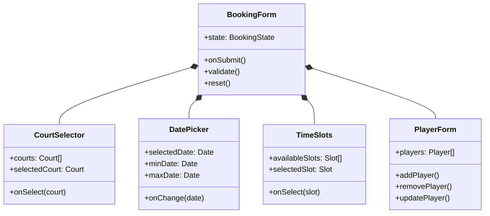
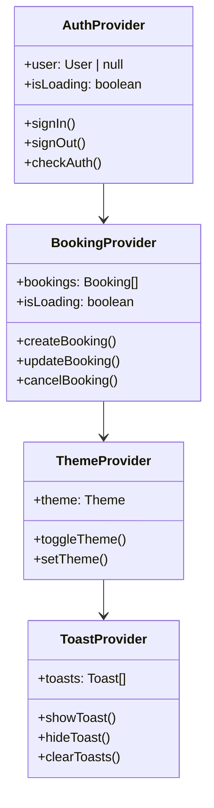
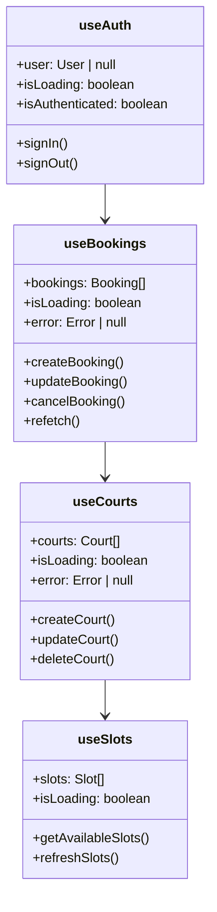

# Arquitectura de Componentes React

## Descripción

Este documento describe la arquitectura de componentes React del sistema de turnero de pádel, incluyendo la jerarquía de componentes, patrones utilizados y dependencias entre componentes.

## Jerarquía de Componentes

```mermaid
graph TD
    %% Root Level
    App["🏠 App (layout.tsx)"] --> AuthProvider["🔐 AuthProvider"]
    AuthProvider --> Router["🛣️ App Router"]
    
    %% Main Pages
    Router --> HomePage["🏠 HomePage"]
    Router --> LoginPage["🔐 LoginPage"]
    Router --> DashboardPage["📊 DashboardPage"]
    Router --> AdminPage["👑 AdminPage"]
    Router --> BookingPage["📅 BookingPage"]
    
    %% Home Page Components
    HomePage --> HeroSection["🎯 HeroSection"]
    HomePage --> FeaturesSection["✨ FeaturesSection"]
    HomePage --> CTASection["📢 CTASection"]
    
    %% Login Page Components
    LoginPage --> LoginForm["📝 LoginForm"]
    LoginForm --> GoogleButton["🔍 GoogleButton"]
    LoginForm --> LoadingSpinner["⏳ LoadingSpinner"]
    
    %% Dashboard Components
    DashboardPage --> TurneroApp["🎾 TurneroApp"]
    TurneroApp --> Header["📋 Header"]
    TurneroApp --> MainContent["📄 MainContent"]
    TurneroApp --> Footer["🔗 Footer"]
    
    %% Header Components
    Header --> Navigation["🧭 Navigation"]
    Header --> UserMenu["👤 UserMenu"]
    Navigation --> NavItem["📎 NavItem"]
    UserMenu --> UserAvatar["🖼️ UserAvatar"]
    UserMenu --> DropdownMenu["📋 DropdownMenu"]
    
    %% Main Content Components
    MainContent --> BookingForm["📝 BookingForm"]
    MainContent --> CourtGrid["🏟️ CourtGrid"]
    MainContent --> BookingList["📋 BookingList"]
    MainContent --> UserProfile["👤 UserProfile"]
    
    %% Booking Form Components
    BookingForm --> CourtSelector["🏟️ CourtSelector"]
    BookingForm --> DatePicker["📅 DatePicker"]
    BookingForm --> TimeSlots["⏰ TimeSlots"]
    BookingForm --> PlayerForm["👥 PlayerForm"]
    BookingForm --> PaymentSection["💳 PaymentSection"]
    
    CourtSelector --> CourtCard["🏟️ CourtCard"]
    TimeSlots --> TimeSlot["⏰ TimeSlot"]
    PlayerForm --> PlayerInput["👤 PlayerInput"]
    PaymentSection --> PaymentMethod["💳 PaymentMethod"]
    
    %% Court Grid Components
    CourtGrid --> CourtCard
    CourtCard --> CourtImage["🖼️ CourtImage"]
    CourtCard --> CourtInfo["ℹ️ CourtInfo"]
    CourtCard --> PriceDisplay["💰 PriceDisplay"]
    CourtCard --> FeatureList["✨ FeatureList"]
    
    %% Booking List Components
    BookingList --> BookingCard["📅 BookingCard"]
    BookingCard --> BookingStatus["📊 BookingStatus"]
    BookingCard --> BookingActions["⚙️ BookingActions"]
    BookingCard --> PlayerList["👥 PlayerList"]
    
    %% Admin Page Components
    AdminPage --> AdminDashboard["👑 AdminDashboard"]
    AdminDashboard --> AdminSidebar["📋 AdminSidebar"]
    AdminDashboard --> AdminContent["📄 AdminContent"]
    
    AdminContent --> BookingManagement["📅 BookingManagement"]
    AdminContent --> CourtManagement["🏟️ CourtManagement"]
    AdminContent --> UserManagement["👥 UserManagement"]
    AdminContent --> ReportsSection["📊 ReportsSection"]
    AdminContent --> SettingsPanel["⚙️ SettingsPanel"]
    
    %% Shared UI Components
    subgraph "🎨 Shared UI Components"
        Button["🔘 Button"]
        Input["📝 Input"]
        Select["📋 Select"]
        Modal["🪟 Modal"]
        Toast["🍞 Toast"]
        Card["🃏 Card"]
        Badge["🏷️ Badge"]
        Skeleton["💀 Skeleton"]
        Tooltip["💬 Tooltip"]
        Dialog["💬 Dialog"]
    end
    
    %% Connections to shared components
    BookingForm -.-> Button
    BookingForm -.-> Input
    BookingForm -.-> Select
    BookingForm -.-> Modal
    
    CourtCard -.-> Card
    CourtCard -.-> Badge
    CourtCard -.-> Button
    
    BookingCard -.-> Card
    BookingCard -.-> Badge
    BookingCard -.-> Tooltip
    
    AdminDashboard -.-> Dialog
    AdminDashboard -.-> Toast
    AdminDashboard -.-> Skeleton
    
    %% Styling
    classDef page fill:#e3f2fd,stroke:#1976d2,stroke-width:2px
    classDef component fill:#f3e5f5,stroke:#7b1fa2,stroke-width:2px
    classDef form fill:#e8f5e8,stroke:#388e3c,stroke-width:2px
    classDef ui fill:#fff3e0,stroke:#f57c00,stroke-width:2px
    classDef admin fill:#ffebee,stroke:#d32f2f,stroke-width:2px
    
    class HomePage,LoginPage,DashboardPage,AdminPage,BookingPage page
    class TurneroApp,Header,MainContent,Footer,Navigation,UserMenu component
    class BookingForm,CourtSelector,DatePicker,TimeSlots,PlayerForm,PaymentSection form
    class Button,Input,Select,Modal,Toast,Card,Badge,Skeleton,Tooltip,Dialog ui
    class AdminDashboard,AdminSidebar,AdminContent,BookingManagement,CourtManagement,UserManagement,ReportsSection,SettingsPanel admin
```



## Patrones de Componentes

### 1. Compound Components



### 2. Provider Pattern



### 3. Custom Hooks Pattern



## Estructura de Archivos

```
components/
├── ui/                          # Componentes base de shadcn/ui
│   ├── button.tsx
│   ├── input.tsx
│   ├── select.tsx
│   ├── modal.tsx
│   ├── toast.tsx
│   ├── card.tsx
│   ├── badge.tsx
│   └── ...
├── auth/                        # Componentes de autenticación
│   ├── LoginForm.tsx
│   ├── GoogleButton.tsx
│   ├── ProtectedRoute.tsx
│   └── AuthGuard.tsx
├── booking/                     # Componentes de reservas
│   ├── BookingForm.tsx
│   ├── CourtSelector.tsx
│   ├── DatePicker.tsx
│   ├── TimeSlots.tsx
│   ├── PlayerForm.tsx
│   ├── PaymentSection.tsx
│   ├── BookingCard.tsx
│   ├── BookingList.tsx
│   └── BookingStatus.tsx
├── court/                       # Componentes de canchas
│   ├── CourtCard.tsx
│   ├── CourtGrid.tsx
│   ├── CourtImage.tsx
│   ├── CourtInfo.tsx
│   ├── PriceDisplay.tsx
│   └── FeatureList.tsx
├── admin/                       # Componentes de administración
│   ├── AdminDashboard.tsx
│   ├── AdminSidebar.tsx
│   ├── BookingManagement.tsx
│   ├── CourtManagement.tsx
│   ├── UserManagement.tsx
│   ├── ReportsSection.tsx
│   └── SettingsPanel.tsx
├── layout/                      # Componentes de layout
│   ├── Header.tsx
│   ├── Footer.tsx
│   ├── Navigation.tsx
│   ├── Sidebar.tsx
│   └── MainContent.tsx
├── providers/                   # Context providers
│   ├── AuthProvider.tsx
│   ├── BookingProvider.tsx
│   ├── ThemeProvider.tsx
│   └── ToastProvider.tsx
└── TurneroApp.tsx              # Componente principal
```

## Props y State Management

### Tipado de Props

```typescript
// Ejemplo: BookingForm Props
interface BookingFormProps {
  initialData?: Partial<BookingFormData>
  onSubmit: (data: BookingFormData) => Promise<void>
  onCancel?: () => void
  isLoading?: boolean
  courts: Court[]
  className?: string
}

// Ejemplo: CourtCard Props
interface CourtCardProps {
  court: Court
  isSelected?: boolean
  onSelect?: (court: Court) => void
  showPrice?: boolean
  variant?: 'default' | 'compact' | 'detailed'
  className?: string
}
```

### Estado Local vs Global

```mermaid
graph TD
    A["🏠 App State"] --> B["🔐 Auth State (Global)"]
    A --> C["🎨 Theme State (Global)"]
    A --> D["🍞 Toast State (Global)"]
    
    E["📝 BookingForm"] --> F["📋 Form State (Local)"]
    E --> G["✅ Validation State (Local)"]
    E --> H["⏳ Loading State (Local)"]
    
    I["📅 BookingList"] --> J["📊 Filter State (Local)"]
    I --> K["📄 Pagination State (Local)"]
    
    L["👑 AdminDashboard"] --> M["📊 Dashboard State (Local)"]
    L --> N["🔍 Search State (Local)"]
    
    classDef global fill:#e8f5e8,stroke:#388e3c
    classDef local fill:#e3f2fd,stroke:#1976d2
    
    class B,C,D global
    class F,G,H,J,K,M,N local
```



## Optimizaciones de Performance

### 1. Memoización

```typescript
// React.memo para componentes puros
const CourtCard = React.memo<CourtCardProps>(({ court, onSelect }) => {
  return (
    <Card onClick={() => onSelect?.(court)}>
      {/* Contenido del componente */}
    </Card>
  )
})

// useMemo para cálculos costosos
const BookingList = ({ bookings, filters }) => {
  const filteredBookings = useMemo(() => {
    return bookings.filter(booking => 
      // Lógica de filtrado compleja
    )
  }, [bookings, filters])
  
  return (
    <div>
      {filteredBookings.map(booking => 
        <BookingCard key={booking.id} booking={booking} />
      )}
    </div>
  )
}

// useCallback para funciones
const BookingForm = ({ onSubmit }) => {
  const handleSubmit = useCallback(async (data) => {
    await onSubmit(data)
  }, [onSubmit])
  
  return <form onSubmit={handleSubmit}>{/* ... */}</form>
}
```

### 2. Code Splitting

```typescript
// Lazy loading de páginas
const AdminPage = lazy(() => import('./pages/AdminPage'))
const BookingPage = lazy(() => import('./pages/BookingPage'))

// Lazy loading de componentes pesados
const ReportsSection = lazy(() => import('./components/admin/ReportsSection'))
const ChartComponent = lazy(() => import('./components/charts/ChartComponent'))
```

### 3. Virtual Scrolling

```typescript
// Para listas largas de reservas
const BookingList = ({ bookings }) => {
  return (
    <VirtualizedList
      height={600}
      itemCount={bookings.length}
      itemSize={120}
      renderItem={({ index, style }) => (
        <div style={style}>
          <BookingCard booking={bookings[index]} />
        </div>
      )}
    />
  )
}
```

## Testing Strategy

### 1. Unit Tests

```typescript
// Ejemplo: CourtCard.test.tsx
describe('CourtCard', () => {
  const mockCourt: Court = {
    id: '1',
    name: 'Cancha 1',
    basePrice: 5000,
    features: { lighting: true }
  }
  
  it('renders court information correctly', () => {
    render(<CourtCard court={mockCourt} />)
    expect(screen.getByText('Cancha 1')).toBeInTheDocument()
  })
  
  it('calls onSelect when clicked', () => {
    const onSelect = jest.fn()
    render(<CourtCard court={mockCourt} onSelect={onSelect} />)
    
    fireEvent.click(screen.getByRole('button'))
    expect(onSelect).toHaveBeenCalledWith(mockCourt)
  })
})
```

### 2. Integration Tests

```typescript
// Ejemplo: BookingFlow.test.tsx
describe('Booking Flow', () => {
  it('completes full booking process', async () => {
    render(
      <AuthProvider>
        <BookingProvider>
          <BookingForm courts={mockCourts} onSubmit={mockSubmit} />
        </BookingProvider>
      </AuthProvider>
    )
    
    // Seleccionar cancha
    fireEvent.click(screen.getByText('Cancha 1'))
    
    // Seleccionar fecha
    fireEvent.click(screen.getByText('Mañana'))
    
    // Seleccionar horario
    fireEvent.click(screen.getByText('10:00 - 11:30'))
    
    // Agregar jugadores
    fireEvent.change(screen.getByLabelText('Jugador 1'), {
      target: { value: 'Juan Pérez' }
    })
    
    // Enviar formulario
    fireEvent.click(screen.getByText('Confirmar Reserva'))
    
    await waitFor(() => {
      expect(mockSubmit).toHaveBeenCalled()
    })
  })
})
```

## Accesibilidad

### ARIA Labels y Roles

```typescript
const CourtCard = ({ court, isSelected, onSelect }) => {
  return (
    <Card
      role="button"
      tabIndex={0}
      aria-label={`Seleccionar ${court.name}`}
      aria-pressed={isSelected}
      onClick={() => onSelect(court)}
      onKeyDown={(e) => {
        if (e.key === 'Enter' || e.key === ' ') {
          onSelect(court)
        }
      }}
    >
      {/* Contenido */}
    </Card>
  )
}
```

### Focus Management

```typescript
const Modal = ({ isOpen, onClose, children }) => {
  const modalRef = useRef<HTMLDivElement>(null)
  
  useEffect(() => {
    if (isOpen && modalRef.current) {
      modalRef.current.focus()
    }
  }, [isOpen])
  
  return (
    <div
      ref={modalRef}
      role="dialog"
      aria-modal="true"
      tabIndex={-1}
    >
      {children}
    </div>
  )
}
```

---

**Framework**: React 18 con TypeScript  
**UI Library**: shadcn/ui + Tailwind CSS  
**State Management**: React Context + Custom Hooks  
**Testing**: Jest + React Testing Library  
**Última actualización**: 2024-01-28  
**Versión**: 1.0