# Arquitectura de Componentes React

## Descripción

Este documento describe la arquitectura de componentes React del sistema de turnero de pádel, incluyendo la jerarquía de componentes, patrones utilizados y dependencias entre componentes.

## Jerarquía de Componentes


## Patrones de Componentes

### 1. Compound Components


### 2. Provider Pattern


### 3. Custom Hooks Pattern


## Estructura de Archivos

```
components/
├── ui/                          # Componentes base de shadcn/ui
│   ├── button.tsx
│   ├── input.tsx
│   ├── select.tsx
│   ├── modal.tsx
│   ├── toast.tsx
│   ├── card.tsx
│   ├── badge.tsx
│   └── ...
├── auth/                        # Componentes de autenticación
│   ├── LoginForm.tsx
│   ├── GoogleButton.tsx
│   ├── ProtectedRoute.tsx
│   └── AuthGuard.tsx
├── booking/                     # Componentes de reservas
│   ├── BookingForm.tsx
│   ├── CourtSelector.tsx
│   ├── DatePicker.tsx
│   ├── TimeSlots.tsx
│   ├── PlayerForm.tsx
│   ├── PaymentSection.tsx
│   ├── BookingCard.tsx
│   ├── BookingList.tsx
│   └── BookingStatus.tsx
├── court/                       # Componentes de canchas
│   ├── CourtCard.tsx
│   ├── CourtGrid.tsx
│   ├── CourtImage.tsx
│   ├── CourtInfo.tsx
│   ├── PriceDisplay.tsx
│   └── FeatureList.tsx
├── admin/                       # Componentes de administración
│   ├── AdminDashboard.tsx
│   ├── AdminSidebar.tsx
│   ├── BookingManagement.tsx
│   ├── CourtManagement.tsx
│   ├── UserManagement.tsx
│   ├── ReportsSection.tsx
│   └── SettingsPanel.tsx
├── layout/                      # Componentes de layout
│   ├── Header.tsx
│   ├── Footer.tsx
│   ├── Navigation.tsx
│   ├── Sidebar.tsx
│   └── MainContent.tsx
├── providers/                   # Context providers
│   ├── AuthProvider.tsx
│   ├── BookingProvider.tsx
│   ├── ThemeProvider.tsx
│   └── ToastProvider.tsx
└── TurneroApp.tsx              # Componente principal
```

## Props y State Management

### Tipado de Props

```typescript
// Ejemplo: BookingForm Props
interface BookingFormProps {
  initialData?: Partial<BookingFormData>
  onSubmit: (data: BookingFormData) => Promise<void>
  onCancel?: () => void
  isLoading?: boolean
  courts: Court[]
  className?: string
}

// Ejemplo: CourtCard Props
interface CourtCardProps {
  court: Court
  isSelected?: boolean
  onSelect?: (court: Court) => void
  showPrice?: boolean
  variant?: 'default' | 'compact' | 'detailed'
  className?: string
}
```

### Estado Local vs Global

```mermaid
graph TD
    A["🏠 App State"] --> B["🔐 Auth State (Global)"]
    A --> C["🎨 Theme State (Global)"]
    A --> D["🍞 Toast State (Global)"]
    
    E["📝 BookingForm"] --> F["📋 Form State (Local)"]
    E --> G["✅ Validation State (Local)"]
    E --> H["⏳ Loading State (Local)"]
    
    I["📅 BookingList"] --> J["📊 Filter State (Local)"]
    I --> K["📄 Pagination State (Local)"]
    
    L["👑 AdminDashboard"] --> M["📊 Dashboard State (Local)"]
    L --> N["🔍 Search State (Local)"]
    
    classDef global fill:#e8f5e8,stroke:#388e3c
    classDef local fill:#e3f2fd,stroke:#1976d2
    
    class B,C,D global
    class F,G,H,J,K,M,N local
```



## Optimizaciones de Performance

### 1. Memoización

```typescript
// React.memo para componentes puros
const CourtCard = React.memo<CourtCardProps>(({ court, onSelect }) => {
  return (
    <Card onClick={() => onSelect?.(court)}>
      {/* Contenido del componente */}
    </Card>
  )
})

// useMemo para cálculos costosos
const BookingList = ({ bookings, filters }) => {
  const filteredBookings = useMemo(() => {
    return bookings.filter(booking => 
      // Lógica de filtrado compleja
    )
  }, [bookings, filters])
  
  return (
    <div>
      {filteredBookings.map(booking => 
        <BookingCard key={booking.id} booking={booking} />
      )}
    </div>
  )
}

// useCallback para funciones
const BookingForm = ({ onSubmit }) => {
  const handleSubmit = useCallback(async (data) => {
    await onSubmit(data)
  }, [onSubmit])
  
  return <form onSubmit={handleSubmit}>{/* ... */}</form>
}
```

### 2. Code Splitting

```typescript
// Lazy loading de páginas
const AdminPage = lazy(() => import('./pages/AdminPage'))
const BookingPage = lazy(() => import('./pages/BookingPage'))

// Lazy loading de componentes pesados
const ReportsSection = lazy(() => import('./components/admin/ReportsSection'))
const ChartComponent = lazy(() => import('./components/charts/ChartComponent'))
```

### 3. Virtual Scrolling

```typescript
// Para listas largas de reservas
const BookingList = ({ bookings }) => {
  return (
    <VirtualizedList
      height={600}
      itemCount={bookings.length}
      itemSize={120}
      renderItem={({ index, style }) => (
        <div style={style}>
          <BookingCard booking={bookings[index]} />
        </div>
      )}
    />
  )
}
```

## Testing Strategy

### 1. Unit Tests

```typescript
// Ejemplo: CourtCard.test.tsx
describe('CourtCard', () => {
  const mockCourt: Court = {
    id: '1',
    name: 'Cancha 1',
    basePrice: 5000,
    features: { lighting: true }
  }
  
  it('renders court information correctly', () => {
    render(<CourtCard court={mockCourt} />)
    expect(screen.getByText('Cancha 1')).toBeInTheDocument()
  })
  
  it('calls onSelect when clicked', () => {
    const onSelect = jest.fn()
    render(<CourtCard court={mockCourt} onSelect={onSelect} />)
    
    fireEvent.click(screen.getByRole('button'))
    expect(onSelect).toHaveBeenCalledWith(mockCourt)
  })
})
```

### 2. Integration Tests

```typescript
// Ejemplo: BookingFlow.test.tsx
describe('Booking Flow', () => {
  it('completes full booking process', async () => {
    render(
      <AuthProvider>
        <BookingProvider>
          <BookingForm courts={mockCourts} onSubmit={mockSubmit} />
        </BookingProvider>
      </AuthProvider>
    )
    
    // Seleccionar cancha
    fireEvent.click(screen.getByText('Cancha 1'))
    
    // Seleccionar fecha
    fireEvent.click(screen.getByText('Mañana'))
    
    // Seleccionar horario
    fireEvent.click(screen.getByText('10:00 - 11:30'))
    
    // Agregar jugadores
    fireEvent.change(screen.getByLabelText('Jugador 1'), {
      target: { value: 'Juan Pérez' }
    })
    
    // Enviar formulario
    fireEvent.click(screen.getByText('Confirmar Reserva'))
    
    await waitFor(() => {
      expect(mockSubmit).toHaveBeenCalled()
    })
  })
})
```

## Accesibilidad

### ARIA Labels y Roles

```typescript
const CourtCard = ({ court, isSelected, onSelect }) => {
  return (
    <Card
      role="button"
      tabIndex={0}
      aria-label={`Seleccionar ${court.name}`}
      aria-pressed={isSelected}
      onClick={() => onSelect(court)}
      onKeyDown={(e) => {
        if (e.key === 'Enter' || e.key === ' ') {
          onSelect(court)
        }
      }}
    >
      {/* Contenido */}
    </Card>
  )
}
```

### Focus Management

```typescript
const Modal = ({ isOpen, onClose, children }) => {
  const modalRef = useRef<HTMLDivElement>(null)
  
  useEffect(() => {
    if (isOpen && modalRef.current) {
      modalRef.current.focus()
    }
  }, [isOpen])
  
  return (
    <div
      ref={modalRef}
      role="dialog"
      aria-modal="true"
      tabIndex={-1}
    >
      {children}
    </div>
  )
}
```

---

**Framework**: React 18 con TypeScript  
**UI Library**: shadcn/ui + Tailwind CSS  
**State Management**: React Context + Custom Hooks  
**Testing**: Jest + React Testing Library  
**Última actualización**: 2024-01-28  
**Versión**: 1.0