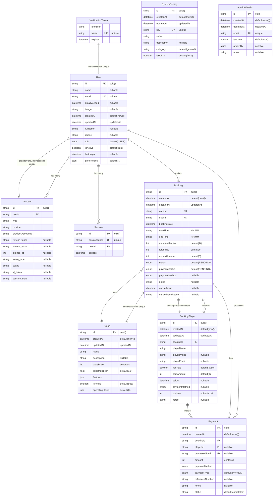

# Diagrama de Base de Datos

## Descripción

Este diagrama muestra la estructura completa de la base de datos PostgreSQL del sistema de turnero de pádel, incluyendo todas las entidades, relaciones, tipos de datos y restricciones.

## Diagrama Entidad-Relación



## Enumeraciones

### Role
```sql
CREATE TYPE "Role" AS ENUM ('USER', 'ADMIN');
```

### BookingStatus
```sql
CREATE TYPE "BookingStatus" AS ENUM (
  'PENDING',
  'CONFIRMED', 
  'ACTIVE',
  'COMPLETED',
  'CANCELLED'
);
```

### PaymentStatus
```sql
CREATE TYPE "PaymentStatus" AS ENUM (
  'PENDING',
  'DEPOSIT_PAID',
  'FULLY_PAID'
);
```

### PaymentMethod
```sql
CREATE TYPE "PaymentMethod" AS ENUM (
  'CASH',
  'BANK_TRANSFER',
  'CARD'
);
```

### PaymentType
```sql
CREATE TYPE "PaymentType" AS ENUM (
  'PAYMENT',
  'REFUND',
  'ADJUSTMENT'
);
```

## Índices Recomendados

### Índices de Performance
```sql
-- Búsquedas frecuentes por email
CREATE INDEX idx_user_email ON "User"(email);
CREATE INDEX idx_admin_email ON "AdminWhitelist"(email);

-- Búsquedas por fecha y cancha
CREATE INDEX idx_booking_date_court ON "Booking"("bookingDate", "courtId");
CREATE INDEX idx_booking_user_date ON "Booking"("userId", "bookingDate");

-- Búsquedas por estado
CREATE INDEX idx_booking_status ON "Booking"(status);
CREATE INDEX idx_court_active ON "Court"("isActive");
CREATE INDEX idx_admin_active ON "AdminWhitelist"("isActive");

-- Sesiones y tokens
CREATE INDEX idx_session_token ON "Session"("sessionToken");
CREATE INDEX idx_session_expires ON "Session"(expires);

-- Configuración del sistema
CREATE INDEX idx_system_setting_key ON "SystemSetting"(key);
CREATE INDEX idx_system_setting_category ON "SystemSetting"(category);
```

## Restricciones de Integridad

### Restricciones Únicas
```sql
-- NextAuth.js
ALTER TABLE "Account" ADD CONSTRAINT "Account_provider_providerAccountId_key" 
  UNIQUE (provider, "providerAccountId");

-- Business Logic
ALTER TABLE "Booking" ADD CONSTRAINT "Booking_court_date_time_key" 
  UNIQUE ("courtId", "bookingDate", "startTime", "endTime");

ALTER TABLE "BookingPlayer" ADD CONSTRAINT "BookingPlayer_booking_position_key" 
  UNIQUE ("bookingId", position);

ALTER TABLE "VerificationToken" ADD CONSTRAINT "VerificationToken_identifier_token_key" 
  UNIQUE (identifier, token);
```

### Restricciones de Clave Foránea
```sql
-- Cascading Deletes
ALTER TABLE "Account" ADD CONSTRAINT "Account_userId_fkey" 
  FOREIGN KEY ("userId") REFERENCES "User"(id) ON DELETE CASCADE;

ALTER TABLE "Session" ADD CONSTRAINT "Session_userId_fkey" 
  FOREIGN KEY ("userId") REFERENCES "User"(id) ON DELETE CASCADE;

ALTER TABLE "Booking" ADD CONSTRAINT "Booking_userId_fkey" 
  FOREIGN KEY ("userId") REFERENCES "User"(id) ON DELETE CASCADE;

-- Restrict Deletes (Business Logic)
ALTER TABLE "Booking" ADD CONSTRAINT "Booking_courtId_fkey" 
  FOREIGN KEY ("courtId") REFERENCES "Court"(id) ON DELETE RESTRICT;
```

## Campos JSON

### User.preferences
```json
{
  "notifications": {
    "email": true,
    "sms": false,
    "push": true
  },
  "defaultPaymentMethod": "CARD",
  "favoriteCourtIds": ["court_1", "court_2"],
  "timezone": "America/Argentina/Buenos_Aires"
}
```

### Court.features
```json
{
  "lighting": true,
  "roof": false,
  "parking": true,
  "lockers": true,
  "shower": false,
  "equipment_rental": true,
  "accessibility": false
}
```

### Court.operatingHours
```json
{
  "start": "08:00",
  "end": "22:00",
  "slot_duration": 90,
  "break_between_slots": 15,
  "closed_days": [],
  "special_hours": {
    "2024-12-25": "closed",
    "2024-12-31": {"start": "10:00", "end": "18:00"}
  }
}
```

## Consultas Frecuentes

### 1. Verificar Disponibilidad de Cancha
```sql
SELECT c.id, c.name
FROM "Court" c
WHERE c."isActive" = true
  AND NOT EXISTS (
    SELECT 1 FROM "Booking" b
    WHERE b."courtId" = c.id
      AND b."bookingDate" = $1
      AND b."startTime" < $3  -- endTime
      AND b."endTime" > $2    -- startTime
      AND b.status NOT IN ('CANCELLED')
  );
```

### 2. Obtener Reservas de Usuario
```sql
SELECT b.*, c.name as court_name, 
       array_agg(bp."playerName") as players
FROM "Booking" b
JOIN "Court" c ON b."courtId" = c.id
LEFT JOIN "BookingPlayer" bp ON b.id = bp."bookingId"
WHERE b."userId" = $1
  AND b."bookingDate" >= CURRENT_DATE
GROUP BY b.id, c.name
ORDER BY b."bookingDate", b."startTime";
```

### 3. Calcular Ingresos por Período
```sql
SELECT 
  DATE_TRUNC('month', b."bookingDate") as month,
  COUNT(*) as total_bookings,
  SUM(b."totalPrice") as total_revenue,
  AVG(b."totalPrice") as avg_booking_value
FROM "Booking" b
WHERE b.status = 'COMPLETED'
  AND b."bookingDate" BETWEEN $1 AND $2
GROUP BY DATE_TRUNC('month', b."bookingDate")
ORDER BY month;
```

## Consideraciones de Performance

### 🚀 Optimizaciones Implementadas

- **Índices Compuestos**: Para consultas multi-columna frecuentes
- **Particionamiento**: Por fecha en tabla Booking (futuro)
- **Campos Calculados**: Evitar JOINs innecesarios
- **JSON Indexing**: Índices GIN para campos JSON (PostgreSQL)

### 📊 Métricas de Monitoreo

- **Query Performance**: Tiempo de respuesta < 100ms
- **Index Usage**: Utilización > 90% en índices críticos
- **Connection Pool**: Conexiones activas < 80% del límite
- **Storage Growth**: Crecimiento mensual < 10%

### 🔄 Mantenimiento

- **VACUUM**: Semanal para tablas con alta rotación
- **ANALYZE**: Después de cargas masivas de datos
- **Index Rebuild**: Mensual para índices fragmentados
- **Backup**: Diario con retención de 30 días

---

**Motor de Base de Datos**: PostgreSQL 15+  
**ORM**: Prisma  
**Migraciones**: Prisma Migrate  
**Última actualización**: 2024-01-28  
**Versión del Esquema**: 1.0