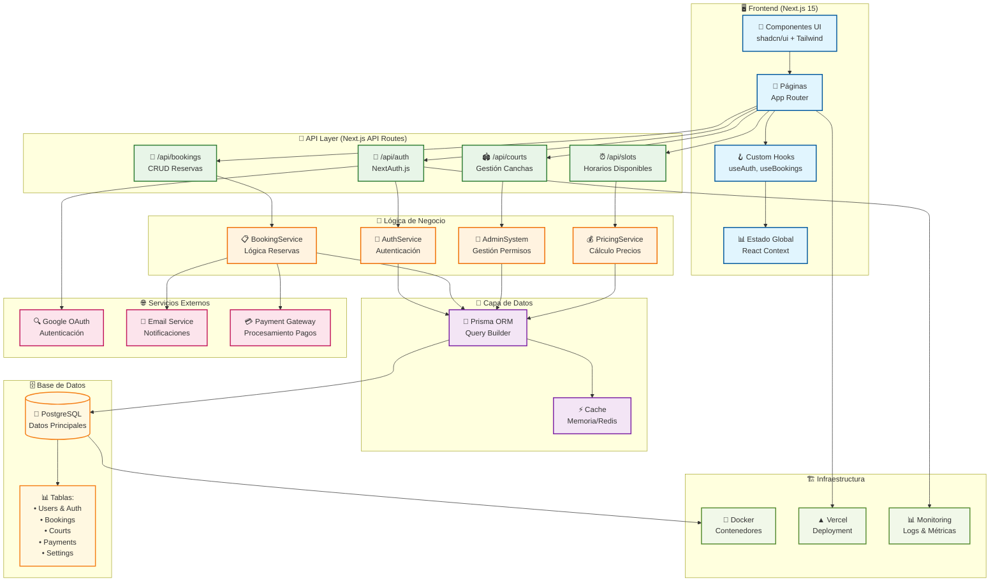

# Arquitectura General del Sistema

## Descripción

Este diagrama muestra la arquitectura general del sistema de turnero de pádel, incluyendo la separación entre frontend, backend, base de datos y servicios externos.

## Diagrama de Arquitectura



## Componentes Principales

### 🖥️ Frontend (Next.js 15)

- **Componentes UI**: Interfaz de usuario construida con shadcn/ui y Tailwind CSS
- **Páginas**: Rutas y páginas usando App Router de Next.js 15
- **Custom Hooks**: Lógica reutilizable encapsulada (useAuth, useBookings, etc.)
- **Estado Global**: Gestión de estado con React Context API

### 🔌 API Layer

- **NextAuth.js**: Manejo completo de autenticación con Google OAuth
- **API Routes**: Endpoints RESTful para todas las operaciones CRUD
- **Middleware**: Protección de rutas y validación de permisos

### 🧠 Lógica de Negocio

- **AdminSystem**: Gestión flexible de administradores (env + DB)
- **BookingService**: Lógica compleja de reservas y validaciones
- **AuthService**: Servicios de autenticación y autorización
- **PricingService**: Cálculo dinámico de precios y descuentos

### 💾 Capa de Datos

- **Prisma ORM**: Abstracción de base de datos con type safety
- **Cache**: Sistema de cache para optimizar consultas frecuentes
- **Migraciones**: Control de versiones de esquema de DB

### 🗄️ Base de Datos

- **PostgreSQL**: Base de datos principal con soporte completo ACID
- **Esquema Normalizado**: Tablas optimizadas para rendimiento
- **Índices**: Optimización de consultas frecuentes

## Flujo de Datos

### 1. Autenticación
```
Usuario → Google OAuth → NextAuth → JWT → Session → Frontend
```

### 2. Reserva de Cancha
```
Formulario → Validación → API → BookingService → Prisma → PostgreSQL
```

### 3. Consulta de Disponibilidad
```
Filtros → SlotAPI → Cache Check → PricingService → Respuesta JSON
```

## Patrones Arquitectónicos

### 🏗️ Patrones Utilizados

- **Layered Architecture**: Separación clara de responsabilidades
- **Repository Pattern**: Abstracción de acceso a datos con Prisma
- **Service Layer**: Lógica de negocio encapsulada
- **API-First Design**: APIs bien definidas y documentadas
- **Component-Based**: Componentes React reutilizables

### 🔒 Seguridad

- **JWT Tokens**: Autenticación stateless segura
- **RBAC**: Control de acceso basado en roles (USER/ADMIN)
- **Input Validation**: Validación en frontend y backend
- **HTTPS Only**: Comunicación encriptada
- **CSRF Protection**: Protección contra ataques CSRF

### ⚡ Performance

- **Server-Side Rendering**: SSR con Next.js para SEO
- **Static Generation**: Páginas estáticas cuando es posible
- **Database Indexing**: Índices optimizados en PostgreSQL
- **Caching Strategy**: Cache en múltiples niveles
- **Code Splitting**: Carga lazy de componentes

## Escalabilidad

### 📈 Consideraciones de Escala

- **Horizontal Scaling**: Múltiples instancias de la aplicación
- **Database Sharding**: Particionamiento de datos por región/cancha
- **CDN Integration**: Distribución de assets estáticos
- **Microservices Ready**: Arquitectura preparada para división

### 🔄 Mejoras Futuras

- **Redis Cache**: Cache distribuido para múltiples instancias
- **Message Queue**: Procesamiento asíncrono de notificaciones
- **Real-time Updates**: WebSockets para actualizaciones en tiempo real
- **API Gateway**: Centralización de APIs y rate limiting
- **Monitoring**: APM y observabilidad completa

---

**Tecnologías Principales**:
- Frontend: Next.js 15, React 18, TypeScript, Tailwind CSS, shadcn/ui
- Backend: Next.js API Routes, Prisma ORM, NextAuth.js
- Base de Datos: PostgreSQL
- Testing: Jest, Playwright, Cypress, Testing Library
- Infraestructura: Docker, Vercel

**Última actualización**: 2024-12-28  
**Versión**: 2.0