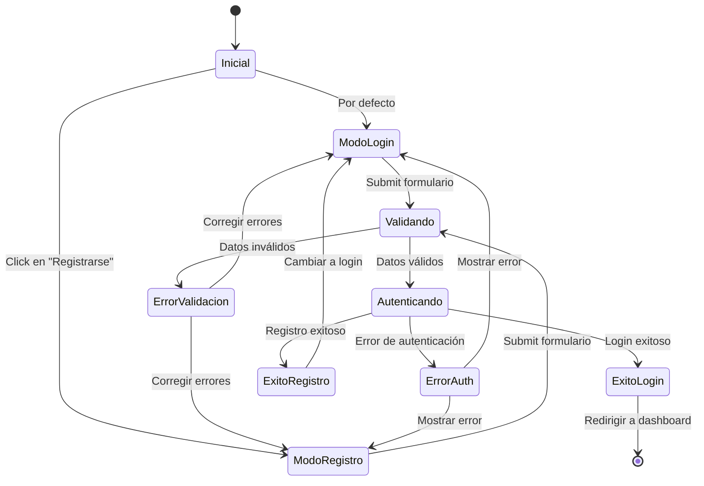

# LoginForm - Componente de Autenticación

## Información del Componente

**Nombre**: `LoginForm`  
**Ubicación**: `components/LoginForm.tsx`  
**Tipo**: Componente de Formulario  
**Autor**: Equipo de desarrollo  
**Fecha**: 2024-01-28

## Descripción

Componente de React que proporciona una interfaz de usuario para el inicio de sesión y registro de usuarios. Maneja tanto la autenticación tradicional por email/contraseña como la autenticación social con Google. Incluye validación de formularios, manejo de estados de carga y integración con el sistema de autenticación de NextAuth.js.

## Responsabilidades

- **Interfaz de Autenticación**: Proporcionar formularios para login y registro
- **Validación de Datos**: Validar campos de email y contraseña
- **Gestión de Estados**: Manejar estados de carga, errores y éxito
- **Integración con Auth**: Conectar con el hook `useAuth` y NextAuth.js
- **UX/UI**: Proporcionar feedback visual al usuario durante el proceso

## Props

```typescript
interface LoginFormProps {
  // No recibe props externas - es un componente autónomo
}
```

## Estados Internos

```typescript
interface LoginFormState {
  // Modo del formulario
  isLogin: boolean // true = login, false = registro
  
  // Campos del formulario
  email: string
  password: string
  confirmPassword: string // Solo para registro
  
  // Estados de UI
  isLoading: boolean
  error: string | null
  
  // Validación
  emailError: string | null
  passwordError: string | null
  confirmPasswordError: string | null
}
```

## Hooks y Dependencias

### Hooks Utilizados
- `useState` - Gestión de estado local del formulario
- `useAuth` - Hook personalizado para autenticación
- `useEffect` - Efectos secundarios y limpieza

### Dependencias Externas
- `next-auth/react` - Para autenticación con Google
- `@/hooks/useAuth` - Hook personalizado de autenticación
- Componentes de UI (botones, inputs, etc.)

## Funcionalidades Principales

### 1. Autenticación por Email/Contraseña
```typescript
const handleEmailLogin = async (email: string, password: string) => {
  setIsLoading(true)
  setError(null)
  
  try {
    const result = await signIn('credentials', {
      email,
      password,
      redirect: false
    })
    
    if (result?.error) {
      setError('Credenciales inválidas')
    } else {
      // Redirigir al dashboard
      router.push('/dashboard')
    }
  } catch (error) {
    setError('Error de conexión')
  } finally {
    setIsLoading(false)
  }
}
```

### 2. Autenticación con Google
```typescript
const handleGoogleLogin = async () => {
  setIsLoading(true)
  
  try {
    await signIn('google', {
      callbackUrl: '/dashboard'
    })
  } catch (error) {
    setError('Error al iniciar sesión con Google')
    setIsLoading(false)
  }
}
```

### 3. Registro de Usuarios
```typescript
const handleRegister = async (email: string, password: string) => {
  setIsLoading(true)
  setError(null)
  
  try {
    const response = await fetch('/api/auth/register', {
      method: 'POST',
      headers: { 'Content-Type': 'application/json' },
      body: JSON.stringify({ email, password })
    })
    
    if (response.ok) {
      // Cambiar a modo login
      setIsLogin(true)
      setError(null)
      // Mostrar mensaje de éxito
    } else {
      const data = await response.json()
      setError(data.message || 'Error en el registro')
    }
  } catch (error) {
    setError('Error de conexión')
  } finally {
    setIsLoading(false)
  }
}
```

### 4. Validación de Formularios
```typescript
const validateEmail = (email: string): string | null => {
  if (!email) return 'Email es requerido'
  if (!/^[^\s@]+@[^\s@]+\.[^\s@]+$/.test(email)) {
    return 'Formato de email inválido'
  }
  return null
}

const validatePassword = (password: string): string | null => {
  if (!password) return 'Contraseña es requerida'
  if (password.length < 6) {
    return 'La contraseña debe tener al menos 6 caracteres'
  }
  return null
}

const validateConfirmPassword = (password: string, confirmPassword: string): string | null => {
  if (!confirmPassword) return 'Confirmar contraseña es requerido'
  if (password !== confirmPassword) {
    return 'Las contraseñas no coinciden'
  }
  return null
}
```

## Estructura del Componente

```typescript
const LoginForm: React.FC = () => {
  // Estados locales
  const [isLogin, setIsLogin] = useState(true)
  const [email, setEmail] = useState('')
  const [password, setPassword] = useState('')
  const [confirmPassword, setConfirmPassword] = useState('')
  const [isLoading, setIsLoading] = useState(false)
  const [error, setError] = useState<string | null>(null)
  
  // Hooks
  const { login, loginWithGoogle } = useAuth()
  
  // Handlers
  const handleSubmit = async (e: React.FormEvent) => {
    e.preventDefault()
    
    // Validación
    const emailError = validateEmail(email)
    const passwordError = validatePassword(password)
    
    if (emailError || passwordError) {
      // Mostrar errores
      return
    }
    
    if (isLogin) {
      await handleEmailLogin(email, password)
    } else {
      const confirmError = validateConfirmPassword(password, confirmPassword)
      if (confirmError) return
      
      await handleRegister(email, password)
    }
  }
  
  return (
    <div className="login-form">
      {/* Formulario JSX */}
    </div>
  )
}
```

## Ejemplos de Uso

### Uso Básico
```typescript
import LoginForm from '@/components/LoginForm'

function AuthPage() {
  return (
    <div className="auth-page">
      <h1>Bienvenido al Sistema de Reservas</h1>
      <LoginForm />
    </div>
  )
}
```

### Con Layout Personalizado
```typescript
import LoginForm from '@/components/LoginForm'
import AuthLayout from '@/components/layouts/AuthLayout'

function LoginPage() {
  return (
    <AuthLayout>
      <div className="login-container">
        <div className="login-header">
          <h2>Iniciar Sesión</h2>
          <p>Accede a tu cuenta para gestionar tus reservas</p>
        </div>
        <LoginForm />
      </div>
    </AuthLayout>
  )
}
```

### Con Redirección Personalizada
```typescript
// En el componente LoginForm, agregar prop para callback
interface LoginFormProps {
  onSuccess?: (user: User) => void
  redirectTo?: string
}

const LoginForm: React.FC<LoginFormProps> = ({ 
  onSuccess, 
  redirectTo = '/dashboard' 
}) => {
  const handleSuccessfulLogin = (user: User) => {
    if (onSuccess) {
      onSuccess(user)
    } else {
      router.push(redirectTo)
    }
  }
  
  // ... resto del componente
}
```

## Flujo de Estados



## Estilos CSS

```css
.login-form {
  max-width: 400px;
  margin: 0 auto;
  padding: 2rem;
  background: white;
  border-radius: 8px;
  box-shadow: 0 4px 6px rgba(0, 0, 0, 0.1);
}

.form-group {
  margin-bottom: 1rem;
}

.form-input {
  width: 100%;
  padding: 0.75rem;
  border: 1px solid #ddd;
  border-radius: 4px;
  font-size: 1rem;
}

.form-input:focus {
  outline: none;
  border-color: #007bff;
  box-shadow: 0 0 0 2px rgba(0, 123, 255, 0.25);
}

.form-input.error {
  border-color: #dc3545;
}

.error-message {
  color: #dc3545;
  font-size: 0.875rem;
  margin-top: 0.25rem;
}

.submit-button {
  width: 100%;
  padding: 0.75rem;
  background: #007bff;
  color: white;
  border: none;
  border-radius: 4px;
  font-size: 1rem;
  cursor: pointer;
  transition: background-color 0.2s;
}

.submit-button:hover:not(:disabled) {
  background: #0056b3;
}

.submit-button:disabled {
  background: #6c757d;
  cursor: not-allowed;
}

.google-button {
  width: 100%;
  padding: 0.75rem;
  background: #db4437;
  color: white;
  border: none;
  border-radius: 4px;
  font-size: 1rem;
  cursor: pointer;
  margin-top: 1rem;
  display: flex;
  align-items: center;
  justify-content: center;
  gap: 0.5rem;
}

.loading-spinner {
  width: 20px;
  height: 20px;
  border: 2px solid #ffffff;
  border-top: 2px solid transparent;
  border-radius: 50%;
  animation: spin 1s linear infinite;
}

@keyframes spin {
  0% { transform: rotate(0deg); }
  100% { transform: rotate(360deg); }
}

.mode-toggle {
  text-align: center;
  margin-top: 1rem;
}

.mode-toggle button {
  background: none;
  border: none;
  color: #007bff;
  cursor: pointer;
  text-decoration: underline;
}
```

## Accesibilidad

### Características Implementadas
- **Labels apropiados**: Todos los inputs tienen labels asociados
- **ARIA attributes**: `aria-describedby` para mensajes de error
- **Focus management**: Orden de tabulación lógico
- **Keyboard navigation**: Soporte completo para teclado
- **Screen reader support**: Mensajes de error anunciados

### Ejemplo de Implementación
```typescript
<div className="form-group">
  <label htmlFor="email">Email</label>
  <input
    id="email"
    type="email"
    value={email}
    onChange={(e) => setEmail(e.target.value)}
    className={`form-input ${emailError ? 'error' : ''}`}
    aria-describedby={emailError ? 'email-error' : undefined}
    aria-invalid={!!emailError}
    required
  />
  {emailError && (
    <div id="email-error" className="error-message" role="alert">
      {emailError}
    </div>
  )}
</div>
```

## Testing

### Tests Unitarios
```typescript
import { render, screen, fireEvent, waitFor } from '@testing-library/react'
import LoginForm from '@/components/LoginForm'
import { useAuth } from '@/hooks/useAuth'

// Mock del hook useAuth
jest.mock('@/hooks/useAuth')
const mockUseAuth = useAuth as jest.MockedFunction<typeof useAuth>

describe('LoginForm', () => {
  beforeEach(() => {
    mockUseAuth.mockReturnValue({
      login: jest.fn(),
      loginWithGoogle: jest.fn(),
      user: null,
      isLoading: false
    })
  })

  test('renders login form by default', () => {
    render(<LoginForm />)
    
    expect(screen.getByLabelText(/email/i)).toBeInTheDocument()
    expect(screen.getByLabelText(/contraseña/i)).toBeInTheDocument()
    expect(screen.getByRole('button', { name: /iniciar sesión/i })).toBeInTheDocument()
  })

  test('switches to register mode', () => {
    render(<LoginForm />)
    
    fireEvent.click(screen.getByText(/registrarse/i))
    
    expect(screen.getByLabelText(/confirmar contraseña/i)).toBeInTheDocument()
    expect(screen.getByRole('button', { name: /registrarse/i })).toBeInTheDocument()
  })

  test('validates email format', async () => {
    render(<LoginForm />)
    
    const emailInput = screen.getByLabelText(/email/i)
    const submitButton = screen.getByRole('button', { name: /iniciar sesión/i })
    
    fireEvent.change(emailInput, { target: { value: 'invalid-email' } })
    fireEvent.click(submitButton)
    
    await waitFor(() => {
      expect(screen.getByText(/formato de email inválido/i)).toBeInTheDocument()
    })
  })

  test('calls login function with correct parameters', async () => {
    const mockLogin = jest.fn()
    mockUseAuth.mockReturnValue({
      login: mockLogin,
      loginWithGoogle: jest.fn(),
      user: null,
      isLoading: false
    })
    
    render(<LoginForm />)
    
    fireEvent.change(screen.getByLabelText(/email/i), {
      target: { value: 'test@example.com' }
    })
    fireEvent.change(screen.getByLabelText(/contraseña/i), {
      target: { value: 'password123' }
    })
    fireEvent.click(screen.getByRole('button', { name: /iniciar sesión/i }))
    
    await waitFor(() => {
      expect(mockLogin).toHaveBeenCalledWith('test@example.com', 'password123')
    })
  })
})
```

### Tests de Integración
```typescript
import { render, screen, fireEvent, waitFor } from '@testing-library/react'
import { SessionProvider } from 'next-auth/react'
import LoginForm from '@/components/LoginForm'

// Mock de NextAuth
jest.mock('next-auth/react')

describe('LoginForm Integration', () => {
  test('integrates with NextAuth for Google login', async () => {
    const mockSignIn = jest.fn()
    require('next-auth/react').signIn = mockSignIn
    
    render(
      <SessionProvider session={null}>
        <LoginForm />
      </SessionProvider>
    )
    
    fireEvent.click(screen.getByText(/continuar con google/i))
    
    expect(mockSignIn).toHaveBeenCalledWith('google', {
      callbackUrl: '/dashboard'
    })
  })
})
```

## Problemas Conocidos

1. **Validación Limitada**: La validación de contraseñas es básica (solo longitud mínima)
2. **Manejo de Errores**: Los mensajes de error podrían ser más específicos
3. **Estado Global**: No persiste el estado del formulario entre navegaciones
4. **Responsive Design**: Podría mejorarse para dispositivos móviles
5. **Internacionalización**: Textos hardcodeados en español

## Mejoras Futuras

1. **Validación Avanzada**: 
   - Validación de fortaleza de contraseña
   - Verificación de email en tiempo real
   - Validación de dominio de email

2. **UX/UI Mejorada**:
   - Animaciones de transición
   - Mejor feedback visual
   - Diseño responsive optimizado
   - Modo oscuro

3. **Funcionalidades Adicionales**:
   - "Recordar sesión"
   - Recuperación de contraseña
   - Autenticación de dos factores
   - Más proveedores OAuth (Facebook, GitHub, etc.)

4. **Rendimiento**:
   - Lazy loading de componentes
   - Debounce en validación
   - Optimización de re-renders

5. **Accesibilidad**:
   - Mejor soporte para lectores de pantalla
   - Navegación por teclado mejorada
   - Contraste de colores optimizado

6. **Testing**:
   - Tests E2E con Playwright
   - Tests de accesibilidad automatizados
   - Tests de rendimiento

## Notas de Desarrollo

- El componente es completamente autónomo y no requiere props
- Utiliza el hook `useAuth` para la lógica de autenticación
- Los estilos están diseñados para ser fácilmente personalizables
- La validación se ejecuta tanto en el cliente como en el servidor
- Compatible con NextAuth.js y múltiples proveedores de autenticación
- Maneja automáticamente la redirección después del login exitoso

## Changelog

### v1.0.0 (2024-01-28)
- Implementación inicial del componente LoginForm
- Soporte para autenticación por email/contraseña
- Integración con Google OAuth
- Validación básica de formularios
- Manejo de estados de carga y errores
- Modo de registro de usuarios
- Estilos CSS responsivos básicos