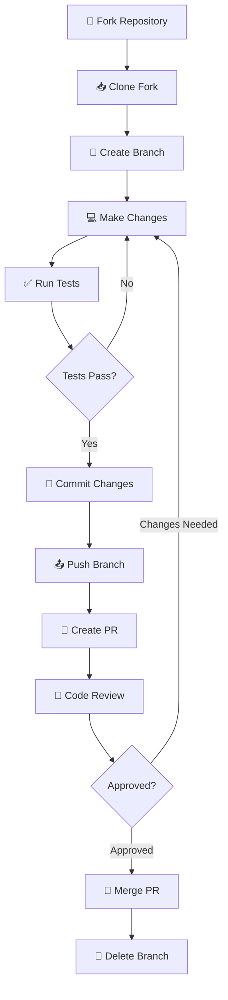

# Guía de Contribución

## 🤝 Bienvenido a Turnero de Pádel

¡Gracias por tu interés en contribuir al proyecto! Esta guía te ayudará a entender cómo puedes participar y hacer contribuciones valiosas.

## 📋 Tabla de Contenidos

- [Código de Conducta](#código-de-conducta)
- [Cómo Contribuir](#cómo-contribuir)
- [Proceso de Desarrollo](#proceso-de-desarrollo)
- [Estándares de Código](#estándares-de-código)
- [Proceso de Review](#proceso-de-review)
- [Tipos de Contribuciones](#tipos-de-contribuciones)
- [Reportar Bugs](#reportar-bugs)
- [Solicitar Features](#solicitar-features)

## 📜 Código de Conducta

Este proyecto se adhiere a un código de conducta. Al participar, se espera que mantengas este código:

### Nuestros Compromisos

- **Ser inclusivo**: Bienvenimos contribuciones de todos, independientemente de su experiencia, género, identidad, religión, etc.
- **Ser respetuoso**: Tratamos a todos con respeto y cortesía
- **Ser constructivo**: Proporcionamos feedback constructivo y útil
- **Ser colaborativo**: Trabajamos juntos hacia objetivos comunes

### Comportamientos Esperados

✅ **Hacer**:
- Usar lenguaje inclusivo y respetuoso
- Ser receptivo a feedback constructivo
- Enfocarse en lo que es mejor para la comunidad
- Mostrar empatía hacia otros miembros

❌ **No hacer**:
- Usar lenguaje o imágenes sexualizadas
- Hacer comentarios despectivos o ataques personales
- Acosar públicamente o privadamente
- Publicar información privada de otros sin permiso

## 🚀 Cómo Contribuir

### 1. Configuración Inicial

```bash
# Fork el repositorio en GitHub
# Luego clona tu fork
git clone https://github.com/TU-USUARIO/turnero-padel.git
cd turnero-padel

# Añade el repositorio original como upstream
git remote add upstream https://github.com/USUARIO-ORIGINAL/turnero-padel.git

# Instala dependencias
pnpm install

# Configura el entorno
cp .env.example .env.local
# Edita .env.local con tus configuraciones

# Configura la base de datos
pnpm db:push
pnpm db:seed
```

### 2. Mantener tu Fork Actualizado

```bash
# Obtener cambios del repositorio original
git fetch upstream
git checkout main
git merge upstream/main

# Actualizar tu fork en GitHub
git push origin main
```

### 3. Crear una Nueva Feature

```bash
# Crear y cambiar a una nueva rama
git checkout -b feature/nombre-descriptivo

# O para un bugfix
git checkout -b fix/descripcion-del-bug

# O para documentación
git checkout -b docs/descripcion-cambio
```

## 🔄 Proceso de Desarrollo

### Flujo de Trabajo



### Convenciones de Ramas

- `main` - Rama principal (protegida)
- `feature/descripcion` - Nuevas características
- `fix/descripcion` - Corrección de bugs
- `docs/descripcion` - Cambios en documentación
- `refactor/descripcion` - Refactoring de código
- `test/descripcion` - Añadir o mejorar tests
- `chore/descripcion` - Tareas de mantenimiento

### Convenciones de Commits

Usamos [Conventional Commits](https://www.conventionalcommits.org/):

```bash
# Formato
<tipo>[scope opcional]: <descripción>

[cuerpo opcional]

[footer opcional]
```

#### Tipos de Commit

- `feat`: Nueva característica
- `fix`: Corrección de bug
- `docs`: Cambios en documentación
- `style`: Cambios de formato (espacios, comas, etc.)
- `refactor`: Refactoring de código
- `test`: Añadir o modificar tests
- `chore`: Tareas de mantenimiento
- `perf`: Mejoras de performance
- `ci`: Cambios en CI/CD

#### Ejemplos

```bash
# Feature
git commit -m "feat(booking): add court selection validation"

# Bug fix
git commit -m "fix(auth): resolve login redirect issue"

# Documentation
git commit -m "docs(api): update booking endpoint examples"

# Breaking change
git commit -m "feat(api): change booking response format

BREAKING CHANGE: booking response now includes court details"
```

## 📏 Estándares de Código

### TypeScript

```typescript
// ✅ Bueno
interface BookingFormData {
  courtId: string
  date: Date
  startTime: string
  endTime: string
  players: Player[]
}

const createBooking = async (data: BookingFormData): Promise<Booking> => {
  // Implementación
}

// ❌ Malo
const createBooking = async (data: any) => {
  // Sin tipos
}
```

### React Components

```tsx
// ✅ Bueno - Componente funcional con tipos
interface CourtCardProps {
  court: Court
  onSelect?: (court: Court) => void
  className?: string
}

export const CourtCard: React.FC<CourtCardProps> = ({ 
  court, 
  onSelect, 
  className 
}) => {
  return (
    <Card className={cn("cursor-pointer", className)}>
      {/* Contenido */}
    </Card>
  )
}

// ❌ Malo - Sin tipos, props desestructuradas en parámetros
export const CourtCard = (props) => {
  return <div>{/* Contenido */}</div>
}
```

### Hooks Personalizados

```typescript
// ✅ Bueno
export const useBookings = (userId?: string) => {
  const [bookings, setBookings] = useState<Booking[]>([])
  const [isLoading, setIsLoading] = useState(true)
  const [error, setError] = useState<Error | null>(null)

  // Implementación

  return {
    bookings,
    isLoading,
    error,
    refetch: () => fetchBookings(),
    createBooking: (data: BookingFormData) => createBooking(data)
  }
}
```

### Estilos con Tailwind

```tsx
// ✅ Bueno - Usar cn() para combinar clases
import { cn } from "@/lib/utils"

const Button = ({ className, variant = "default", ...props }) => {
  return (
    <button
      className={cn(
        "inline-flex items-center justify-center rounded-md text-sm font-medium",
        {
          "bg-primary text-primary-foreground hover:bg-primary/90": variant === "default",
          "bg-destructive text-destructive-foreground hover:bg-destructive/90": variant === "destructive"
        },
        className
      )}
      {...props}
    />
  )
}

// ❌ Malo - Clases hardcodeadas sin flexibilidad
const Button = (props) => {
  return (
    <button className="bg-blue-500 text-white px-4 py-2" {...props} />
  )
}
```

### API Routes

```typescript
// ✅ Bueno - Con validación y manejo de errores
import { z } from "zod"
import { NextRequest, NextResponse } from "next/server"

const createBookingSchema = z.object({
  courtId: z.string().uuid(),
  date: z.string().datetime(),
  players: z.array(z.object({
    name: z.string().min(1),
    email: z.string().email()
  })).min(2).max(4)
})

export async function POST(request: NextRequest) {
  try {
    const body = await request.json()
    const validatedData = createBookingSchema.parse(body)
    
    // Lógica de negocio
    const booking = await createBooking(validatedData)
    
    return NextResponse.json({ success: true, data: booking })
  } catch (error) {
    if (error instanceof z.ZodError) {
      return NextResponse.json(
        { error: true, message: "Invalid data", details: error.errors },
        { status: 400 }
      )
    }
    
    return NextResponse.json(
      { error: true, message: "Internal server error" },
      { status: 500 }
    )
  }
}
```

## 🔍 Proceso de Review

### Antes de Crear un PR

```bash
# Ejecutar todos los checks
pnpm lint          # ESLint
pnpm type-check    # TypeScript
pnpm test          # Tests unitarios
pnpm test:e2e      # Tests e2e (opcional)
pnpm build         # Verificar que el build funciona
```

### Template de Pull Request

```markdown
## 📝 Descripción

Breve descripción de los cambios realizados.

## 🔗 Issue Relacionado

Fixes #123

## 🧪 Tipo de Cambio

- [ ] Bug fix (cambio que corrige un issue)
- [ ] Nueva feature (cambio que añade funcionalidad)
- [ ] Breaking change (fix o feature que causa que funcionalidad existente no funcione como se esperaba)
- [ ] Cambio en documentación

## ✅ Checklist

- [ ] Mi código sigue los estándares del proyecto
- [ ] He realizado una auto-revisión de mi código
- [ ] He comentado mi código, particularmente en áreas difíciles de entender
- [ ] He realizado cambios correspondientes en la documentación
- [ ] Mis cambios no generan nuevas advertencias
- [ ] He añadido tests que prueban que mi fix es efectivo o que mi feature funciona
- [ ] Tests unitarios nuevos y existentes pasan localmente con mis cambios
- [ ] Cualquier cambio dependiente ha sido mergeado y publicado

## 📸 Screenshots (si aplica)

## 🧪 Cómo Probar

1. Paso 1
2. Paso 2
3. Paso 3
```

### Criterios de Aprobación

Un PR será aprobado si:

✅ **Código**:
- Sigue los estándares establecidos
- Está bien documentado
- No introduce bugs
- Tiene tests adecuados

✅ **Funcionalidad**:
- Cumple con los requisitos
- No rompe funcionalidad existente
- Es accesible y responsive

✅ **Performance**:
- No degrada el performance
- Optimiza cuando es posible
- Considera el SEO

## 🎯 Tipos de Contribuciones

### 🐛 Reportar Bugs

```markdown
**Describe el bug**
Una descripción clara y concisa del bug.

**Para Reproducir**
Pasos para reproducir el comportamiento:
1. Ve a '...'
2. Haz click en '....'
3. Scroll down to '....'
4. Ve el error

**Comportamiento Esperado**
Una descripción clara y concisa de lo que esperabas que pasara.

**Screenshots**
Si aplica, añade screenshots para ayudar a explicar tu problema.

**Información del Sistema:**
 - OS: [e.g. iOS]
 - Browser [e.g. chrome, safari]
 - Version [e.g. 22]

**Contexto Adicional**
Añade cualquier otro contexto sobre el problema aquí.
```

### ✨ Solicitar Features

```markdown
**¿Tu feature request está relacionada a un problema? Por favor describe.**
Una descripción clara y concisa de cuál es el problema. Ej. Siempre me frustra cuando [...]

**Describe la solución que te gustaría**
Una descripción clara y concisa de lo que quieres que pase.

**Describe alternativas que has considerado**
Una descripción clara y concisa de cualquier solución o feature alternativa que hayas considerado.

**Contexto adicional**
Añade cualquier otro contexto o screenshots sobre el feature request aquí.
```

### 📚 Mejorar Documentación

- Corregir typos o errores
- Añadir ejemplos
- Mejorar explicaciones
- Traducir contenido
- Añadir diagramas o imágenes

### 🧪 Añadir Tests

- Tests unitarios para componentes
- Tests de integración para APIs
- Tests e2e para flujos críticos
- Tests de performance
- Tests de accesibilidad

### 🎨 Mejorar UI/UX

- Mejorar diseño visual
- Optimizar experiencia de usuario
- Añadir animaciones
- Mejorar accesibilidad
- Optimizar para móviles

## 🏷️ Labels de Issues

- `bug` - Algo no está funcionando
- `enhancement` - Nueva feature o request
- `documentation` - Mejoras o adiciones a documentación
- `good first issue` - Bueno para newcomers
- `help wanted` - Ayuda extra es bienvenida
- `question` - Información adicional es solicitada
- `wontfix` - Esto no será trabajado
- `duplicate` - Este issue o pull request ya existe
- `invalid` - Esto no parece correcto

## 🎉 Reconocimiento

Todos los contribuidores serán reconocidos en:

- README del proyecto
- Página de contribuidores
- Release notes (para contribuciones significativas)
- Redes sociales del proyecto

## 📞 ¿Necesitas Ayuda?

Si tienes preguntas sobre cómo contribuir:

1. **Lee la documentación** - Especialmente esta guía y el README
2. **Busca en issues existentes** - Tu pregunta puede ya estar respondida
3. **Crea un issue** - Con la etiqueta "question"
4. **Únete a nuestro Discord** - Para chat en tiempo real (si existe)

---

**¡Gracias por contribuir! 🙏** Tu ayuda hace que este proyecto sea mejor para todos.

**Última actualización**: 2024-01-28  
**Versión**: 1.0