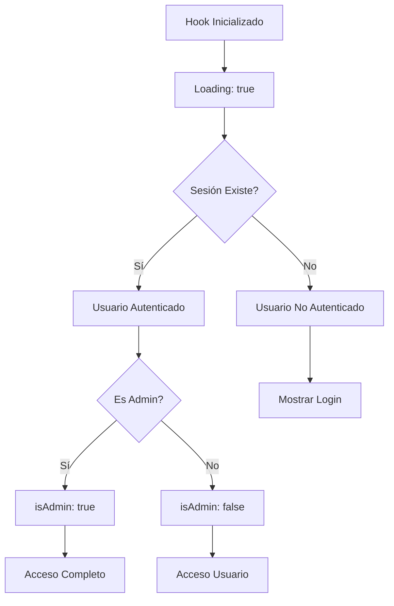

# useAuth - Hook de Autenticación

## Información del Hook

**Nombre**: `useAuth`  
**Ubicación**: `hooks/useAuth.ts`  
**Tipo**: Hook Personalizado de Autenticación  
**Autor**: Equipo de desarrollo  
**Fecha**: 2024-01-28

## Descripción

Hook personalizado que encapsula toda la lógica de autenticación de la aplicación. Proporciona una interfaz simplificada para manejar el estado de autenticación, roles de usuario y operaciones de login/logout utilizando NextAuth.js como base.

## Signatura

```typescript
function useAuth(): {
  user: User | null
  loading: boolean
  isAuthenticated: boolean
  isAdmin: boolean
  signIn: () => Promise<void>
  signOut: () => Promise<void>
  profile: Profile | null
}
```

## Parámetros

Este hook no recibe parámetros.

## Valor de Retorno

| Propiedad | Tipo | Descripción |
|-----------|------|-------------|
| `user` | `User \| null` | Objeto del usuario autenticado o null si no está autenticado |
| `loading` | `boolean` | Indica si se está cargando el estado de autenticación |
| `isAuthenticated` | `boolean` | True si el usuario está autenticado |
| `isAdmin` | `boolean` | True si el usuario tiene rol de administrador |
| `signIn` | `() => Promise<void>` | Función para iniciar sesión con Google OAuth |
| `signOut` | `() => Promise<void>` | Función para cerrar sesión |
| `profile` | `Profile \| null` | Perfil del usuario con formato legacy para compatibilidad |

## Tipos TypeScript

### Profile
```typescript
interface Profile {
  id: string
  full_name: string | null
  role: 'user' | 'admin'
  phone: string | null
  avatar_url: string | null
}
```

## Implementación

```typescript
'use client'

import { useSession } from 'next-auth/react'
import { signIn, signOut } from 'next-auth/react'

export function useAuth() {
  const { data: session, status } = useSession()

  const loading = status === 'loading'
  const user = session?.user || null
  const isAuthenticated = !!session?.user
  const isAdmin = session?.user?.isAdmin || false

  const handleSignIn = async () => {
    await signIn('google', {
      callbackUrl: '/',
      redirect: true
    })
  }

  const handleSignOut = async () => {
    await signOut({
      callbackUrl: '/login',
      redirect: true
    })
  }

  return {
    user,
    loading,
    isAuthenticated,
    isAdmin,
    signIn: handleSignIn,
    signOut: handleSignOut,
    profile: user ? {
      id: user.id,
      full_name: user.name,
      role: user.role.toLowerCase() as 'user' | 'admin',
      phone: null,
      avatar_url: user.image,
    } : null,
  }
}
```

## Ejemplos de Uso

### Uso Básico
```tsx
import { useAuth } from '@/hooks/useAuth'

function MyComponent() {
  const { user, isAuthenticated, loading, signIn, signOut } = useAuth()

  if (loading) {
    return <div>Cargando...</div>
  }

  if (!isAuthenticated) {
    return (
      <button onClick={signIn}>
        Iniciar Sesión
      </button>
    )
  }

  return (
    <div>
      <p>Bienvenido, {user?.name}!</p>
      <button onClick={signOut}>
        Cerrar Sesión
      </button>
    </div>
  )
}
```

### Verificación de Rol de Administrador
```tsx
import { useAuth } from '@/hooks/useAuth'

function AdminPanel() {
  const { isAdmin, isAuthenticated } = useAuth()

  if (!isAuthenticated) {
    return <div>Debes iniciar sesión</div>
  }

  if (!isAdmin) {
    return <div>No tienes permisos de administrador</div>
  }

  return (
    <div>
      <h2>Panel de Administración</h2>
      {/* Contenido del panel de admin */}
    </div>
  )
}
```

### En Hook Compuesto
```tsx
import { useAuth } from '@/hooks/useAuth'
import { useEffect, useState } from 'react'

function useUserBookings() {
  const { user, isAuthenticated } = useAuth()
  const [bookings, setBookings] = useState([])

  useEffect(() => {
    if (isAuthenticated && user) {
      fetchUserBookings(user.id)
    }
  }, [isAuthenticated, user])

  const fetchUserBookings = async (userId: string) => {
    // Lógica para obtener reservas del usuario
  }

  return { bookings }
}
```

### Con Contexto de Protección de Rutas
```tsx
import { useAuth } from '@/hooks/useAuth'
import { useRouter } from 'next/navigation'
import { useEffect } from 'react'

function ProtectedPage() {
  const { isAuthenticated, loading } = useAuth()
  const router = useRouter()

  useEffect(() => {
    if (!loading && !isAuthenticated) {
      router.push('/login')
    }
  }, [isAuthenticated, loading, router])

  if (loading) {
    return <div>Verificando autenticación...</div>
  }

  if (!isAuthenticated) {
    return null // Se redirigirá
  }

  return (
    <div>
      {/* Contenido protegido */}
    </div>
  )
}
```

## Dependencias

- `next-auth/react` - Para manejo de sesiones y autenticación
- `NextAuth.js` - Sistema de autenticación configurado

## Estados Internos

Este hook no maneja estados internos propios, sino que actúa como una interfaz sobre `useSession` de NextAuth.js.

## Rendimiento y Optimización

- **Memoización**: NextAuth.js ya optimiza las consultas de sesión
- **Cache**: Las sesiones se cachean automáticamente
- **Re-renders**: Solo se re-renderiza cuando cambia el estado de la sesión

## Flujo de Estados



## Testing

### Tests Unitarios
```typescript
import { renderHook } from '@testing-library/react'
import { useSession } from 'next-auth/react'
import { useAuth } from './useAuth'

// Mock NextAuth
jest.mock('next-auth/react')
const mockUseSession = useSession as jest.MockedFunction<typeof useSession>

describe('useAuth', () => {
  test('should return loading state initially', () => {
    mockUseSession.mockReturnValue({
      data: null,
      status: 'loading'
    })

    const { result } = renderHook(() => useAuth())
    expect(result.current.loading).toBe(true)
    expect(result.current.isAuthenticated).toBe(false)
  })

  test('should return authenticated user', () => {
    const mockUser = {
      id: '1',
      name: 'John Doe',
      email: 'john@example.com',
      isAdmin: false
    }

    mockUseSession.mockReturnValue({
      data: { user: mockUser },
      status: 'authenticated'
    })

    const { result } = renderHook(() => useAuth())
    expect(result.current.loading).toBe(false)
    expect(result.current.isAuthenticated).toBe(true)
    expect(result.current.user).toEqual(mockUser)
    expect(result.current.isAdmin).toBe(false)
  })

  test('should identify admin users', () => {
    const mockAdminUser = {
      id: '1',
      name: 'Admin User',
      email: 'admin@example.com',
      isAdmin: true
    }

    mockUseSession.mockReturnValue({
      data: { user: mockAdminUser },
      status: 'authenticated'
    })

    const { result } = renderHook(() => useAuth())
    expect(result.current.isAdmin).toBe(true)
  })
})
```

## Problemas Conocidos

1. **Compatibilidad Legacy**: El objeto `profile` se mantiene para compatibilidad con código anterior
2. **Información Limitada**: Algunos campos como `phone` no están disponibles en la sesión actual
3. **Dependencia de NextAuth**: Fuertemente acoplado a NextAuth.js

## Mejoras Futuras

1. **Información de Perfil Extendida**: Agregar más campos al perfil del usuario
2. **Cache Personalizado**: Implementar cache adicional para datos de usuario
3. **Manejo de Errores**: Agregar manejo de errores más robusto
4. **Tipos Más Estrictos**: Mejorar los tipos TypeScript para mayor seguridad
5. **Refresh Token**: Manejar renovación automática de tokens

## Notas de Desarrollo

- Este hook debe usarse dentro de un `SessionProvider` de NextAuth.js
- La función `signIn` redirige automáticamente a Google OAuth
- La función `signOut` redirige a la página de login
- El estado `loading` es crucial para evitar flashes de contenido no autenticado
- El rol de administrador se determina en el servidor durante la autenticación

## Changelog

### v1.0.0 (2024-01-28)
- Implementación inicial del hook de autenticación
- Integración con NextAuth.js y Google OAuth
- Soporte para roles de usuario y administrador
- Compatibilidad con código legacy a través del objeto `profile`