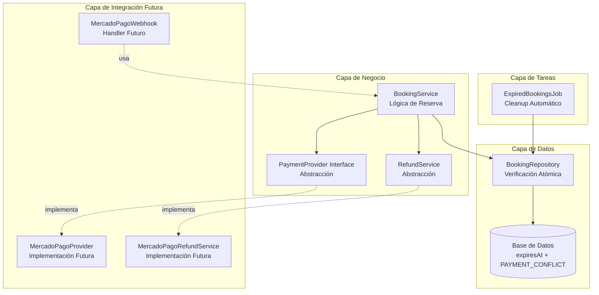

# Implementación: Defensa en Profundidad para Reservas

**Fecha de Implementación:** Enero 2025  
**Versión:** 1.0.0  
**Estado:** ✅ Completado

## Resumen Ejecutivo

Se ha implementado un sistema robusto de dos capas (Bloqueo Transaccional + Expiración Sincronizada) para prevenir race conditions en reservas, dejando toda la infraestructura preparada para integrar Mercado Pago mediante interfaces y patrones de diseño.

## Objetivos Cumplidos

1. ✅ Prevención de race conditions mediante verificación atómica en transacciones
2. ✅ Sistema de expiración de reservas con sincronización preparada para Mercado Pago
3. ✅ Manejo robusto de pagos tardíos con estado `PAYMENT_CONFLICT`
4. ✅ Arquitectura extensible mediante interfaces para futuros proveedores de pago
5. ✅ Sistema automático de limpieza de reservas expiradas

## Cambios en Base de Datos

### Schema Prisma

**Archivo:** `prisma/schema.prisma`

#### Nuevo Campo: `expiresAt`
```prisma
model Booking {
  // ... campos existentes
  expiresAt          DateTime?
  // ... resto de campos
  @@index([expiresAt])
}
```

- Tipo: `DateTime?` (opcional)
- Propósito: Almacena la fecha/hora de expiración para reservas pendientes de pago
- Índice: Agregado para consultas eficientes de reservas expiradas

#### Nuevo Estado: `PAYMENT_CONFLICT`
```prisma
enum BookingStatus {
  PENDING
  CONFIRMED
  ACTIVE
  COMPLETED
  CANCELLED
  PAYMENT_CONFLICT  // Nuevo estado
}
```

- Propósito: Marca reservas donde se recibió un pago tardío pero la cancha ya está ocupada
- Uso: Requiere procesamiento manual de reembolso por parte del administrador

### Migración Requerida

```bash
npx prisma migrate dev --name add_expires_at_and_payment_conflict
npx prisma generate
```

## Arquitectura de la Solución

### Diagrama de Componentes



## Componentes Implementados

### 1. Excepciones Personalizadas

**Archivo:** `lib/errors/BookingErrors.ts`

- `BookingConflictError`: Lanzada cuando se intenta crear una reserva en un horario ya ocupado
- `BookingNotFoundError`: Lanzada cuando una reserva no existe

### 2. Repository con Verificación Atómica

**Archivo:** `lib/repositories/BookingRepository.ts`

#### Cambios Principales:

1. **Método `_checkAvailabilityInTransaction()`**
   - Verificación de disponibilidad dentro de transacción
   - Excluye reservas `CANCELLED` y `PAYMENT_CONFLICT`
   - Excluye reservas con `expiresAt < now()`
   - Previene condiciones de carrera

2. **Método `create()` Refactorizado**
   - Acepta parámetro `expirationMinutes` (default: 15)
   - Verificación de disponibilidad DENTRO de la transacción (PRIMERO)
   - Creación de reserva con `expiresAt` calculado (DESPUÉS)
   - Lanza `BookingConflictError` si hay conflicto

3. **Método `checkAvailability()` Actualizado**
   - Excluye reservas expiradas en verificaciones públicas
   - Excluye estado `PAYMENT_CONFLICT`

### 3. Interfaces y Abstracciones

#### IPaymentProvider
**Archivo:** `lib/services/payments/interfaces/IPaymentProvider.ts`

Interface base para crear preferencias de pago. Implementaciones:
- `MockPaymentProvider`: Para desarrollo (actual)
- `MercadoPagoProvider`: Para producción (futuro)

#### IRefundService
**Archivo:** `lib/services/payments/interfaces/IRefundService.ts`

Interface para procesar reembolsos. Implementaciones:
- `MockRefundService`: Para desarrollo (actual)
- `MercadoPagoRefundService`: Para producción (futuro)

#### IWebhookHandler
**Archivo:** `lib/services/payments/interfaces/IWebhookHandler.ts`

Interface para procesar webhooks de pagos. Implementaciones:
- `BookingWebhookHandler`: Handler genérico con lógica de negocio (actual)

### 4. Servicios de Negocio

#### BookingService
**Archivo:** `lib/services/BookingService.ts`

**Nuevos Métodos:**
- `_getExpirationMinutes()`: Obtiene minutos de expiración desde SystemSetting
- `createPaymentPreference()`: Crea preferencia de pago para una reserva

**Métodos Actualizados:**
- `createBooking()`: Usa verificación atómica, maneja `BookingConflictError`
- `cancelBooking()`: Integra procesamiento de reembolsos automáticos

**Tipo Actualizado:**
- `BookingWithDetails`: Agregado campo `expiresAt: string | null`

#### RefundService
**Archivo:** `lib/services/payments/RefundService.ts`

- `processRefund()`: Procesa reembolso usando `IRefundService`
- `processRefundForCancellation()`: Aplica políticas de negocio (2 horas de anticipación)

#### BookingWebhookHandler
**Archivo:** `lib/services/payments/BookingWebhookHandler.ts`

Lógica de negocio para webhooks:
- **Caso Normal**: Pago aprobado → Actualiza reserva a `CONFIRMED`
- **Caso PAYMENT_CONFLICT**: Pago tardío con cancha ocupada → Marca `PAYMENT_CONFLICT` y procesa reembolso

### 5. Job de Limpieza Automática

#### ExpiredBookingsService
**Archivo:** `lib/services/bookings/ExpiredBookingsService.ts`

- `cancelExpiredBookings()`: Cancela reservas con `expiresAt < now()` y `status = 'PENDING'`
- `getExpiredBookingsStats()`: Obtiene estadísticas de reservas expiradas

#### Endpoint de Job
**Archivo:** `app/api/jobs/cancel-expired-bookings/route.ts`

- `POST`: Ejecuta el job de cancelación
- `GET`: Obtiene estadísticas sin ejecutar cancelaciones

### 6. Endpoints de API

#### Webhook de Pagos
**Archivo:** `app/api/webhooks/payments/route.ts`

- `POST`: Recibe webhooks de proveedores de pago
- `GET`: Verificación de endpoint activo

### 7. Configuración del Sistema

#### SystemSetting Agregado

**Key:** `booking_payment_expiration_minutes`  
**Valor Default:** `15`  
**Descripción:** "Minutos de expiración para reservas pendientes de pago"  
**Categoría:** `payment`  
**isPublic:** `false`

**Scripts Actualizados:**
- `scripts/init-admins.js`
- `scripts/load-data-to-neon.js`

## Flujo de Operación

### Flujo Normal: Creación de Reserva

```
1. Usuario selecciona turno
   ↓
2. Frontend llama POST /api/bookings
   ↓
3. BookingService.createBooking()
   - Obtiene expirationMinutes desde SystemSetting
   - Llama repository.create() con expirationMinutes
   ↓
4. BookingRepository.create()
   - Calcula expiresAt = now() + expirationMinutes
   - Inicia transacción
   - VERIFICA disponibilidad DENTRO de transacción
   - Si disponible: crea reserva con expiresAt
   - Si no disponible: lanza BookingConflictError
   ↓
5. Retorna reserva creada con expiresAt
   ↓
6. Frontend puede llamar createPaymentPreference() para obtener URL de pago
```

### Flujo: Pago Tardío (PAYMENT_CONFLICT)

```
1. Usuario completa pago después de que la reserva expiró
   ↓
2. Webhook recibido en /api/webhooks/payments
   ↓
3. BookingWebhookHandler.handle()
   - Busca reserva por external_reference
   - Estado actual: CANCELLED (expirada)
   ↓
4. Re-verifica disponibilidad INMEDIATAMENTE
   ↓
5a. Si cancha LIBRE:
    - Reactiva reserva (CANCELLED → CONFIRMED)
    - Registra pago
    - Limpia expiresAt
   ↓
5b. Si cancha OCUPADA:
    - Marca estado: PAYMENT_CONFLICT
    - Registra pago con nota de conflicto
    - Procesa reembolso automático
    - Notifica administrador (TODO: implementar)
```

### Flujo: Limpieza Automática

```
1. Cron job ejecuta POST /api/jobs/cancel-expired-bookings (cada 5 min)
   ↓
2. ExpiredBookingsService.cancelExpiredBookings()
   - Busca reservas con expiresAt < now() y status = 'PENDING'
   - Actualiza a status = 'CANCELLED'
   - Establece cancellationReason = 'Timeout: pago no completado'
   ↓
3. Retorna cantidad de reservas canceladas
```

## Archivos Creados

### Nuevos Archivos (13)

1. `lib/errors/BookingErrors.ts`
2. `lib/services/payments/interfaces/IPaymentProvider.ts`
3. `lib/services/payments/interfaces/IRefundService.ts`
4. `lib/services/payments/interfaces/IWebhookHandler.ts`
5. `lib/services/payments/MockPaymentProvider.ts`
6. `lib/services/payments/MockRefundService.ts`
7. `lib/services/payments/PaymentProviderFactory.ts`
8. `lib/services/payments/RefundService.ts`
9. `lib/services/payments/BookingWebhookHandler.ts`
10. `lib/services/bookings/ExpiredBookingsService.ts`
11. `app/api/webhooks/payments/route.ts`
12. `app/api/jobs/cancel-expired-bookings/route.ts`
13. `docs/architecture/payment-integration.md`

### Archivos Modificados (5)

1. `prisma/schema.prisma`
   - Agregado campo `expiresAt` al model `Booking`
   - Agregado estado `PAYMENT_CONFLICT` al enum `BookingStatus`
   - Agregado índice `@@index([expiresAt])`

2. `lib/repositories/BookingRepository.ts`
   - Método `_checkAvailabilityInTransaction()` (nuevo)
   - Método `create()` refactorizado con verificación atómica
   - Método `checkAvailability()` actualizado

3. `lib/services/BookingService.ts`
   - Método `_getExpirationMinutes()` (nuevo)
   - Método `createPaymentPreference()` (nuevo)
   - Método `createBooking()` actualizado
   - Método `cancelBooking()` actualizado con reembolsos
   - Tipo `BookingWithDetails` actualizado con `expiresAt`

4. `scripts/init-admins.js`
   - Agregado SystemSetting `booking_payment_expiration_minutes`

5. `scripts/load-data-to-neon.js`
   - Agregado SystemSetting `booking_payment_expiration_minutes`

## Configuración Necesaria

### Variables de Entorno

**No se requieren nuevas variables para el funcionamiento básico.**

Para futura integración con Mercado Pago:
```env
PAYMENT_PROVIDER=mercadopago
MERCADOPAGO_ACCESS_TOKEN=your_access_token
MERCADOPAGO_PUBLIC_KEY=your_public_key
MERCADOPAGO_WEBHOOK_SECRET=your_webhook_secret
```

### Cron Job

Configurar un cron job para ejecutar periódicamente:

**Endpoint:** `POST /api/jobs/cancel-expired-bookings`  
**Frecuencia Recomendada:** Cada 5 minutos  
**Método de Protección:** Agregar token de autorización (comentado en código)

**Ejemplo Vercel Cron:**
```json
{
  "crons": [{
    "path": "/api/jobs/cancel-expired-bookings",
    "schedule": "*/5 * * * *"
  }]
}
```

## Pruebas y Validación

### Casos de Prueba Recomendados

1. **Verificación Atómica:**
   - Crear dos reservas simultáneas para el mismo slot
   - Verificar que solo una se cree exitosamente

2. **Expiración:**
   - Crear reserva y esperar a que expire
   - Verificar que el job la cancela automáticamente

3. **PAYMENT_CONFLICT:**
   - Crear reserva que expire
   - Ocupar el slot con otra reserva
   - Simular webhook de pago tardío
   - Verificar que se marca como PAYMENT_CONFLICT y se procesa reembolso

4. **Reembolsos:**
   - Cancelar reserva con >2 horas de anticipación
   - Verificar que se procesa reembolso automático
   - Cancelar reserva con <2 horas
   - Verificar que no se procesa reembolso

## Estado Actual del Sistema

### ✅ Funcionalidades Completas

- Verificación atómica de disponibilidad
- Sistema de expiración de reservas
- Manejo de PAYMENT_CONFLICT
- Job de limpieza automática
- Abstracciones para payment providers
- Sistema de reembolsos (mock)

### 🔄 Pendientes para Integración de Mercado Pago

1. Implementar `MercadoPagoProvider` (ver `docs/architecture/payment-integration.md`)
2. Implementar `MercadoPagoRefundService`
3. Implementar validación de firma en webhooks
4. Configurar webhooks en Mercado Pago dashboard
5. Agregar notificaciones para administradores en casos de PAYMENT_CONFLICT

## Notas Técnicas

### Consideraciones de Performance

- Las transacciones tienen timeout de 10 segundos (configurable)
- El índice en `expiresAt` optimiza consultas de reservas expiradas
- El job de limpieza procesa reservas en batch

### Seguridad

- Las excepciones personalizadas no exponen información sensible
- Los webhooks requieren validación de firma (implementar en Mercado Pago)
- El job de limpieza debería protegerse con token (TODO)

### Mantenibilidad

- Las interfaces permiten cambiar de proveedor sin modificar lógica de negocio
- Los servicios mock facilitan desarrollo y testing
- La documentación en `payment-integration.md` guía futuras implementaciones

## Referencias

- [Plan de Implementación Original](../../../.cursor/plans/def_85d9e029.plan.md)
- [Documentación de Integración de Pagos](../architecture/payment-integration.md)
- [Schema Prisma](../../prisma/schema.prisma)

## Changelog

### v1.0.0 - Enero 2025

- ✅ Implementación inicial completa
- ✅ Verificación atómica de disponibilidad
- ✅ Sistema de expiración de reservas
- ✅ Estado PAYMENT_CONFLICT
- ✅ Abstracciones para payment providers
- ✅ Job de limpieza automática
- ✅ Sistema de reembolsos (mock)
- ✅ Documentación completa


