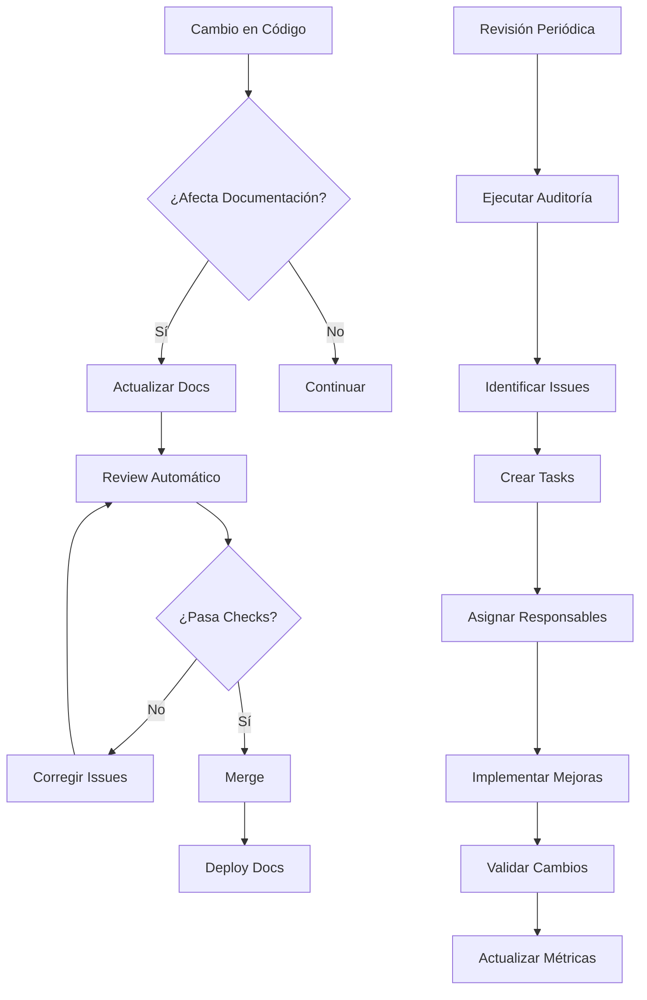

# Sistema de Mantenimiento de Documentación

## Descripción General

Este directorio contiene los procesos, herramientas y criterios para mantener la documentación del proyecto actualizada y de alta calidad.

## Estructura del Sistema

```
docs/maintenance/
├── README.md                    # Este archivo
├── review-checklist.md          # Lista de verificación para revisiones
├── update-schedule.md           # Cronograma de actualizaciones
├── quality-standards.md         # Estándares de calidad
├── automation/                  # Scripts y herramientas de automatización
│   ├── doc-checker.js          # Verificador de documentación
│   ├── link-checker.js         # Verificador de enlaces
│   └── outdated-detector.js    # Detector de contenido obsoleto
└── templates/                   # Plantillas para mantenimiento
    ├── review-template.md       # Plantilla de revisión
    └── update-log.md           # Plantilla de registro de actualizaciones
```

## Procesos de Mantenimiento

### 1. Revisión Periódica

- **Frecuencia**: Mensual para documentación crítica, trimestral para documentación general
- **Responsables**: Equipo de desarrollo (rotativo)
- **Criterios**: Ver `quality-standards.md`

### 2. Actualización Automática

- **Triggers**: Cambios en código, nuevas features, releases
- **Herramientas**: Scripts en `automation/`
- **Validación**: CI/CD pipeline

### 3. Feedback y Mejora Continua

- **Canales**: Issues de GitHub, comentarios en PRs
- **Métricas**: Uso de documentación, tiempo de onboarding
- **Iteración**: Mejoras basadas en feedback

## Responsabilidades

### Desarrolladores
- Actualizar documentación con cambios de código
- Revisar documentación en PRs
- Reportar documentación obsoleta

### Maintainers
- Supervisar calidad de documentación
- Coordinar revisiones periódicas
- Mantener herramientas de automatización

### Contributors
- Sugerir mejoras en documentación
- Reportar errores o inconsistencias
- Contribuir con ejemplos y casos de uso

## Métricas de Calidad

### Indicadores Clave
- **Cobertura**: % de código documentado
- **Actualidad**: Tiempo desde última actualización
- **Precisión**: % de enlaces funcionales
- **Usabilidad**: Feedback de usuarios

### Herramientas de Medición
- Scripts automatizados
- Análisis de logs
- Encuestas a desarrolladores
- Métricas de GitHub

## Flujo de Trabajo



## Herramientas y Automatización

### Scripts Disponibles

```bash
# Verificar estado de documentación
npm run docs:check

# Verificar enlaces rotos
npm run docs:links

# Detectar contenido obsoleto
npm run docs:outdated

# Generar reporte de cobertura
npm run docs:coverage

# Actualizar índices automáticamente
npm run docs:index
```

### Integración CI/CD

- **Pre-commit hooks**: Verificación básica
- **PR checks**: Validación completa
- **Deploy hooks**: Actualización automática
- **Scheduled jobs**: Auditorías periódicas

## Guías de Referencia

- [Checklist de Revisión](./review-checklist.md)
- [Cronograma de Actualizaciones](./update-schedule.md)
- [Estándares de Calidad](./quality-standards.md)
- [Plantillas de Mantenimiento](./templates/)

## Contacto y Soporte

- **Issues**: Usar etiqueta `documentation`
- **Discusiones**: GitHub Discussions
- **Urgente**: Contactar maintainers directamente

---

**Última actualización**: $(date)
**Próxima revisión**: $(date +1 month)
**Responsable**: Equipo de desarrollo