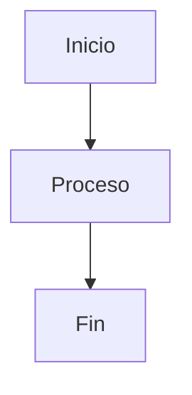

# Estándares de Calidad de Documentación

## Descripción General

Este documento establece los estándares de calidad que debe cumplir toda la documentación del proyecto Turnero de Pádel para garantizar consistencia, usabilidad y mantenibilidad.

## Principios Fundamentales

### 🎯 Claridad
- **Lenguaje simple**: Evitar jerga innecesaria
- **Estructura lógica**: Información organizada de manera intuitiva
- **Propósito claro**: Cada documento tiene un objetivo específico

### 📊 Precisión
- **Información correcta**: Técnicamente precisa y actualizada
- **Ejemplos funcionales**: Todo código debe ser ejecutable
- **Referencias válidas**: Enlaces y citas verificadas

### 🔄 Mantenibilidad
- **Formato consistente**: Siguiendo plantillas establecidas
- **Versionado claro**: Fechas y versiones especificadas
- **Modularidad**: Documentos independientes pero interconectados

### 👥 Accesibilidad
- **Múltiples audiencias**: Desde principiantes hasta expertos
- **Navegación intuitiva**: Fácil de encontrar y usar
- **Compatibilidad**: Funciona en diferentes plataformas

## Estándares por Categoría

### 📝 Contenido

#### Estructura Requerida

```markdown
# Título Principal

## Descripción/Introducción
- Qué es y para qué sirve
- Audiencia objetivo
- Prerrequisitos si aplica

## Contenido Principal
- Secciones organizadas lógicamente
- Subsecciones con H2, H3, etc.
- Ejemplos prácticos

## Referencias/Enlaces
- Enlaces relacionados
- Documentación adicional
- Recursos externos

---
**Última actualización**: YYYY-MM-DD
**Responsable**: @usuario
```

#### Criterios de Calidad

| Criterio | Excelente (5) | Bueno (4) | Aceptable (3) | Necesita Mejora (2) | Inaceptable (1) |
|----------|---------------|-----------|---------------|---------------------|------------------|
| **Claridad** | Extremadamente claro, sin ambigüedades | Muy claro, mínimas dudas | Generalmente claro | Algunas secciones confusas | Difícil de entender |
| **Completitud** | Cubre todos los aspectos necesarios | Cubre aspectos principales | Información básica presente | Faltan detalles importantes | Información insuficiente |
| **Precisión** | 100% preciso y actualizado | Mayormente preciso | Generalmente correcto | Algunos errores menores | Errores significativos |
| **Ejemplos** | Múltiples ejemplos funcionales | Buenos ejemplos | Ejemplos básicos | Pocos ejemplos | Sin ejemplos o no funcionan |
| **Organización** | Estructura perfecta | Bien organizado | Organización aceptable | Algo desorganizado | Muy desorganizado |

### 🎨 Formato y Estilo

#### Markdown

```markdown
# H1 - Solo uno por documento (título principal)
## H2 - Secciones principales
### H3 - Subsecciones
#### H4 - Detalles específicos (máximo nivel recomendado)

**Texto en negrita** para términos importantes
*Texto en cursiva* para énfasis
`código inline` para comandos y variables

```javascript
// Bloques de código con sintaxis highlighting
const ejemplo = 'siempre especificar el lenguaje';
```

> Citas para información importante o advertencias

- Listas con viñetas para elementos no ordenados
1. Listas numeradas para pasos secuenciales

[Enlaces descriptivos](https://ejemplo.com) - nunca "click aquí"

| Columna 1 | Columna 2 |
|-----------|----------|
| Dato 1    | Dato 2   |
```

#### Convenciones de Nomenclatura

- **Archivos**: `kebab-case.md` (ej: `quick-start.md`)
- **Directorios**: `kebab-case` (ej: `api-reference`)
- **Títulos**: Title Case para H1, Sentence case para H2+
- **Variables**: `UPPER_CASE` para constantes, `camelCase` para variables

#### Elementos Visuales

```markdown
<!-- Emojis para categorización -->
🚀 Inicio rápido
📚 Documentación
🔧 Configuración
⚠️ Advertencias
💡 Tips
🐛 Troubleshooting

<!-- Badges para estado -->


<!-- Diagramas Mermaid -->

```

### 💻 Código y Ejemplos

#### Estándares de Código

```typescript
// ✅ BUENO: Código completo y funcional
import { useState } from 'react';

interface Props {
  title: string;
  onSubmit: (data: FormData) => void;
}

export function ExampleComponent({ title, onSubmit }: Props) {
  const [loading, setLoading] = useState(false);
  
  const handleSubmit = async (e: React.FormEvent) => {
    e.preventDefault();
    setLoading(true);
    // Lógica de envío
    setLoading(false);
  };
  
  return (
    <form onSubmit={handleSubmit}>
      <h2>{title}</h2>
      <button type="submit" disabled={loading}>
        {loading ? 'Enviando...' : 'Enviar'}
      </button>
    </form>
  );
}
```

```typescript
// ❌ MALO: Código incompleto o sin contexto
function Component() {
  // ...
  return <div>...</div>;
}
```

#### Criterios para Ejemplos

- **Funcionales**: Deben ejecutarse sin errores
- **Completos**: Incluir imports y dependencias necesarias
- **Relevantes**: Relacionados directamente con el tema
- **Progresivos**: De simple a complejo
- **Comentados**: Explicar partes complejas

### 🔗 Enlaces y Referencias

#### Enlaces Internos

```markdown
<!-- Relativos al directorio docs -->
[Guía de Contribución](./guides/contributing.md)
[API Reference](./api/README.md)

<!-- Anclas dentro del documento -->
[Ver Configuración](#configuración)

<!-- Referencias a código -->
Ver el componente [Button](../src/components/Button.tsx)
```

#### Enlaces Externos

```markdown
<!-- Siempre con descripción clara -->
[Documentación oficial de Next.js](https://nextjs.org/docs)
[Guía de TypeScript](https://www.typescriptlang.org/docs/)

<!-- Evitar -->
[Aquí](https://ejemplo.com) <!-- ❌ No descriptivo -->
[Click aquí para más info](https://ejemplo.com) <!-- ❌ Redundante -->
```

#### Validación de Enlaces

- **Automática**: Scripts que verifican enlaces rotos
- **Manual**: Revisión periódica de enlaces externos
- **Actualización**: Reemplazar enlaces obsoletos

## Métricas de Calidad

### Indicadores Cuantitativos

```javascript
// Métricas automáticas
const qualityMetrics = {
  readabilityScore: 85, // Flesch Reading Ease
  linkValidation: 98,   // % enlaces funcionales
  codeExecution: 100,   // % ejemplos que funcionan
  completeness: 92,     // % secciones completas
  freshness: 30         // días desde última actualización
};
```

### Indicadores Cualitativos

| Métrica | Excelente | Bueno | Aceptable | Necesita Mejora |
|---------|-----------|-------|-----------|------------------|
| **Claridad** | 90-100% | 80-89% | 70-79% | <70% |
| **Precisión** | 95-100% | 90-94% | 85-89% | <85% |
| **Utilidad** | 90-100% | 80-89% | 70-79% | <70% |
| **Actualidad** | <30 días | 30-90 días | 90-180 días | >180 días |

### Herramientas de Medición

```bash
# Scripts de calidad
npm run docs:quality-check    # Análisis completo
npm run docs:readability      # Score de legibilidad
npm run docs:link-check       # Validación de enlaces
npm run docs:code-test        # Prueba de ejemplos
npm run docs:freshness        # Análisis de actualidad
```

## Proceso de Evaluación

### 1. Auto-evaluación

```markdown
## Checklist de Auto-evaluación

### Contenido
- [ ] Título claro y descriptivo
- [ ] Introducción que explica el propósito
- [ ] Información completa y precisa
- [ ] Ejemplos funcionales incluidos
- [ ] Conclusión o próximos pasos

### Formato
- [ ] Markdown válido
- [ ] Estructura de encabezados correcta
- [ ] Código con syntax highlighting
- [ ] Enlaces descriptivos
- [ ] Imágenes con alt text

### Calidad
- [ ] Sin errores ortográficos
- [ ] Lenguaje claro y conciso
- [ ] Organización lógica
- [ ] Referencias actualizadas
- [ ] Metadatos completos
```

### 2. Revisión por Pares

```markdown
## Template de Revisión

**Documento**: [nombre del archivo]
**Revisor**: @usuario
**Fecha**: YYYY-MM-DD

### Puntuación General
- Claridad: ⭐⭐⭐⭐⭐ (1-5)
- Completitud: ⭐⭐⭐⭐⭐ (1-5)
- Precisión: ⭐⭐⭐⭐⭐ (1-5)
- Utilidad: ⭐⭐⭐⭐⭐ (1-5)

### Comentarios
- **Fortalezas**: [qué está bien]
- **Mejoras**: [qué se puede mejorar]
- **Errores**: [errores encontrados]

### Recomendación
- [ ] Aprobar
- [ ] Aprobar con cambios menores
- [ ] Requiere cambios significativos
- [ ] Rechazar
```

### 3. Validación Automática

```yaml
# .github/workflows/docs-quality.yml
name: Documentation Quality Check

on:
  pull_request:
    paths: ['docs/**']

jobs:
  quality-check:
    runs-on: ubuntu-latest
    steps:
      - uses: actions/checkout@v3
      
      - name: Lint Markdown
        run: markdownlint docs/
        
      - name: Check Links
        run: markdown-link-check docs/**/*.md
        
      - name: Test Code Examples
        run: npm run docs:test-examples
        
      - name: Quality Score
        run: npm run docs:quality-score
```

## Plantillas de Calidad

### Template Básico

```markdown
# [Título Descriptivo]

> **Audiencia**: [Desarrolladores/Usuarios/Administradores]
> **Nivel**: [Principiante/Intermedio/Avanzado]
> **Tiempo estimado**: [X minutos]

## Descripción

[Breve descripción del contenido y su propósito]

## Prerrequisitos

- [Conocimiento/herramienta requerida 1]
- [Conocimiento/herramienta requerida 2]

## Contenido Principal

### [Sección 1]

[Contenido con ejemplos]

```javascript
// Ejemplo de código
const ejemplo = 'funcional';
```

### [Sección 2]

[Más contenido]

## Próximos Pasos

- [Acción recomendada 1]
- [Enlace a documentación relacionada]

## Referencias

- [Enlace relevante 1](url)
- [Enlace relevante 2](url)

---

**Última actualización**: YYYY-MM-DD  
**Responsable**: @usuario  
**Revisado por**: @revisor  
**Próxima revisión**: YYYY-MM-DD
```

### Template Avanzado

```markdown
# [Título]

<div align="center">


</div>

## 📋 Tabla de Contenidos

- [Descripción](#descripción)
- [Instalación](#instalación)
- [Uso](#uso)
- [Ejemplos](#ejemplos)
- [API Reference](#api-reference)
- [Troubleshooting](#troubleshooting)
- [Contributing](#contributing)

## 🎯 Descripción

[Descripción detallada con contexto]

## 🚀 Instalación

```bash
# Comandos de instalación
npm install ejemplo
```

## 💻 Uso

### Uso Básico

```typescript
// Ejemplo básico
import { Ejemplo } from 'ejemplo';

const resultado = new Ejemplo();
```

### Uso Avanzado

```typescript
// Ejemplo avanzado con configuración
const config = {
  opcion1: 'valor1',
  opcion2: true
};

const resultado = new Ejemplo(config);
```

## 📚 Ejemplos

### Ejemplo 1: [Caso de Uso]

[Descripción del ejemplo]

```typescript
// Código completo del ejemplo
```

**Resultado esperado**:
```
[Output del ejemplo]
```

## 🔧 Troubleshooting

### Error Común 1

**Problema**: [Descripción del error]

**Solución**:
```bash
# Comandos para solucionarlo
```

## 🤝 Contributing

Ver [Guía de Contribución](../guides/contributing.md)

---

<div align="center">

**¿Encontraste un error?** [Reportar issue](link-to-issues)  
**¿Tienes una sugerencia?** [Crear discussion](link-to-discussions)

</div>
```

## Herramientas de Apoyo

### Linters y Validadores

```json
// .markdownlint.json
{
  "MD013": { "line_length": 100 },
  "MD033": false,
  "MD041": false
}
```

### Scripts de Calidad

```javascript
// scripts/quality-check.js
const fs = require('fs');
const path = require('path');

function checkDocumentQuality(filePath) {
  const content = fs.readFileSync(filePath, 'utf8');
  
  const checks = {
    hasTitle: /^# /.test(content),
    hasDescription: content.includes('## Descripción') || content.includes('## Description'),
    hasExamples: content.includes('```'),
    hasLastUpdated: content.includes('**Última actualización**'),
    linkCount: (content.match(/\[.*?\]\(.*?\)/g) || []).length
  };
  
  return checks;
}
```

## Mejora Continua

### Feedback Loop

1. **Recopilar feedback** de usuarios y desarrolladores
2. **Analizar métricas** de uso y calidad
3. **Identificar patrones** de problemas comunes
4. **Actualizar estándares** basado en aprendizajes
5. **Comunicar cambios** al equipo

### Evolución de Estándares

- **Revisión trimestral** de estándares
- **Incorporación** de mejores prácticas emergentes
- **Adaptación** a nuevas herramientas y tecnologías
- **Feedback** de la comunidad de desarrolladores

---

**Última actualización**: $(date)  
**Responsable**: Maintainer  
**Próxima revisión**: $(date +3 months)