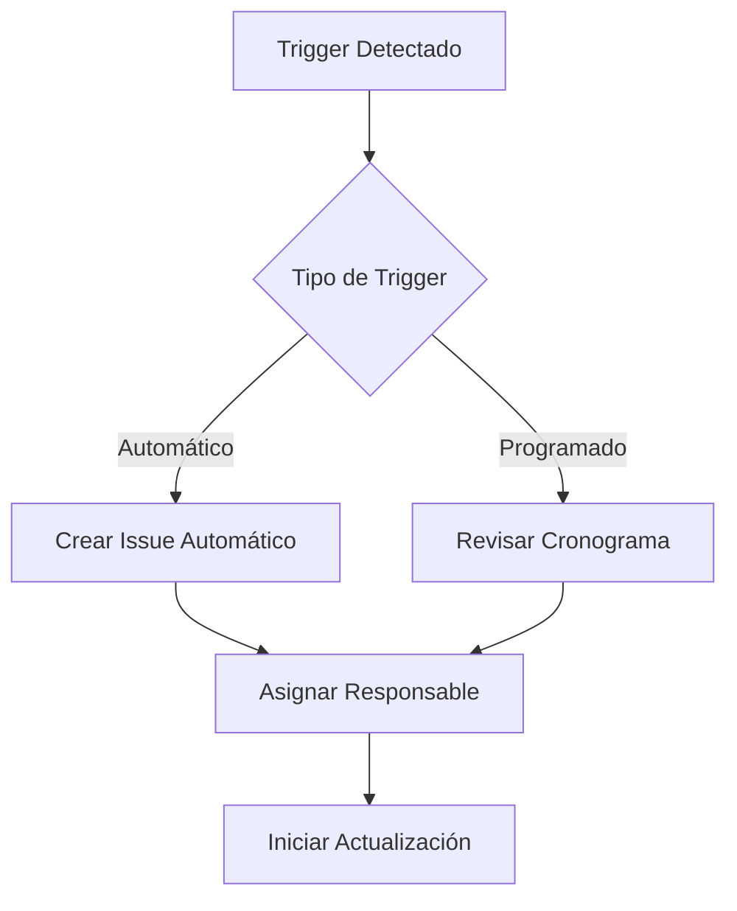
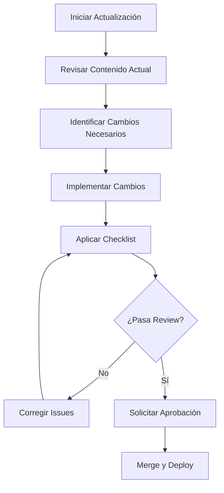
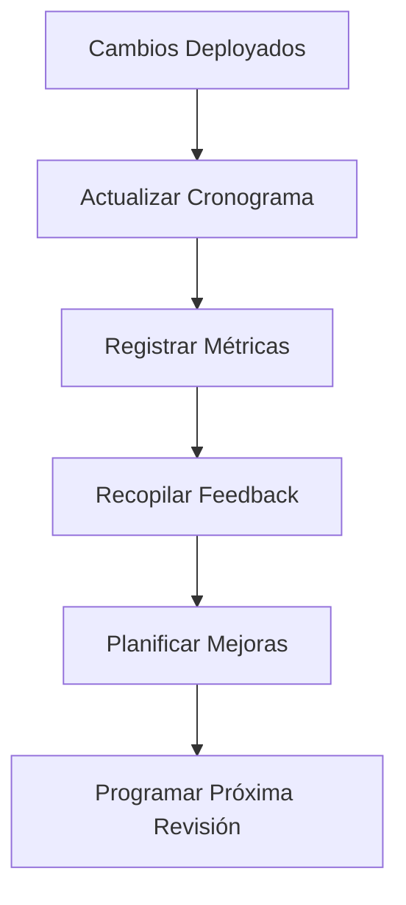

# Cronograma de Actualizaciones de Documentación

## Descripción General

Este documento establece la frecuencia y responsabilidades para mantener actualizada la documentación del proyecto Turnero de Pádel.

## Clasificación de Documentación

### 🔴 Crítica (Revisión Mensual)

**Documentación que afecta directamente el desarrollo y deployment**

| Documento | Responsable | Frecuencia | Última Revisión | Próxima Revisión |
|-----------|-------------|------------|-----------------|------------------|
| `README.md` | Maintainer | Mensual | - | - |
| `docs/api/` | Backend Lead | Mensual | - | - |
| `docs/guides/quick-start.md` | DevOps | Mensual | - | - |
| `docs/guides/deployment.md` | DevOps | Mensual | - | - |
| `docs/architecture/system-architecture.md` | Tech Lead | Mensual | - | - |

### 🟡 Importante (Revisión Trimestral)

**Documentación de desarrollo y contribución**

| Documento | Responsable | Frecuencia | Última Revisión | Próxima Revisión |
|-----------|-------------|------------|-----------------|------------------|
| `docs/guides/contributing.md` | Maintainer | Trimestral | - | - |
| `docs/guides/development.md` | Frontend Lead | Trimestral | - | - |
| `docs/components/` | Frontend Team | Trimestral | - | - |
| `docs/architecture/component-architecture.md` | Frontend Lead | Trimestral | - | - |
| `docs/architecture/database-diagram.md` | Backend Lead | Trimestral | - | - |

### 🟢 General (Revisión Semestral)

**Documentación de soporte y referencia**

| Documento | Responsable | Frecuencia | Última Revisión | Próxima Revisión |
|-----------|-------------|------------|-----------------|------------------|
| `docs/guides/troubleshooting.md` | Support Team | Semestral | - | - |
| `docs/architecture/user-flows.md` | UX/UI | Semestral | - | - |
| `docs/architecture/api-flows.md` | Backend Team | Semestral | - | - |
| `docs/standards/` | Quality Team | Semestral | - | - |

## Triggers de Actualización

### 🚀 Automáticos (Inmediatos)

**Eventos que requieren actualización inmediata**

- **Nuevas Features**
  - Actualizar documentación de API
  - Actualizar guías de usuario
  - Actualizar ejemplos de código

- **Breaking Changes**
  - Actualizar guías de migración
  - Actualizar documentación de API
  - Actualizar quick-start guide

- **Nuevas Dependencias**
  - Actualizar guías de instalación
  - Actualizar documentación de deployment
  - Actualizar troubleshooting

- **Cambios de Arquitectura**
  - Actualizar diagramas
  - Actualizar documentación técnica
  - Actualizar guías de desarrollo

### 📅 Programados (Periódicos)

**Revisiones regulares independientes de cambios**

- **Semanalmente**
  - Verificar enlaces rotos
  - Validar ejemplos de código
  - Revisar issues de documentación

- **Mensualmente**
  - Auditoría de documentación crítica
  - Actualizar métricas de uso
  - Revisar feedback de usuarios

- **Trimestralmente**
  - Revisión completa de guías
  - Actualizar screenshots y demos
  - Evaluar estructura de documentación

- **Semestralmente**
  - Revisión estratégica completa
  - Actualizar roadmap de documentación
  - Evaluar herramientas y procesos

## Calendario de Revisiones 2024

### Q1 2024 (Enero - Marzo)

```
Enero:
- Semana 1: Setup inicial del sistema de mantenimiento
- Semana 2: Revisión crítica completa
- Semana 3: Actualización de guías de desarrollo
- Semana 4: Implementación de herramientas automatizadas

Febrero:
- Semana 1: Revisión de documentación de API
- Semana 2: Actualización de diagramas de arquitectura
- Semana 3: Revisión de guías de contribución
- Semana 4: Auditoría de enlaces y referencias

Marzo:
- Semana 1: Revisión trimestral completa
- Semana 2: Actualización de troubleshooting
- Semana 3: Mejoras basadas en feedback
- Semana 4: Preparación para Q2
```

### Q2 2024 (Abril - Junio)

```
Abril:
- Semana 1: Revisión de documentación crítica
- Semana 2: Actualización post-release
- Semana 3: Revisión de guías de deployment
- Semana 4: Optimización de procesos

Mayo:
- Semana 1: Revisión de componentes
- Semana 2: Actualización de ejemplos
- Semana 3: Revisión de arquitectura
- Semana 4: Auditoría de calidad

Junio:
- Semana 1: Revisión semestral completa
- Semana 2: Actualización estratégica
- Semana 3: Planificación H2
- Semana 4: Implementación de mejoras
```

## Responsabilidades por Rol

### 👑 Maintainer
- Supervisar cronograma general
- Asignar responsabilidades
- Revisar documentación crítica
- Aprobar cambios importantes

### 🏗️ Tech Lead
- Documentación de arquitectura
- Decisiones técnicas
- Revisión de diseño
- Coordinación entre equipos

### 💻 Frontend Lead
- Documentación de componentes
- Guías de desarrollo frontend
- Ejemplos de UI/UX
- Patrones de diseño

### 🔧 Backend Lead
- Documentación de API
- Arquitectura de datos
- Guías de integración
- Seguridad y performance

### 🚀 DevOps
- Guías de deployment
- Configuración de entornos
- Monitoreo y logging
- Automatización de procesos

### 🎨 UX/UI Designer
- Flujos de usuario
- Guías de diseño
- Documentación de componentes visuales
- Casos de uso

## Proceso de Actualización

### 1. Identificación


### 2. Ejecución


### 3. Seguimiento


## Herramientas de Automatización

### Scripts de Monitoreo

```bash
# Verificar documentación obsoleta
npm run docs:check-outdated

# Generar reporte de estado
npm run docs:status-report

# Verificar cronograma
npm run docs:schedule-check

# Notificar revisiones pendientes
npm run docs:notify-reviews
```

### GitHub Actions

```yaml
# .github/workflows/docs-maintenance.yml
name: Documentation Maintenance
on:
  schedule:
    - cron: '0 9 * * 1'  # Lunes a las 9 AM
  workflow_dispatch:

jobs:
  check-schedule:
    runs-on: ubuntu-latest
    steps:
      - uses: actions/checkout@v3
      - name: Check Documentation Schedule
        run: npm run docs:schedule-check
      - name: Create Issues for Overdue Reviews
        run: npm run docs:create-review-issues
```

### Notificaciones

- **Slack/Discord**: Recordatorios automáticos
- **GitHub Issues**: Tareas de revisión
- **Email**: Reportes semanales
- **Dashboard**: Estado en tiempo real

## Métricas y KPIs

### Indicadores de Cumplimiento
- **Puntualidad**: % de revisiones a tiempo
- **Cobertura**: % de documentación actualizada
- **Calidad**: Score promedio de reviews
- **Engagement**: Uso y feedback de documentación

### Reportes

```markdown
## Reporte Mensual - Enero 2024

### Cumplimiento del Cronograma
- ✅ Documentación Crítica: 100% (5/5)
- ⚠️ Documentación Importante: 80% (4/5)
- ✅ Documentación General: 100% (3/3)

### Métricas de Calidad
- Score promedio: 4.2/5
- Issues resueltos: 12
- Nuevas contribuciones: 8

### Próximas Acciones
- Actualizar guía de desarrollo
- Revisar documentación de componentes
- Implementar mejoras sugeridas
```

## Contacto y Escalación

### Para Dudas
- **Slack**: #documentation
- **Email**: docs@turnero-padel.com
- **GitHub**: Issues con label `documentation`

### Para Escalación
- **Retrasos críticos**: Contactar Maintainer
- **Recursos insuficientes**: Contactar Tech Lead
- **Problemas de proceso**: Crear issue en repo principal

---

**Última actualización**: $(date)
**Próxima revisión del cronograma**: $(date +1 month)
**Responsable del cronograma**: Maintainer