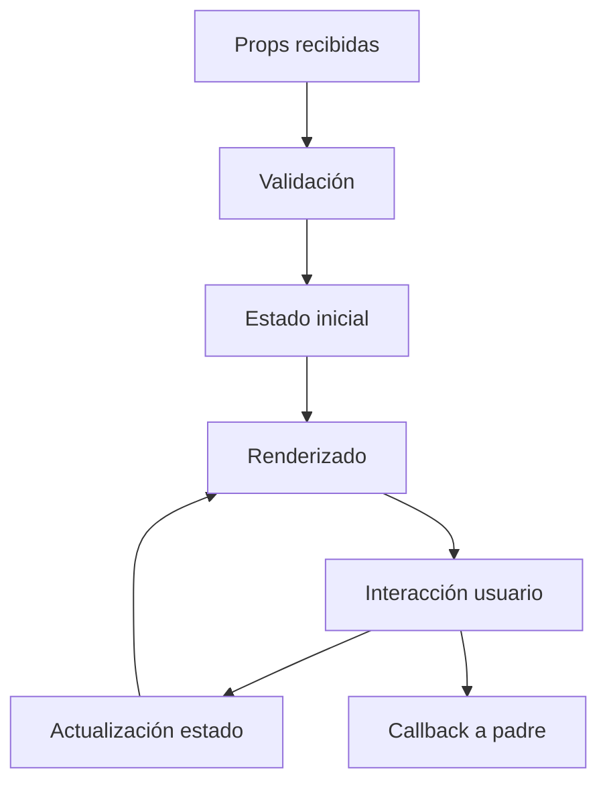

# Plantilla de Documentación para Componentes React

## Información del Componente

**Nombre**: `[NombreDelComponente]`  
**Ubicación**: `[ruta/del/archivo]`  
**Tipo**: `[Componente de UI / Página / Layout / Hook]`  
**Autor**: `[Nombre del desarrollador]`  
**Fecha**: `[YYYY-MM-DD]`

## Descripción

[Descripción detallada de qué hace el componente y cuál es su propósito en la aplicación]

## Props/Parámetros

| Prop | Tipo | Requerido | Default | Descripción |
|------|------|-----------|---------|-------------|
| `prop1` | `string` | ✅ | - | Descripción de prop1 |
| `prop2` | `number` | ❌ | `0` | Descripción de prop2 |
| `onAction` | `(data: Type) => void` | ❌ | - | Callback ejecutado cuando... |

## Estados Internos

| Estado | Tipo | Descripción |
|--------|------|-------------|
| `isLoading` | `boolean` | Indica si el componente está cargando datos |
| `error` | `string \| null` | Mensaje de error si ocurre algún problema |

## Hooks Utilizados

- `useState` - Para manejar estado local
- `useEffect` - Para efectos secundarios
- `useAuth` - Hook personalizado para autenticación
- `useRouter` - Para navegación

## Dependencias

- `react` - Biblioteca principal
- `next/router` - Para navegación
- `@/lib/utils` - Utilidades del proyecto

## Ejemplos de Uso

### Uso Básico

```tsx
import { ComponentName } from '@/components/ComponentName';

function ParentComponent() {
  return (
    <ComponentName 
      prop1="valor"
      prop2={123}
      onAction={(data) => console.log(data)}
    />
  );
}
```

### Uso Avanzado

```tsx
import { ComponentName } from '@/components/ComponentName';

function AdvancedExample() {
  const handleAction = (data: DataType) => {
    // Lógica personalizada
  };

  return (
    <ComponentName 
      prop1="valor-complejo"
      prop2={456}
      onAction={handleAction}
    />
  );
}
```

## Casos de Uso

1. **Caso 1**: [Descripción del primer caso de uso]
2. **Caso 2**: [Descripción del segundo caso de uso]
3. **Caso 3**: [Descripción del tercer caso de uso]

## Flujo de Datos



## Estilos y Clases CSS

| Clase | Descripción |
|-------|-------------|
| `.component-container` | Contenedor principal del componente |
| `.component-header` | Encabezado del componente |
| `.component-content` | Contenido principal |

## Accesibilidad

- ✅ Soporte para lectores de pantalla
- ✅ Navegación por teclado
- ✅ Contraste de colores adecuado
- ✅ Etiquetas ARIA apropiadas

## Testing

### Tests Unitarios

```typescript
// Ejemplo de test
describe('ComponentName', () => {
  it('should render correctly', () => {
    render(<ComponentName prop1="test" />);
    expect(screen.getByText('Expected Text')).toBeInTheDocument();
  });

  it('should handle user interaction', () => {
    const mockCallback = jest.fn();
    render(<ComponentName onAction={mockCallback} />);
    
    fireEvent.click(screen.getByRole('button'));
    expect(mockCallback).toHaveBeenCalled();
  });
});
```

## Problemas Conocidos

- [ ] **Problema 1**: Descripción del problema y posible solución
- [ ] **Problema 2**: Descripción del problema y workaround temporal

## Mejoras Futuras

- [ ] **Mejora 1**: Descripción de la mejora propuesta
- [ ] **Mejora 2**: Optimización de rendimiento
- [ ] **Mejora 3**: Nuevas funcionalidades

## Notas de Desarrollo

- [Notas importantes sobre la implementación]
- [Decisiones de diseño tomadas]
- [Consideraciones de rendimiento]

## Changelog

| Versión | Fecha | Cambios |
|---------|-------|----------|
| 1.0.0 | 2024-01-01 | Versión inicial |
| 1.1.0 | 2024-01-15 | Agregada funcionalidad X |

---

**Última actualización**: [Fecha]  
**Revisado por**: [Nombre del revisor]