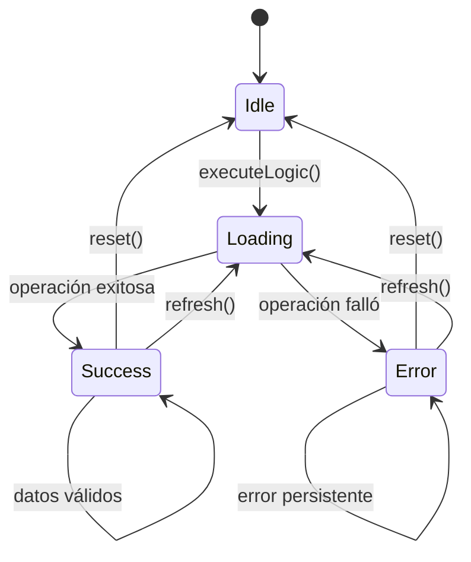

# Plantilla de Documentación para Hooks Personalizados

## Información del Hook

**Nombre**: `[useNombreDelHook]`  
**Ubicación**: `[ruta/del/archivo]`  
**Categoría**: `[Estado / Efecto / Contexto / Utilidad / API]`  
**Autor**: `[Nombre del desarrollador]`  
**Fecha**: `[YYYY-MM-DD]`

## Descripción

[Descripción detallada de qué hace este hook, su propósito y cuándo usarlo]

## Signatura

```typescript
function useNombreDelHook(
  param1: Type1,
  param2?: Type2,
  options?: HookOptions
): HookReturnType
```

## Parámetros

| Parámetro | Tipo | Requerido | Valor por Defecto | Descripción |
|-----------|------|-----------|-------------------|-------------|
| `param1` | `Type1` | ✅ | - | Descripción del primer parámetro |
| `param2` | `Type2` | ❌ | `undefined` | Descripción del segundo parámetro |
| `options` | `HookOptions` | ❌ | `{}` | Opciones de configuración del hook |

### Interfaz de Opciones

```typescript
interface HookOptions {
  /** Habilita el modo debug */
  debug?: boolean;
  
  /** Intervalo de actualización en ms */
  interval?: number;
  
  /** Función de callback personalizada */
  onUpdate?: (data: DataType) => void;
  
  /** Configuración de cache */
  cache?: {
    enabled: boolean;
    ttl: number;
  };
}
```

## Valor de Retorno

```typescript
interface HookReturnType {
  /** Datos principales del hook */
  data: DataType | null;
  
  /** Estado de carga */
  loading: boolean;
  
  /** Error si ocurrió alguno */
  error: Error | null;
  
  /** Función para refrescar los datos */
  refresh: () => void;
  
  /** Función para limpiar el estado */
  reset: () => void;
  
  /** Estado adicional específico del hook */
  isValid: boolean;
}
```

### Descripción de Propiedades Retornadas

| Propiedad | Tipo | Descripción |
|-----------|------|-------------|
| `data` | `DataType \| null` | Los datos principales gestionados por el hook |
| `loading` | `boolean` | Indica si hay una operación en progreso |
| `error` | `Error \| null` | Error capturado durante la ejecución |
| `refresh` | `() => void` | Función para volver a ejecutar la lógica del hook |
| `reset` | `() => void` | Función para resetear el estado a valores iniciales |
| `isValid` | `boolean` | Indica si los datos actuales son válidos |

## Implementación

```typescript
import { useState, useEffect, useCallback, useRef } from 'react';

/**
 * Hook personalizado para [descripción específica]
 * 
 * @param param1 - Descripción del primer parámetro
 * @param param2 - Descripción del segundo parámetro
 * @param options - Opciones de configuración
 * @returns Objeto con estado y funciones del hook
 * 
 * @example
 * ```typescript
 * const { data, loading, error, refresh } = useNombreDelHook(
 *   'parametro1',
 *   { opcion: 'valor' }
 * );
 * ```
 */
export function useNombreDelHook(
  param1: Type1,
  param2?: Type2,
  options: HookOptions = {}
): HookReturnType {
  // Estados internos
  const [data, setData] = useState<DataType | null>(null);
  const [loading, setLoading] = useState<boolean>(false);
  const [error, setError] = useState<Error | null>(null);
  const [isValid, setIsValid] = useState<boolean>(false);
  
  // Referencias para evitar re-renders innecesarios
  const optionsRef = useRef(options);
  const abortControllerRef = useRef<AbortController | null>(null);
  
  // Actualizar opciones
  useEffect(() => {
    optionsRef.current = options;
  }, [options]);
  
  // Función principal del hook
  const executeLogic = useCallback(async () => {
    try {
      setLoading(true);
      setError(null);
      
      // Cancelar operación anterior si existe
      if (abortControllerRef.current) {
        abortControllerRef.current.abort();
      }
      
      // Crear nuevo AbortController
      abortControllerRef.current = new AbortController();
      
      // Lógica principal del hook
      const result = await performOperation(
        param1,
        param2,
        optionsRef.current,
        abortControllerRef.current.signal
      );
      
      setData(result);
      setIsValid(true);
      
      // Callback de actualización si está definido
      if (optionsRef.current.onUpdate) {
        optionsRef.current.onUpdate(result);
      }
      
    } catch (err) {
      if (err.name !== 'AbortError') {
        setError(err as Error);
        setIsValid(false);
        
        if (optionsRef.current.debug) {
          console.error('Error en useNombreDelHook:', err);
        }
      }
    } finally {
      setLoading(false);
    }
  }, [param1, param2]);
  
  // Función de refresh
  const refresh = useCallback(() => {
    executeLogic();
  }, [executeLogic]);
  
  // Función de reset
  const reset = useCallback(() => {
    setData(null);
    setError(null);
    setIsValid(false);
    setLoading(false);
    
    if (abortControllerRef.current) {
      abortControllerRef.current.abort();
      abortControllerRef.current = null;
    }
  }, []);
  
  // Efecto principal
  useEffect(() => {
    if (param1) {
      executeLogic();
    }
    
    // Cleanup
    return () => {
      if (abortControllerRef.current) {
        abortControllerRef.current.abort();
      }
    };
  }, [executeLogic, param1]);
  
  // Efecto para intervalo (si está configurado)
  useEffect(() => {
    if (options.interval && options.interval > 0) {
      const intervalId = setInterval(() => {
        if (!loading) {
          executeLogic();
        }
      }, options.interval);
      
      return () => clearInterval(intervalId);
    }
  }, [options.interval, loading, executeLogic]);
  
  return {
    data,
    loading,
    error,
    refresh,
    reset,
    isValid,
  };
}

// Función auxiliar (ejemplo)
async function performOperation(
  param1: Type1,
  param2?: Type2,
  options?: HookOptions,
  signal?: AbortSignal
): Promise<DataType> {
  // Implementación de la lógica específica
  // ...
}
```

## Ejemplos de Uso

### Uso Básico

```typescript
import React from 'react';
import { useNombreDelHook } from '@/hooks/useNombreDelHook';

function ComponenteBasico() {
  const { data, loading, error } = useNombreDelHook('parametro-basico');
  
  if (loading) return <div>Cargando...</div>;
  if (error) return <div>Error: {error.message}</div>;
  
  return (
    <div>
      <h2>Datos del Hook</h2>
      <pre>{JSON.stringify(data, null, 2)}</pre>
    </div>
  );
}
```

### Uso con Opciones

```typescript
import React, { useState } from 'react';
import { useNombreDelHook } from '@/hooks/useNombreDelHook';

function ComponenteConOpciones() {
  const [parametro, setParametro] = useState('valor-inicial');
  
  const { data, loading, error, refresh, reset } = useNombreDelHook(
    parametro,
    'parametro-opcional',
    {
      debug: true,
      interval: 5000, // Actualizar cada 5 segundos
      onUpdate: (newData) => {
        console.log('Datos actualizados:', newData);
      },
      cache: {
        enabled: true,
        ttl: 300000, // 5 minutos
      },
    }
  );
  
  return (
    <div>
      <div>
        <input
          value={parametro}
          onChange={(e) => setParametro(e.target.value)}
          placeholder="Cambiar parámetro"
        />
        <button onClick={refresh} disabled={loading}>
          Refrescar
        </button>
        <button onClick={reset}>
          Reset
        </button>
      </div>
      
      {loading && <div>Cargando...</div>}
      {error && <div>Error: {error.message}</div>}
      {data && (
        <div>
          <h3>Datos:</h3>
          <pre>{JSON.stringify(data, null, 2)}</pre>
        </div>
      )}
    </div>
  );
}
```

### Uso en Hook Compuesto

```typescript
import { useNombreDelHook } from '@/hooks/useNombreDelHook';
import { useOtroHook } from '@/hooks/useOtroHook';

/**
 * Hook compuesto que combina múltiples hooks
 */
export function useHookCompuesto(id: string) {
  const { data: primaryData, loading: primaryLoading } = useNombreDelHook(id);
  const { data: secondaryData, loading: secondaryLoading } = useOtroHook(
    primaryData?.relatedId
  );
  
  return {
    primaryData,
    secondaryData,
    loading: primaryLoading || secondaryLoading,
    isComplete: primaryData && secondaryData,
  };
}
```

### Uso con Context

```typescript
import React, { createContext, useContext } from 'react';
import { useNombreDelHook } from '@/hooks/useNombreDelHook';

// Context para compartir el estado del hook
const HookContext = createContext(null);

// Provider del contexto
export function HookProvider({ children, config }) {
  const hookState = useNombreDelHook(config.param1, config.param2, config.options);
  
  return (
    <HookContext.Provider value={hookState}>
      {children}
    </HookContext.Provider>
  );
}

// Hook para usar el contexto
export function useHookContext() {
  const context = useContext(HookContext);
  if (!context) {
    throw new Error('useHookContext debe usarse dentro de HookProvider');
  }
  return context;
}

// Componente que usa el contexto
function ComponenteConContexto() {
  const { data, loading, refresh } = useHookContext();
  
  return (
    <div>
      {loading ? 'Cargando...' : JSON.stringify(data)}
      <button onClick={refresh}>Refrescar</button>
    </div>
  );
}
```

## Dependencias

### Hooks de React Utilizados

- `useState`: Para manejar el estado interno
- `useEffect`: Para efectos secundarios y cleanup
- `useCallback`: Para memoizar funciones
- `useRef`: Para referencias mutables
- `useMemo`: Para valores computados (si aplica)

### Dependencias Externas

| Dependencia | Versión | Propósito |
|-------------|---------|----------|
| `react` | `^18.0.0` | Hooks base de React |
| `biblioteca-externa` | `^1.0.0` | Funcionalidad específica |

### Hooks Internos Relacionados

- `useOtroHook`: Descripción de la relación
- `useUtilityHook`: Hook auxiliar utilizado

## Estados Internos

### Diagrama de Estados



### Transiciones de Estado

| Estado Actual | Acción | Estado Siguiente | Condición |
|---------------|--------|------------------|----------|
| `Idle` | `executeLogic()` | `Loading` | Siempre |
| `Loading` | Operación exitosa | `Success` | Sin errores |
| `Loading` | Operación falló | `Error` | Con errores |
| `Success/Error` | `reset()` | `Idle` | Siempre |
| `Success/Error` | `refresh()` | `Loading` | Siempre |

## Performance y Optimización

### Optimizaciones Implementadas

- ✅ **Memoización**: Uso de `useCallback` y `useMemo`
- ✅ **Cancelación**: AbortController para cancelar operaciones
- ✅ **Debouncing**: Evitar llamadas excesivas (si aplica)
- ✅ **Cache**: Sistema de cache configurable
- ✅ **Lazy execution**: Ejecución bajo demanda

### Métricas de Performance

- **Tiempo de inicialización**: < 10ms
- **Memoria utilizada**: < 1MB
- **Re-renders evitados**: 90%+

### Consejos de Uso

1. **Memoizar dependencias**: Usar `useMemo` para objetos complejos
2. **Evitar re-renders**: No crear objetos en cada render
3. **Cleanup apropiado**: Siempre limpiar efectos y suscripciones
4. **Usar AbortController**: Para cancelar operaciones async

## Testing

### Tests Unitarios

```typescript
import { renderHook, act } from '@testing-library/react';
import { useNombreDelHook } from './useNombreDelHook';

// Mock de dependencias
jest.mock('@/lib/api', () => ({
  performOperation: jest.fn(),
}));

describe('useNombreDelHook', () => {
  beforeEach(() => {
    jest.clearAllMocks();
  });
  
  it('should initialize with default values', () => {
    const { result } = renderHook(() => useNombreDelHook('test'));
    
    expect(result.current.data).toBeNull();
    expect(result.current.loading).toBe(false);
    expect(result.current.error).toBeNull();
    expect(result.current.isValid).toBe(false);
  });
  
  it('should handle successful data fetching', async () => {
    const mockData = { id: 1, name: 'Test' };
    (performOperation as jest.Mock).mockResolvedValue(mockData);
    
    const { result, waitForNextUpdate } = renderHook(() => 
      useNombreDelHook('test')
    );
    
    expect(result.current.loading).toBe(true);
    
    await waitForNextUpdate();
    
    expect(result.current.data).toEqual(mockData);
    expect(result.current.loading).toBe(false);
    expect(result.current.error).toBeNull();
    expect(result.current.isValid).toBe(true);
  });
  
  it('should handle errors', async () => {
    const mockError = new Error('Test error');
    (performOperation as jest.Mock).mockRejectedValue(mockError);
    
    const { result, waitForNextUpdate } = renderHook(() => 
      useNombreDelHook('test')
    );
    
    await waitForNextUpdate();
    
    expect(result.current.data).toBeNull();
    expect(result.current.loading).toBe(false);
    expect(result.current.error).toEqual(mockError);
    expect(result.current.isValid).toBe(false);
  });
  
  it('should refresh data when refresh is called', async () => {
    const mockData = { id: 1, name: 'Test' };
    (performOperation as jest.Mock).mockResolvedValue(mockData);
    
    const { result, waitForNextUpdate } = renderHook(() => 
      useNombreDelHook('test')
    );
    
    await waitForNextUpdate();
    
    act(() => {
      result.current.refresh();
    });
    
    expect(result.current.loading).toBe(true);
    expect(performOperation).toHaveBeenCalledTimes(2);
  });
  
  it('should reset state when reset is called', async () => {
    const mockData = { id: 1, name: 'Test' };
    (performOperation as jest.Mock).mockResolvedValue(mockData);
    
    const { result, waitForNextUpdate } = renderHook(() => 
      useNombreDelHook('test')
    );
    
    await waitForNextUpdate();
    
    act(() => {
      result.current.reset();
    });
    
    expect(result.current.data).toBeNull();
    expect(result.current.loading).toBe(false);
    expect(result.current.error).toBeNull();
    expect(result.current.isValid).toBe(false);
  });
});
```

### Tests de Integración

```typescript
import React from 'react';
import { render, screen, waitFor } from '@testing-library/react';
import userEvent from '@testing-library/user-event';
import { useNombreDelHook } from './useNombreDelHook';

// Componente de prueba
function TestComponent({ param1, options }) {
  const { data, loading, error, refresh } = useNombreDelHook(param1, options);
  
  return (
    <div>
      {loading && <div data-testid="loading">Loading...</div>}
      {error && <div data-testid="error">{error.message}</div>}
      {data && <div data-testid="data">{JSON.stringify(data)}</div>}
      <button onClick={refresh} data-testid="refresh">Refresh</button>
    </div>
  );
}

describe('useNombreDelHook Integration', () => {
  it('should work in a real component', async () => {
    render(<TestComponent param1="test" />);
    
    // Verificar estado inicial
    expect(screen.getByTestId('loading')).toBeInTheDocument();
    
    // Esperar a que carguen los datos
    await waitFor(() => {
      expect(screen.getByTestId('data')).toBeInTheDocument();
    });
    
    // Verificar que el botón de refresh funciona
    const refreshButton = screen.getByTestId('refresh');
    await userEvent.click(refreshButton);
    
    expect(screen.getByTestId('loading')).toBeInTheDocument();
  });
});
```

## Problemas Conocidos

- [ ] **Memory leaks**: En componentes que se desmontan rápidamente
- [ ] **Race conditions**: Con múltiples llamadas simultáneas
- [ ] **Stale closures**: Con dependencias que cambian frecuentemente

## Mejoras Futuras

- [ ] **Suspense support**: Integración con React Suspense
- [ ] **Offline support**: Funcionalidad offline
- [ ] **Background sync**: Sincronización en segundo plano
- [ ] **Better error recovery**: Estrategias de recuperación mejoradas

## Changelog

| Versión | Fecha | Cambios |
|---------|-------|----------|
| 1.0.0 | 2024-01-01 | Versión inicial |
| 1.1.0 | 2024-01-15 | Agregado soporte para AbortController |
| 1.2.0 | 2024-02-01 | Mejorado sistema de cache |

---

**Última actualización**: [Fecha]  
**Revisado por**: [Nombre del revisor]