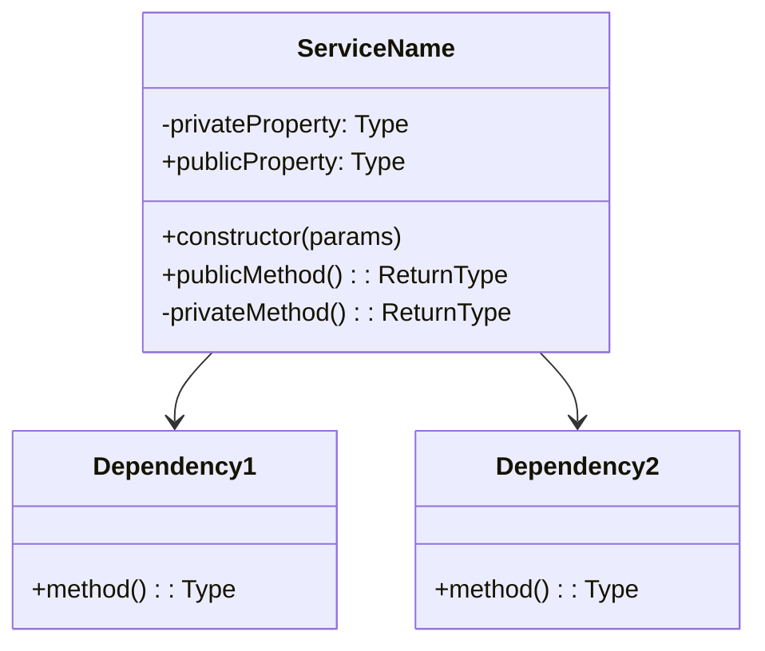
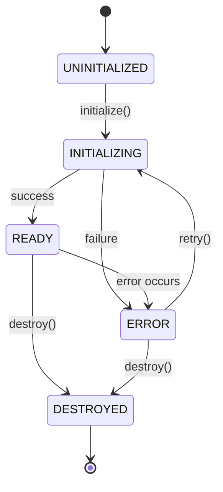

# Plantilla de Documentación para Servicios y Utilidades

## Información del Servicio

**Nombre**: `[NombreDelServicio]`  
**Ubicación**: `[ruta/del/archivo]`  
**Tipo**: `[Servicio / Utilidad / Helper / Manager]`  
**Autor**: `[Nombre del desarrollador]`  
**Fecha**: `[YYYY-MM-DD]`

## Descripción

[Descripción detallada de qué hace este servicio, su propósito y responsabilidades en la arquitectura del sistema]

## Responsabilidades

- **Responsabilidad 1**: Descripción de la primera responsabilidad
- **Responsabilidad 2**: Descripción de la segunda responsabilidad
- **Responsabilidad 3**: Descripción de la tercera responsabilidad

## Arquitectura



## Interfaz Pública

### Constructor

```typescript
/**
 * Crea una nueva instancia del servicio
 * 
 * @param config - Configuración del servicio
 * @param dependencies - Dependencias requeridas
 */
constructor(config: ServiceConfig, dependencies: ServiceDependencies)
```

### Métodos Principales

#### `metodo1(parametros): ReturnType`

```typescript
/**
 * Descripción del método principal
 * 
 * @param param1 - Descripción del primer parámetro
 * @param param2 - Descripción del segundo parámetro
 * @returns Descripción de lo que retorna
 * @throws ErrorType Cuándo se lanza este error
 * 
 * @example
 * ```typescript
 * const result = await service.metodo1('valor', 123);
 * console.log(result);
 * ```
 */
async metodo1(param1: string, param2: number): Promise<ReturnType>
```

#### `metodo2(parametros): ReturnType`

```typescript
/**
 * Descripción del segundo método
 * 
 * @param options - Opciones de configuración
 * @returns Resultado de la operación
 */
metodo2(options: MethodOptions): ReturnType
```

### Propiedades Públicas

| Propiedad | Tipo | Descripción | Solo Lectura |
|-----------|------|-------------|---------------|
| `isInitialized` | `boolean` | Indica si el servicio está inicializado | ✅ |
| `config` | `ServiceConfig` | Configuración actual del servicio | ✅ |
| `status` | `ServiceStatus` | Estado actual del servicio | ✅ |

## Configuración

### Interfaz de Configuración

```typescript
interface ServiceConfig {
  /** Configuración de conexión */
  connection: {
    host: string;
    port: number;
    timeout: number;
  };
  
  /** Configuración de cache */
  cache: {
    enabled: boolean;
    ttl: number;
  };
  
  /** Configuración de logging */
  logging: {
    level: 'debug' | 'info' | 'warn' | 'error';
    enabled: boolean;
  };
}
```

### Configuración por Defecto

```typescript
const defaultConfig: ServiceConfig = {
  connection: {
    host: 'localhost',
    port: 5432,
    timeout: 5000,
  },
  cache: {
    enabled: true,
    ttl: 300,
  },
  logging: {
    level: 'info',
    enabled: true,
  },
};
```

## Dependencias

### Dependencias Externas

| Dependencia | Versión | Propósito |
|-------------|---------|----------|
| `biblioteca1` | `^1.0.0` | Funcionalidad específica |
| `biblioteca2` | `^2.1.0` | Utilidades auxiliares |

### Dependencias Internas

| Servicio | Ubicación | Propósito |
|----------|-----------|----------|
| `DatabaseService` | `@/lib/database` | Operaciones de base de datos |
| `CacheService` | `@/lib/cache` | Gestión de cache |
| `LoggerService` | `@/lib/logger` | Logging del sistema |

## Ejemplos de Uso

### Uso Básico

```typescript
import { ServiceName } from '@/lib/services/ServiceName';

// Crear instancia del servicio
const service = new ServiceName(config, dependencies);

// Inicializar el servicio
await service.initialize();

// Usar métodos del servicio
const result = await service.metodo1('parametro', 123);
console.log(result);
```

### Uso Avanzado

```typescript
import { ServiceName, ServiceConfig } from '@/lib/services/ServiceName';

// Configuración personalizada
const customConfig: ServiceConfig = {
  connection: {
    host: 'production-host',
    port: 5432,
    timeout: 10000,
  },
  cache: {
    enabled: true,
    ttl: 600,
  },
  logging: {
    level: 'warn',
    enabled: true,
  },
};

// Crear servicio con configuración personalizada
const service = new ServiceName(customConfig, dependencies);

// Manejar eventos del servicio
service.on('error', (error) => {
  console.error('Error en el servicio:', error);
});

service.on('initialized', () => {
  console.log('Servicio inicializado correctamente');
});

// Inicializar y usar
await service.initialize();

try {
  const result = await service.metodo1('datos', 456);
  // Procesar resultado
} catch (error) {
  // Manejar error
}
```

### Uso en Componentes React

```typescript
import { useEffect, useState } from 'react';
import { ServiceName } from '@/lib/services/ServiceName';

function ComponenteEjemplo() {
  const [service] = useState(() => new ServiceName(config, dependencies));
  const [data, setData] = useState(null);
  const [loading, setLoading] = useState(true);

  useEffect(() => {
    const initializeService = async () => {
      try {
        await service.initialize();
        const result = await service.metodo1('parametro', 123);
        setData(result);
      } catch (error) {
        console.error('Error:', error);
      } finally {
        setLoading(false);
      }
    };

    initializeService();

    // Cleanup
    return () => {
      service.destroy();
    };
  }, [service]);

  if (loading) return <div>Cargando...</div>;
  
  return (
    <div>
      {/* Renderizar datos */}
    </div>
  );
}
```

## Estados y Ciclo de Vida

### Estados del Servicio

```typescript
enum ServiceStatus {
  UNINITIALIZED = 'uninitialized',
  INITIALIZING = 'initializing',
  READY = 'ready',
  ERROR = 'error',
  DESTROYED = 'destroyed',
}
```

### Diagrama de Estados



### Métodos de Ciclo de Vida

```typescript
/**
 * Inicializa el servicio
 */
async initialize(): Promise<void>

/**
 * Verifica si el servicio está listo
 */
isReady(): boolean

/**
 * Destruye el servicio y libera recursos
 */
async destroy(): Promise<void>

/**
 * Reinicia el servicio
 */
async restart(): Promise<void>
```

## Manejo de Errores

### Tipos de Errores

```typescript
// Error base del servicio
class ServiceError extends Error {
  constructor(
    message: string,
    public code: string,
    public details?: any
  ) {
    super(message);
    this.name = 'ServiceError';
  }
}

// Errores específicos
class ConnectionError extends ServiceError {
  constructor(message: string, details?: any) {
    super(message, 'CONNECTION_ERROR', details);
  }
}

class ValidationError extends ServiceError {
  constructor(message: string, details?: any) {
    super(message, 'VALIDATION_ERROR', details);
  }
}
```

### Estrategias de Recuperación

1. **Retry automático**: Para errores temporales de conexión
2. **Circuit breaker**: Para prevenir cascadas de fallos
3. **Fallback**: Valores por defecto cuando el servicio falla
4. **Graceful degradation**: Funcionalidad reducida en caso de error

## Performance y Optimización

### Métricas de Performance

- **Tiempo de inicialización**: < 100ms
- **Tiempo de respuesta promedio**: < 50ms
- **Throughput**: > 1000 operaciones/segundo
- **Uso de memoria**: < 50MB

### Optimizaciones Implementadas

- ✅ **Connection pooling**: Reutilización de conexiones
- ✅ **Caching**: Cache en memoria para datos frecuentes
- ✅ **Lazy loading**: Carga bajo demanda de recursos
- ✅ **Batch processing**: Procesamiento en lotes

## Testing

### Tests Unitarios

```typescript
describe('ServiceName', () => {
  let service: ServiceName;
  let mockDependencies: jest.Mocked<ServiceDependencies>;

  beforeEach(() => {
    mockDependencies = {
      database: jest.fn(),
      cache: jest.fn(),
      logger: jest.fn(),
    };
    
    service = new ServiceName(defaultConfig, mockDependencies);
  });

  afterEach(async () => {
    await service.destroy();
  });

  describe('initialization', () => {
    it('should initialize successfully', async () => {
      await service.initialize();
      expect(service.isReady()).toBe(true);
    });

    it('should handle initialization errors', async () => {
      mockDependencies.database.mockRejectedValue(new Error('Connection failed'));
      
      await expect(service.initialize()).rejects.toThrow('Connection failed');
      expect(service.status).toBe(ServiceStatus.ERROR);
    });
  });

  describe('metodo1', () => {
    beforeEach(async () => {
      await service.initialize();
    });

    it('should process data correctly', async () => {
      const result = await service.metodo1('test', 123);
      expect(result).toBeDefined();
      expect(mockDependencies.database).toHaveBeenCalled();
    });
  });
});
```

### Tests de Integración

```typescript
describe('ServiceName Integration', () => {
  let service: ServiceName;

  beforeAll(async () => {
    // Setup real dependencies for integration testing
    const realDependencies = await setupTestDependencies();
    service = new ServiceName(testConfig, realDependencies);
    await service.initialize();
  });

  afterAll(async () => {
    await service.destroy();
    await cleanupTestDependencies();
  });

  it('should work with real dependencies', async () => {
    const result = await service.metodo1('integration-test', 999);
    expect(result).toMatchSnapshot();
  });
});
```

## Monitoring y Logging

### Métricas Monitoreadas

- Número de operaciones por segundo
- Tiempo de respuesta promedio
- Tasa de errores
- Uso de memoria y CPU
- Estado de las conexiones

### Logs Importantes

```typescript
// Inicialización
logger.info('Service initializing', { config, timestamp });
logger.info('Service ready', { initTime, timestamp });

// Operaciones
logger.debug('Method called', { method: 'metodo1', params, timestamp });
logger.info('Operation completed', { method: 'metodo1', duration, timestamp });

// Errores
logger.error('Operation failed', { method: 'metodo1', error, timestamp });
logger.warn('Retry attempt', { attempt, maxRetries, timestamp });
```

## Problemas Conocidos

- [ ] **Problema 1**: Descripción del problema y workaround
- [ ] **Problema 2**: Limitación actual y plan de solución

## Mejoras Futuras

- [ ] **Mejora 1**: Implementar cache distribuido
- [ ] **Mejora 2**: Agregar métricas más detalladas
- [ ] **Mejora 3**: Optimizar algoritmo de procesamiento

## Changelog

| Versión | Fecha | Cambios |
|---------|-------|----------|
| 1.0.0 | 2024-01-01 | Versión inicial |
| 1.1.0 | 2024-01-15 | Agregado soporte para cache |
| 1.2.0 | 2024-02-01 | Mejorado manejo de errores |

---

**Última actualización**: [Fecha]  
**Revisado por**: [Nombre del revisor]